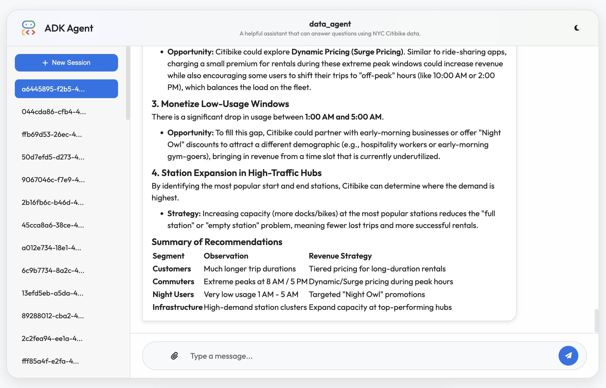

# Agent Development Kit (ADK) Client

A simple custom web client for [Agent Development Kit (ADK)](https://adk.dev/).



## Why not `adk web`?

The default ADK Web App is a testing and debugging tool. It is not intended for end-users. This custom web client is an example of a custom web client that covers the vast majority of core ADK features:

* Multi-turn conversations
* Tool calls visualization (a bit too nerdy, but the user knows what's going on)
* Multimodal input (text, images, videos)
* Real-time token streaming
* Tool calls and results
* Artifacts visualization (text, images, videos, markdown)
* Interactive authentication for MCP tools with OAuth 2.0 flow

## How to run

### Install requirements

* Your machine or container must have Node.js 22+ installed.

> When calling a remote ADK server, the client uses current user's identity token for authentication. The token is obtained using:
> * Cloud Metadata Service (if running in Cloud)
> * `gcloud auth print-identity-token` CLI command (if running locally)

### Locally

1. Copy `.env.sample` as `.env`, and specify configuration values:

    * `SERVER_BASE_URL` – (Optional) The URL of the ADK API server for the web client to proxy to (defaults to `http://localhost:8000`).
    * `AGENT_NAME` – (Optional) The name of the agent to use. If not set, the server will pick first from the agents available on the server.

2. Run the application using the provided script:

    ```bash
    ./run.sh
    ```

    This script will start both the ADK API server (port 8000) and the custom web client (port 8080).

3. Open your browser and navigate to `http://localhost:8080` to interact with the agent.

### In Cloud Run

1. Obtain URL of your agent's ADK server. If it's deployed in Cloud Run, you can get it from the Cloud Console or by running:

```bash
gcloud run services describe <your-adk-server-name> --region <your-adk-server-region> --format 'value(status.url)'
```

This will be your `SERVER_BASE_URL` value to use in the next step.

2. Deploy this app to Cloud Run:

```bash
export GOOGLE_CLOUD_PROJECT="" # (Required) Your Google Cloud project ID.
export GOOGLE_CLOUD_REGION="us-central1" # (Required) Your Google Cloud region.
export SERVER_BASE_URL="" # (Required) e.g. https://another-adk-server-123456.us-central1.run.app
export AGENT_NAME="" # (Optional) If not set, the server will pick first from the agents available on the server.

gcloud run deploy adk-client \
  --source src \
  --no-build \
  --base-image "node:22-slim" \
  --command "node" \
  --args "server.js" \
  --project $GOOGLE_CLOUD_PROJECT \
  --region $GOOGLE_CLOUD_REGION \
  --set-env-vars SERVER_BASE_URL=$SERVER_BASE_URL,AGENT_NAME=$AGENT_NAME \
  --set-env-vars GOOGLE_CLOUD_PROJECT=$GOOGLE_CLOUD_PROJECT \
  --set-env-vars GOOGLE_CLOUD_REGION=$GOOGLE_CLOUD_REGION \
  --min-instances 1 \
  --no-allow-unauthenticated
```

3. Configure Authentication for the web app:

   **Follow instructions in [Configure IAP for Cloud Run](https://docs.cloud.google.com/run/docs/securing/identity-aware-proxy-cloud-run)**
   - this will allow you to access the web app using your Google account.

4. **If you configured the agent to use OAuth 2.0**, you need to configure the OAuth 2.0 client in the Google Cloud Console:
    * Go to the Google Cloud Console, make sure you have selected the correct project.
    * Navigate to **Google Auth Platform** > **Clients**.
    * In **OAuth 2.0 Client IDs**, select your application.
    * In the **Authorized redirect URIs** field, add a URL with your Cloud Run service URL and the `/auth_callback.html` path:
        ```
        https://<your-cloud-run-service-url>/auth_callback.html
        ```

4. Open your browser and navigate to the URL of the deployed Cloud Run service.