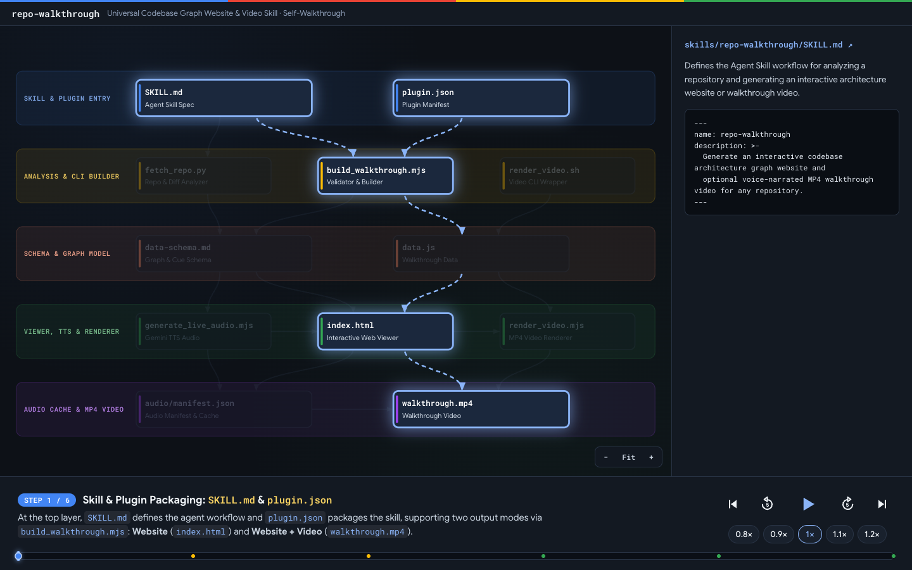
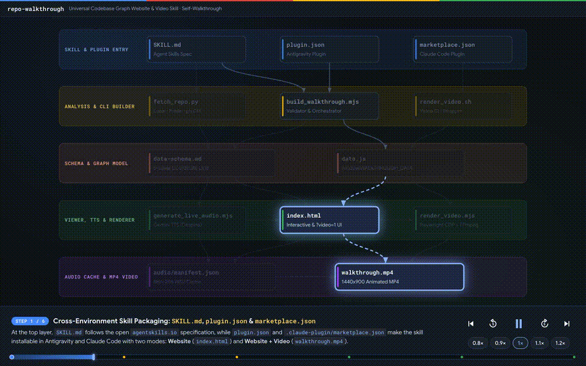

# repo-walkthrough

Interactive codebase architecture graph website and voice-narrated MP4 walkthrough video for any repository.

Packaged as a standard [Agent Skill (`SKILL.md`)](./skills/repo-walkthrough/SKILL.md) compatible with **Antigravity**, **Claude Code**, and more (any agent supporting [Agent Skills (`agentskills.io`)](https://agentskills.io)). All examples in this repository were generated with **[Gemini 4 Argon](https://blog.google/innovation-and-ai/models-and-research/gemini-models/gemini-4-argon/)**.





## Output Modes

1. **Website (`--mode website`)**
   - Generates an interactive web page where you can explore the repository's architecture layer by layer, click any file or connection to inspect its role and code, and play a step-by-step voice-narrated walkthrough.
2. **Website + Video (`--mode video`)**
   - Builds the interactive website and exports an MP4 video that walks through the architecture step by step, zooming into each layer and highlighting files as they are explained.

## Prerequisites

Check your local environment with:

```bash
node scripts/build_walkthrough.mjs --check-prereqs
```

| Requirement | Website (`--mode website`) | Website + Video (`--mode video`) | Notes |
| :--- | :--- | :--- | :--- |
| **Python 3** | Required | Required | Analyzes local or GitHub repositories. |
| **Node.js 20+** | Required | Required | Runs the build, audio, and video scripts. |
| **`GEMINI_API_KEY`** | Optional (`--no-tts` uses browser speech) | **Required** | Generates Gemini TTS narration. |
| **`ffmpeg`** | Not required | **Required** | Encodes the walkthrough video. |
| **Playwright + Chrome** | Optional | **Required** | Renders video frames in headless Chrome. |
| **`gh` CLI** | Optional (private repos only) | Optional (private repos only) | Needed only for private GitHub repositories. |

## Project Structure

```text
repo-walkthrough/
├── README.md
├── TESTING.md                          # Guide for running the automated test suites
├── skills/
│   └── repo-walkthrough/
│       ├── SKILL.md                    # Agent Skill definition
│       ├── scripts -> ../../scripts
│       └── references/
│           └── data-schema.md          # Layout rules & WALKTHROUGH_DATA schema
├── scripts/
│   ├── fetch_repo.py                   # Repository & git-diff analyzer
│   ├── build_walkthrough.mjs           # Validator & website/video builder
│   ├── generate_live_audio.mjs         # Gemini TTS audio generator
│   ├── render_video.mjs                # MP4 video renderer
│   └── render_video.sh                 # Shell wrapper for render_video.mjs
├── web/
│   ├── index.html                      # Interactive graph & walkthrough viewer
│   └── data-adk.js                     # Sample walkthrough data
├── examples/
│   ├── self-walkthrough/               # Walkthrough of repo-walkthrough itself
│   ├── cymbal-autos-multimodal/        # Monorepo subdirectory walkthrough example
│   └── diff-5984e02-to-head/           # Git diff (--diff) walkthrough example
└── tests/
    ├── test_fetch_repo.py              # Repository analyzer tests
    ├── test_pipeline.mjs               # Validator, TTS, and build pipeline tests
    └── test_ui_e2e.mjs                 # Browser UI, geometry, and video E2E tests
```

## Quick Start

```bash
# 1. Analyze a repository (or pass --diff <base>..<head> for a git diff)
python3 scripts/fetch_repo.py <repo-or-path> --json /tmp/repo-analysis.json

# 2a. Build & open the interactive Website
node scripts/build_walkthrough.mjs --data <path/to/data.js> --mode website --open

# 2b. Build the interactive Website + MP4 Video
node scripts/build_walkthrough.mjs --data <path/to/data.js> --mode video --open
```

## Installing the Skill

- **Antigravity**: Copy or symlink `skills/repo-walkthrough` to `~/.gemini/config/skills/repo-walkthrough`.
- **Claude Code**: Copy or symlink `skills/repo-walkthrough` to `~/.claude/skills/repo-walkthrough` (or `.claude/skills/repo-walkthrough` in a project).
- **Other Agents (`agentskills.io`)**: Copy or symlink `skills/repo-walkthrough` into your agent's `skills/` directory (e.g., `.agents/skills/repo-walkthrough`).
