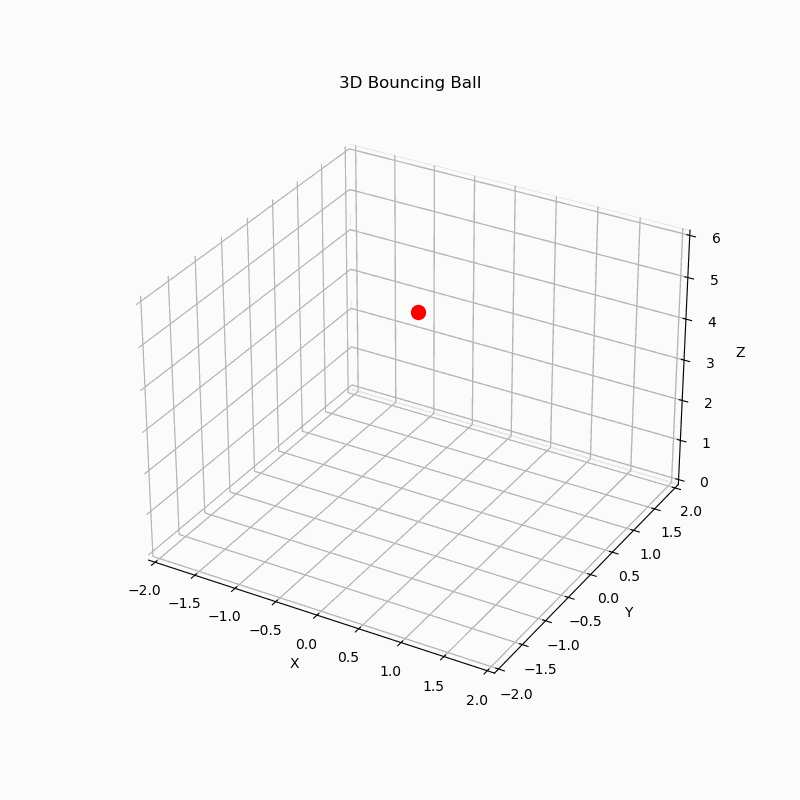

# Gemma 4 Coding Agent

This agent demonstrates how to create a coding agent using [Aget Development Kit (ADK)](https://adk.dev/) and [Google Gemma 4](https://ai.google.dev/gemma) open model. The agent can generate and execute Python code in an isolated WebAssembly environment (Pyodide).

## Example task

Task: `Draw a 3D animation of a bouncing ball.`

### Code

```python
import matplotlib
matplotlib.use('Agg')  # Use non-interactive backend for headless environment
import numpy as np
import matplotlib.pyplot as plt
from matplotlib.animation import FuncAnimation, PillowWriter
from mpl_toolkits.mplot3d import Axes3D

# Physics parameters
g = -9.81       # Gravity (m/s^2)
dt = 0.05       # Time step (s)
e = 0.8         # Coefficient of restitution
initial_pos = np.array([0.0, 0.0, 5.0]) # x, y, z
initial_vel = np.array([0.5, 0.3, 0.0])  # vx, vy, vz
duration = 5.0  # seconds

# Calculate trajectory
t = np.arange(0, duration, dt)
positions = []
curr_pos = initial_pos.copy()
curr_vel = initial_vel.copy()

for time in t:
    positions.append(curr_pos.copy())

    # Update velocity
    curr_vel[2] += g * dt

    # Update position
    curr_pos += curr_vel * dt

    # Collision with floor (z=0)
    if curr_pos[2] <= 0:
        curr_pos[2] = 0
        curr_vel[2] = -e * curr_vel[2]

positions = np.array(positions)

# Setup plot
fig = plt.figure(figsize=(8, 8))
ax = fig.add_subplot(111, projection='3d')

# Ball representation
ball, = ax.plot([], [], [], 'ro', markersize=10)
trail, = ax.plot([], [], [], 'b-', alpha=0.3)

# Axis limits
ax.set_xlim(-2, 2)
ax.set_ylim(-2, 2)
ax.set_zlim(0, 6)
ax.set_xlabel('X')
ax.set_ylabel('Y')
ax.set_zlabel('Z')
ax.set_title('3D Bouncing Ball')

def init():
    ball.set_data([], [])
    ball.set_3d_properties([])
    trail.set_data([], [])
    trail.set_3d_properties([])
    return ball, trail

def update(frame):
    # Update ball position
    pos = positions[frame]
    ball.set_data([pos[0]], [pos[1]])
    ball.set_3d_properties([pos[2]])

    # Update trail (last 20 frames)
    start = max(0, frame - 20)
    trail_data = positions[start:frame+1]
    trail.set_data(trail_data[:, 0], trail_data[:, 1])
    trail.set_3d_properties(trail_data[:, 2])

    return ball, trail

ani = FuncAnimation(fig, update, frames=len(t), init_func=init, blit=False)

# Save as GIF
writer = PillowWriter(fps=20)
ani.save('/data/bouncing_ball.gif', writer=writer)
plt.close()

```

### Result



## How to run

1. Deploy a Google Gemma 4 31B-it endpoint in Cloud Run as described in [Run inference of Gemma 4 model on Cloud Run with RTX 6000 Pro GPU with vLLM](https://codelabs.developers.google.com/codelabs/cloud-run/cloud-run-gpu-rtx-pro-6000-gemma4-vllm).

2. Create a Python virtual environment and install Google ADK:

    ```bash
    uv pip install google-adk[extensions]
    ```

3. Install node.js and npm.

    You can install them via uv as well:

    ```bash
    uv pip install nodejs-wheel
    ```

4. Install `pyodide` npm package:

    ```bash
    npm install pyodide@0.29.3
    npm audit fix
    ```

5. Copy `.env.sample` as `.env`, and specify configuration values:
    * `API_BASE` – the URL of the deployed Cloud Run service with Gemma 4 vLLM server running.
    * `MODEL_NAME` – the model name, which is `google/gemma-4-31b-it`.

5. Run `adk web` to interact with the agent:

    ```bash
    adk web agents/simple-coding-agent
    ```

## DISCLAIMER

Pyodide is only recommended for local experiments. For production or pretty much as serious code execution work, consider using a proper Sandbox Environment, such as [Cloud Run Sandbox](https://github.com/GoogleCloudPlatform/cloud-run-sandbox), [GKE Sandbox](https://docs.cloud.google.com/kubernetes-engine/docs/concepts/sandbox-pods), or [Vertex AI Agent Engine Code Execution](https://docs.cloud.google.com/agent-builder/agent-engine/code-execution/overview).

You may also take a look at [BentoRun](https://github.com/vladkol/bentorun).
