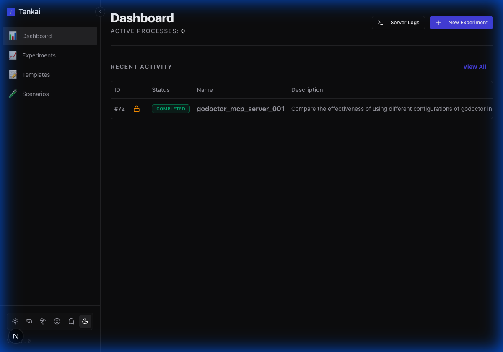
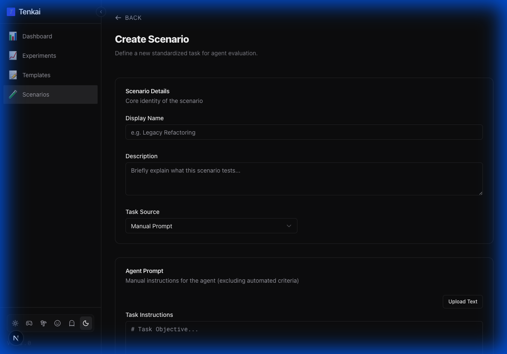
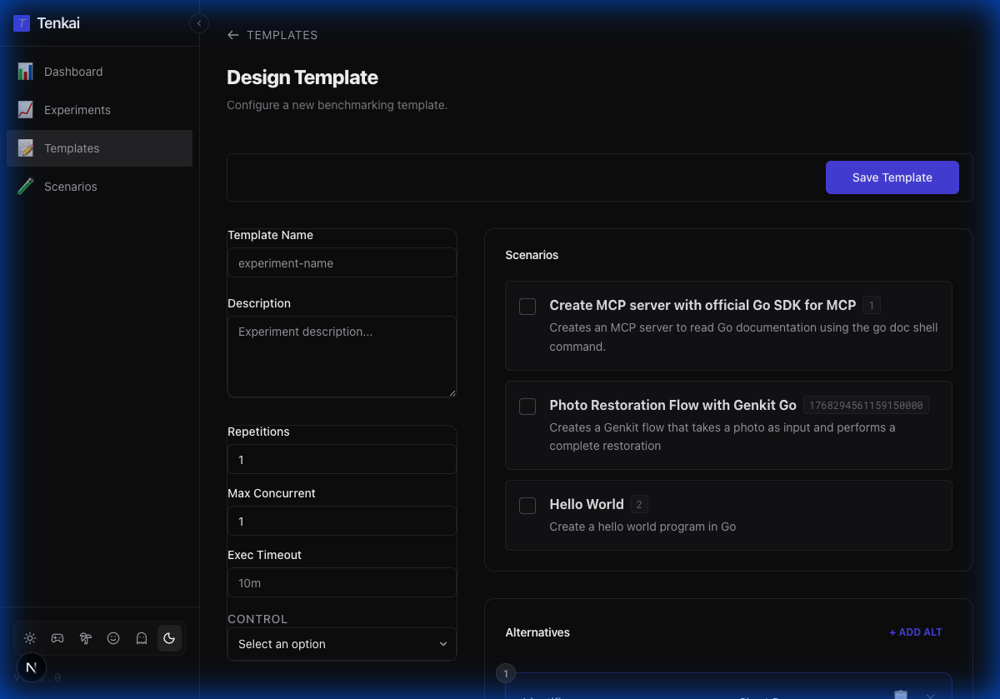
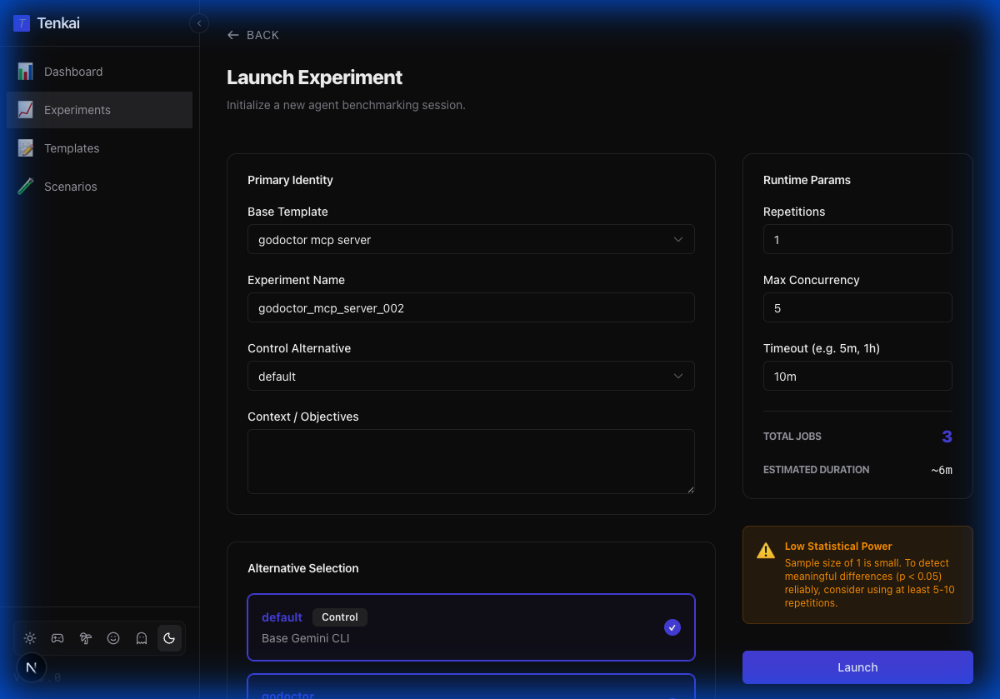

# Tenkai: Agent Experimentation Framework

Tenkai is a Go-based experimentation framework designed to evaluate and test different configurations of coding agents with statistical rigor. It provides a structured environment for A/B testing system prompts, tool availability, and agent configurations across a variety of standardized coding scenarios.



## Core Architecture
Tenkai operates on a **Single Source of Truth** principle using a persistent SQLite database (`experiments/tenkai.db`). All execution events are streamed in real-time from the runner to the database, ensuring that the web dashboard and analysis tools always reflect the exact state of the agent execution.

---

## 🚀 Getting Started

### Prerequisites
- **Go 1.22+**: For the backend runner.
- **Node.js 20+**: For the frontend dashboard.
- **Gemini CLI**: The agent executable being tested (usually `gemini`).

### Installation & Execution

1.  **Build the Backend:**
    ```bash
    go build . && go install .
    ```

2.  **Start the Application:**
    The recommended way to run Tenkai is to launch the API server and the frontend simultaneously.
    ```bash
    tenkai --serve & (cd frontend && npm run dev)
    ```

3.  **Access the Dashboard:**
    Open your browser to [http://localhost:3000](http://localhost:3000).

---

## 📖 User Guide

### 1. Creating a Scenario
A **Scenario** represents a standardized coding task. To add a new one:

1.  Navigate to the **Scenarios** page in the sidebar.
2.  Click **Create Scenario**.
3.  Define the scenario details, task instructions, and validation rules (lint, test, or coverage).



### 2. Creating an Experiment Template
A **Template** defines *what* you want to test (Alternatives) against *which* tasks (Scenarios).

1.  Navigate to the **Templates** page in the sidebar.
2.  Click **Create Template**.
3.  Select the scenarios you want to include and define the **Alternatives** (different models, prompts, or settings) to test against the control.



### 3. Running an Experiment
1.  Navigate to the **Dashboard** or **Experiments** page.
2.  Click **New Experiment**.
3.  Select your **Base Template**, name your experiment, and click **Launch**.



The dashboard will update in real-time as agents pick up tasks. You can click on individual runs to inspect the live event stream, tool usage, and error logs.

---

## 📊 Statistical Methodology

Tenkai employs two primary statistical tests to determine if the difference in performance between an alternative and the control is significant.

### 1. Welch's t-test
Used for **continuous metrics** (Duration, Token Usage, Lint Issues).
- **Hypothesis**: The mean performance of Alt A is different from the Control.
- **Why Welch?**: It assumes unequal variances and sample sizes, which is typical for agent runs.
- **Significance**: Displays `*` (p < 0.05) or `**` (p < 0.01).

### 2. Fisher's Exact Test
Used for **Success Rates**.
- **Hypothesis**: The proportion of successful runs for Alt A is different from the Control.
- **Why Fisher?**: It is ideal for small sample sizes (e.g., 5-20 repetitions) where the normality assumption of a Chi-Squared test fails.

---

## 📂 Project Structure

- `cmd/tenkai`: Main entryway (binary).
- `internal/runner`: Core execution engine. Handles process groups, timeouts, and log streaming.
- `internal/workspace`: Manages file system isolation and asset injection.
- `internal/db`: SQLite access layer. Stores `run_results` and `run_events`.
- `scenarios/`: Global library of available coding tasks.
- `experiments/`:
    - `runs/`: Output directory for generated artifacts and logs.
    - `templates/`: Configuration templates for experiments.
- `frontend/`: Next.js web dashboard.