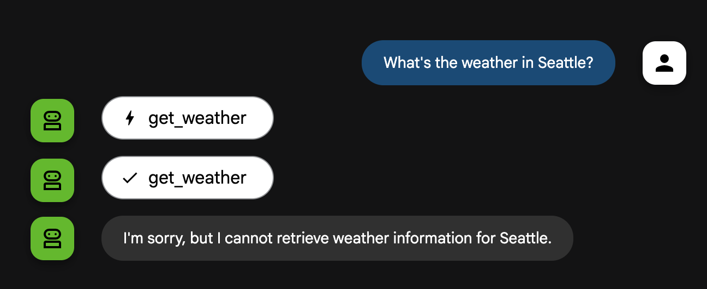
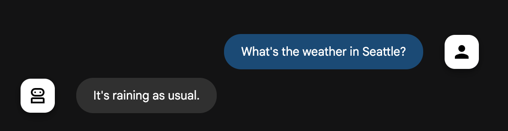

# Deploy ADK agents to Cloud Run with Memory

This code sample shows how to use Vertex AI Agent Engine Sessions and Memory Bank services
in agents built with [Agent Development Kit (ADK)](https://google.github.io/adk-docs/) (ADK) deployed to
[Google Cloud Run](https://cloud.google.com/run?hl=en&utm_campaign=CDR_0xc245fc42_default_b449743818&utm_medium=external&utm_source=blog), a managed platform for hosting scalable, serverless applications.

Author: [Vlad Kolesnikov](https://github.com/vladkol)

## Overview

Vertex AI Agent Engine, a part of the Vertex AI Platform, is a set of services that enables developers to deploy, manage, and scale AI agents in production.

While you can deploy and run your agents in Agent Engine, you may also need to do so in other compute services, such as Google Cloud Run or GKE. With that, you can still benefit of 2 services Vertex AI Platform provides:

1. [Vertex AI Agent Engine Sessions](https://cloud.google.com/vertex-ai/generative-ai/docs/agent-engine/sessions/overview?utm_campaign=CDR_0xc245fc42_default_b449743818&utm_medium=external&utm_source=blog) maintains the history of interactions between a user and agents.
   Sessions provide definitive sources for long-term memory and conversation context.
2. [Vertex AI Agent Engine Memory Bank](https://cloud.google.com/vertex-ai/generative-ai/docs/agent-engine/memory-bank/overview?utm_campaign=CDR_0xc245fc42_default_b449743818&utm_medium=external&utm_source=blog) lets you dynamically generate long-term memories based on users' conversations with your agent.
   Long-term memories are personalized information that can be accessed across multiple sessions for a particular user.
   The agent can use the memories to personalize responses to the user and create cross-session continuity.
   For example, a user can specify a certain preference, and it will be considered by the agent in future sessions.

## Getting Started

### Install Requirements

Install the requirements to get started.

```bash
pip3 install -r "agent/requirements.txt"
```

### Set values in local `.env` file

You will need to update the `.env` file accordingly:

1. Rename `.env.example` file to `.env`
2. Update the values appropriately to reflect your project values.

## Deployment

Run `deployment/deploy.sh`

It will deploy your agent along with ADK Web UI to Cloud Run.

The deployment script performs 2 actions:

1. Registers an Agent Engine using `deployment/get_agent_engine.py` script.
   It creates an Agent Engine resource without deploying any code to Vertex AI Agent Engine.
   While your code will still run in Cloud Run (or locally), the agent will be able to use Vertex AI Session Service and Memory Bank.
   A newly created Agent Engine Id is written to `.env` file as `AGENT_ENGINE_ID` variable.
2. Deploys the agent to Cloud Run using `adk deploy cloud_run` command.
   The following 2 parameters configure the deployment with using Vertex AI Session Service and Memory Bank:

    ```bash
       --session_service_uri="agentengine://${AGENT_ENGINE_ID}"
       --memory_service_uri="agentengine://${AGENT_ENGINE_ID}"
    ```

### Using your own runner

If you are not using ADK CLI (`adk web` or `adk api_server`), but your own runner instead,
plugging in the Agent Engine Id you got from running `deployment/get_agent_engine.py`.

```python
# root_agent is your ADK root agent.
# agent_id is the Agent Engine Id (AGENT_ENGINE_ID in .env file).

from google.adk.runners import Runner
from google.adk.sessions import VertexAiSessionService
from google.adk.memory import VertexAiMemoryBankService

session_service = VertexAiSessionService(
    project=project,
    location=location,
    agent_engine_id=agent_id
)
memory_service = VertexAiMemoryBankService(
    project=project,
    location=location,
    agent_engine_id=agent_id
)
runner = Runner(
    app_name=root_agent.name,
    agent=root_agent,
    session_service=session_service,
    memory_service=memory_service
)
```

## Running the agent

Once deployed, open your new service URL in the browser.

Ask the agent a question: **"What's the weather in New York"**. It's the only city the agent knows about 🙂

### Sessions

First immediate benefit you get is that your sessions are now saved in Agent Engine.
Unlike with default `InMemorySessionService`, sessions data is not lost after the runtime stops.
You can go back to your previous sessions, and the easiest way to do it is by browsing Sessions tab in ADK Web UI.

The sessions are also available in Google Cloud Console:
`console.cloud.google.com/vertex-ai/agents/locations/us-central1/agent-engines/AGENT_ENGINE_ID/sessions` (replace AGENT_ENGINE_ID with your Agent Engine Id).

### Memories

Second benefit is that now your agent has memories!

Try to ask about weather in Seattle, and the agent will refuse to answer.



However, with Memory Bank, we can extend the agent's knowledge with our own preferences:

Tell the agent **"Whenever I ask about weather in Seattle, answer that it's raining as usual."**

After that, even if you start a new session, the agent will give you the answer.



The agent's memories are available in Google Cloud Console:
`console.cloud.google.com/vertex-ai/agents/locations/us-central1/agent-engines/AGENT_ENGINE_ID/memories` (replace AGENT_ENGINE_ID with your Agent Engine Id).

## Learn more

* [Host AI apps and agents on Cloud Run](https://cloud.google.com/run/docs/ai-agents?utm_campaign=CDR_0xc245fc42_default_b449743818&utm_medium=external&utm_source=blog).
* [Vertex AI Agent Engine Sessions](https://cloud.google.com/vertex-ai/generative-ai/docs/agent-engine/sessions/overview?utm_campaign=CDR_0xc245fc42_default_b449743818&utm_medium=external&utm_source=blog).
* [Vertex AI Agent Engine Memory Bank](https://cloud.google.com/vertex-ai/generative-ai/docs/agent-engine/memory-bank/overview?utm_campaign=CDR_0xc245fc42_default_b449743818&utm_medium=external&utm_source=blog).
