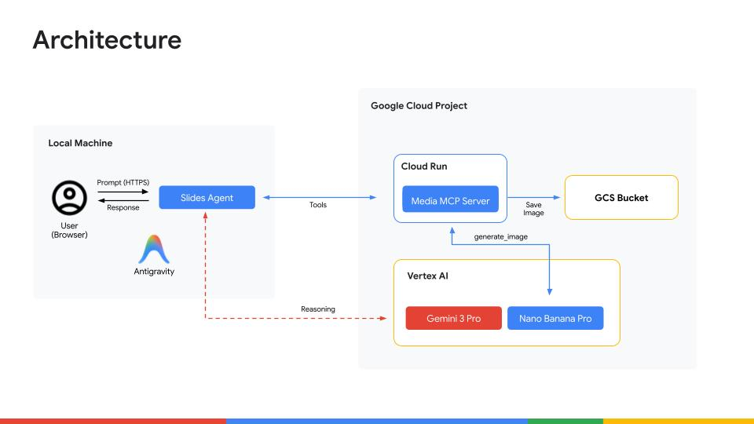

# Agent Factory Podcast: Antigravity & Nano Banana Pro
Author: [rsamborski](https://github.com/rsamborski)

This repository contains the source code and examples from the Agent Factory Podcast episode covering Antigravity and the Nano Banana Pro models.

Watch the full episode and more on YouTube: [Antigravity and Nano Banana Pro with Remik | The Agent Factory Podcast](https://www.youtube.com/watch?v=XCGbDx7aSks).

## Architecture



## Project Structure

This project is divided into two main folders:

### mcp

This directory contains a Python-based MCP (Model Context Protocol) server. It's pre-configured to connect with the Nano Banana Pro model, demonstrating how to expose image generation tools to a larger agent ecosystem.

For setup and deployment instructions, please refer to [mcp/README.md](mcp/README.md).

### slides-agent-demo

This directory holds the code for the AI agent created during the podcast recording. It was bootstrapped using the Agent Starter Pack and developed with the help of [Antigravity](https://antigravity.google). This serves as a practical example of rapid agent development and deployment on Google Cloud.

Please see the [slides-agent-demo/README.md](slides-agent-demo/README.md) for detailed instructions on how to set up, run, and deploy this agent.

This code was generated with Antigravity using following prompt:
```
I want to create an agent which will use the MCP server deployed at https://CLOUD_RUN_SERVICE_URL/mcp to generate slides (pictures) for an idea that the user provides in their prompt. The agent should make sure the slides keep the same style and iterate on each of them to have a high quality. Each slide should be very detailed and include text, infographics, icons to support the story. After finishing the slides generation the Agent should present links to all created images. Each presentation should be limited to a maximum of 5 slides.

The current workspace has been initialized with Agent Development Kit code (ADK), so you should start building our agent based on existing files. Make sure to leverage instructions from the GEMINI.md file.
```
