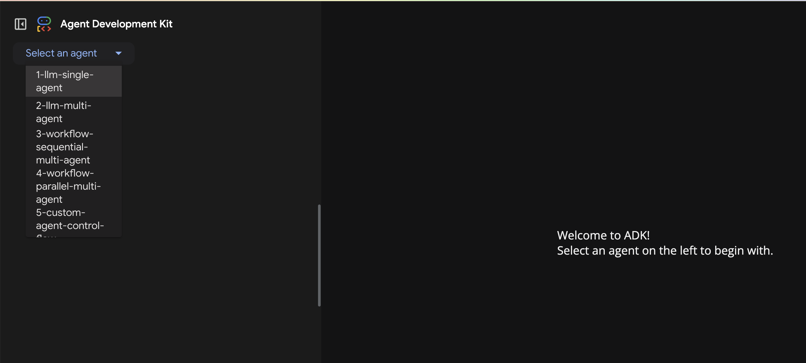
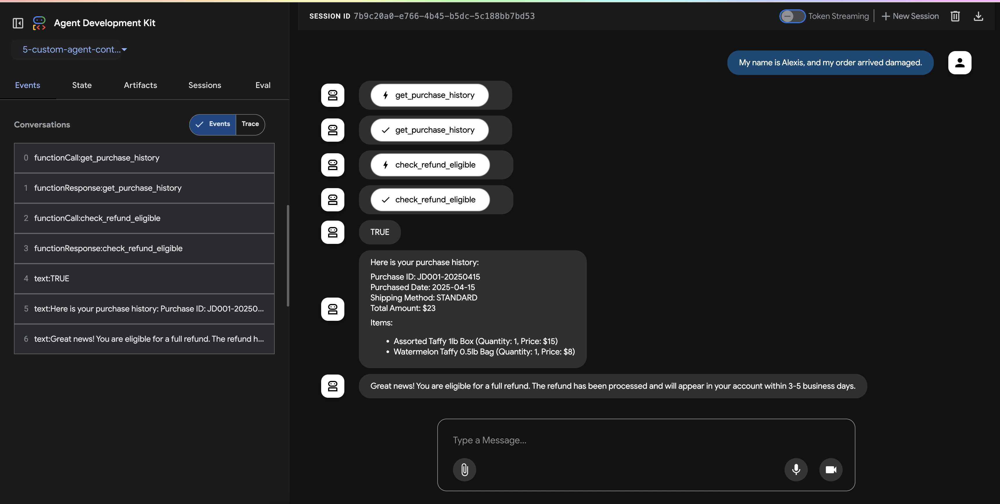

# 🍬  Agent Patterns with Agent Development Kit (ADK) 🍬

This demo walks through five different AI agent [patterns](https://google.github.io/adk-docs/agents/multi-agents/#2-common-multi-agent-patterns-using-adk-primitives) using [ADK](https://google.github.io/adk-docs/) (Python). 

All five agents act as a customer support refund system for a candy company called Crabby's Taffy.  

Each subdirectory contains one implementation: 
1. `1-llm-single-agent` - Single-Agent with Tools
2. `2-llm-multi-agent` - Multi-Agent (LLM-based orchestration)
3. `3-workflow-sequential-multi-agent` - SequentialAgent (Workflow, non LLM-based orchestration)
4. `4-workflow-parallel-multi-agent` - ParallelAgent with SequentialAgent (Workflow, non LLM-based orchestration)
5. `5-custom-agent-control-flow` - Custom agent control-logic with underlying ParallelAgent. 


## Run Locally 

**Prerequisites**:
- A `GOOGLE_API_KEY` ([AI Studio - Gemini API Key](https://ai.google.dev/gemini-api/docs/api-key)), set as an environment variable.
- Python 3.10+
- pip 
- virtualenv


1. Clone this repository to your local machine, and `cd` into this directory. 

```bash
git clone https://github.com/GoogleCloudPlatform/devrel-demos
cd devrel-demos/ai-ml/agent-patterns
```

2. Create a virtual environment and install dependencies.

```bash
python3 -m venv venv
source venv/bin/activate
pip install -r requirements.txt
```

3. Run the ADK Web UI to test out the agent patterns. 

```bash
adk web
```

4. Open the [ADK Web UI](http://localhost:8000) by navigating to http://localhost:8000 in a web browser. On the top-left, you should see a drop-down with the five agents ready to test: 



**Example prompts** (for all five agent implementations):
- *My name is Alexis, and my order arrived damaged.* 
- *My name is David, and my order never arrived!* 
- *My name is Moira, and my order was eaten by a raccoon.* 

**Example output**: 

