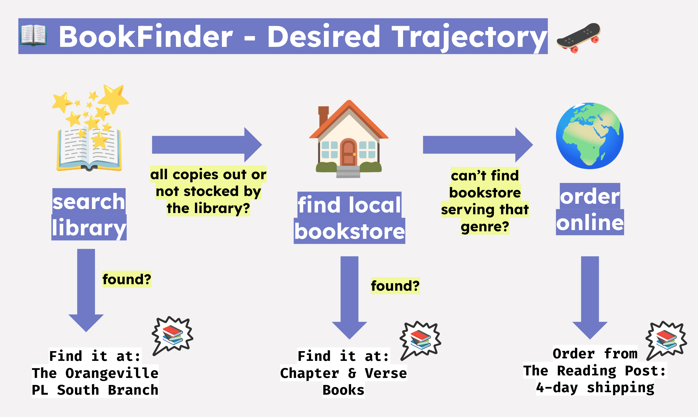

# BookFinder - ADK Agent Evaluation Demo 

This is a simple, mocked agent designed to demonstrate [ADK Evaluation](). The agent's task is to take in a book title, and find the fastest way to get a copy of the book to the user.



### How to run the agent locally 

```
uv sync 
uv run adk web 
```

*Prompts to try*: 
- "I'm looking for a copy of Pride and Prejudice."
- "There There by Tommy Orange - where can I find it quick?" 
- "The Bluest Eye by Toni Morrison" 
- "Heartstopper (Alice Oseman) - vol 1" 

### Evaluate the agent 

```bash 
uv run adk eval bookfinder bookfinder/heartstopper.test.json --config_file_path=bookfinder/test_config.json --print_detailed_results  
```

You can see an example output (test passed) in `bookfinder/heartstopper_eval_output.json`. 