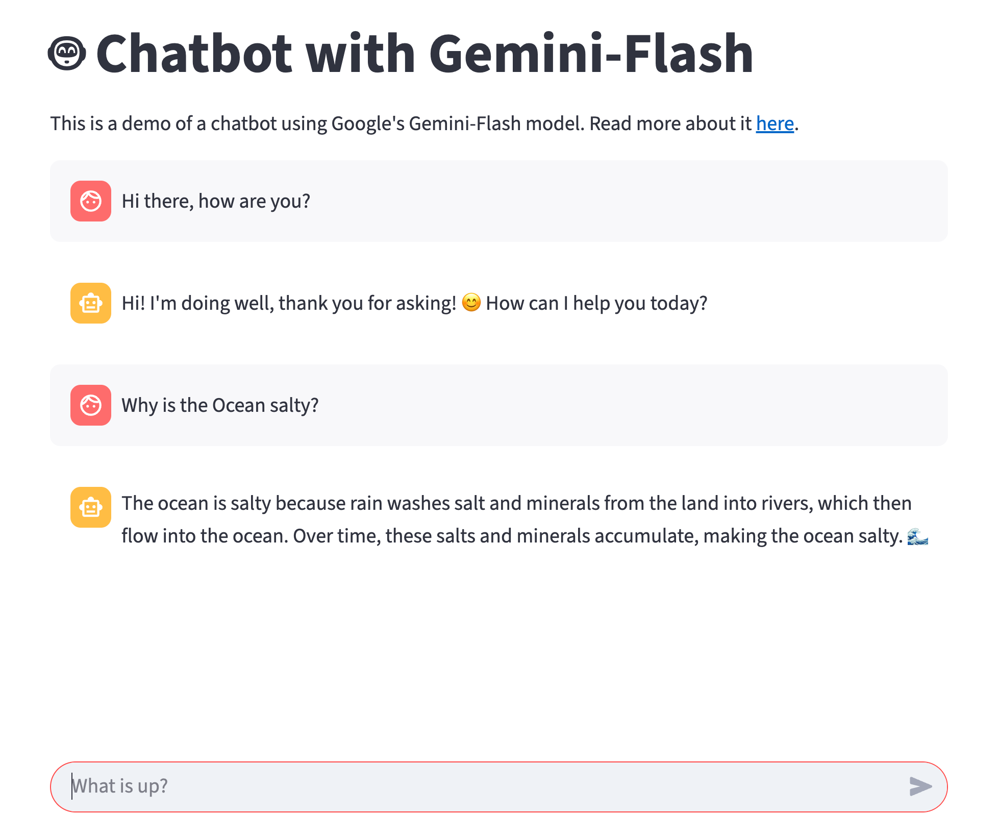

# How to build a simple Streamlit chatbot using Gemini 2.5 Flash Lite model

In this blog post, I will show you how to use the Gemini Flash model to build a chatbot using Streamlit.
Compared to my [past works](https://medium.com/google-cloud/how-to-deploy-your-streamlit-web-app-to-google-cloud-run-with-ease-c9f044aabc12),
in this post, I use latest version of Streamlit and new Google GenAI SDK.

## What is different?

> Skip this section, if you are not familiar with my old blog post or if you don't know of Google Vertex AI SDK.

Let's start by understanding, how and why this blog post is different from my past works.

Google has offered Gemini Models services in 2 -3 different ways. For those where are following regular updates these are easy to graps but for general crowd, this has become a little challenge and this is mainly due to the every update in AI/LLM topics.

Personally, I have felt that AI updates are like an unexpected storms 🌪️. So here is short version. From a backend programmer lens 🧐, Google offered Gemini Models access in 3️⃣ ways: (1) Google AI Studio API Keys (2) Google Cloud Project - Application Default Credentials (ADC) (3) Google Cloud Gemini API keys.

(Off-topic: I have used all these 3️⃣ ways and I find using Google Cloud ADC is my preferred option. This is because it is easy to use, feel more secure than others. In production environments, I prefer to use Terraform code to update my services accounts to have required credentials.)

Google-GenAI SDK acts as a standalone SDK for all these 3️⃣ ways of accessing Gemini Models. Also switching the authentication methods takes only a 2–3 lines of code. If you like to use ENVIRONMENT variables, or a .env file then your code becomes more portable. To learn more about, check https://github.com/googleapis/python-genai/

## Setup

Create a virtual environment and install dependencies.

```shell
python -m venv .venv
source .venv/bin/activate
pip install -r requirements.txt
```

If you like to use UV, then

```shell
uv venv
uv add -r requirements.txt
```

### Download the code

```shell
git clone git@github.com:GoogleCloudPlatform/devrel-demos.git
cd devrel-demos/ai-ml/gemini-chatbot-app/lesson03 
```

### Mandatory steps to access Gemini Models from you Google Cloud Project.

I have installed `Gcloud` tool and used [Application Default Credentials](https://cloud.google.com/docs/authentication/application-default-credentials) to get the credentials.

If you want to run the code in Google Cloud project, then you need to update respective service account with the required permissions. Check out this [user-managed service account](https://cloud.google.com/docs/authentication/set-up-adc-attached-service-account) article.

### Run the code (locally in CLI)

Run the code locally using `python` command. This allows you to check if the application can authenticate and get the response from Gemini Model.

```bash
python llm.py
```

Samples Logs:
```logs
(venv) sampath:lesson03 sampathm$ python llm.py 
Chat session ID: 4563963584
Enter your question (or 'exit' to quit)

User: Hi there
Model: Hello! 👋 How can I help you today?


User: exit
Exiting the chat session. Goodbye!
(venv) sampath:lesson03 sampathm$
```

### Run the code (locally in Google Chrome)

```shell
streamlit run streamlit_app.py
```

Samples Logs:
```logs
(venv) sampath:lesson03 sampathm$ streamlit run streamlit_app.py

  You can now view your Streamlit app in your browser.

  Local URL: http://localhost:8501
  Network URL: http://192.0.0.2:8501

  For better performance, install the Watchdog module:

  $ xcode-select --install
  $ pip install watchdog
            
Chat session ID: 4604152912
2025-07-07 18:54:50,592 - INFO - New chat session initialized.
```

### Deploy the app to Cloud RUn

```shell
bash deploy.sh
```

Example Logs

```logs
(venv) sampath:lesson03 sampathm$ bash deploy.sh 
Building using Buildpacks and deploying container to Cloud Run service [simple-app] in project [go-zeroth] region [europe-north1]
⠹ Building and deploying... Uploading sources.                                                      
  ⠹ Uploading sources...                                                                            
  . Building Container...                                                                           
✓ Building and deploying... Done.                                                                   
  ✓ Uploading sources...                                                                            
  ✓ Building Container... Logs are available at [https://console.cloud.google.com/cloud-build/builds
  ;region=europe-north1/XXXX-XXX-XXXX-XXXX-XXXX?project=0001110001110].                 
  ✓ Creating Revision...                                                                            .
  ✓ Routing traffic...                                                                              
  ✓ Setting IAM Policy...                                                                           
Done.                                                                                               
Service [simple-app] revision [simple-app-00004-hs7] has been deployed and is serving 100 percent of traffic.
Service URL: https://simple-app-0001110001110.europe-north1.run.app

(venv) sampath:lesson03 sampathm$ 
```

🎉👏🎊 Congratulations! You have successfully deployed your first web application on Google Cloud Platform.




## Conclusion
In this lesson, we learned how to deploy a simple web application using Google Cloud Run. We also learned about the different components of a container.

