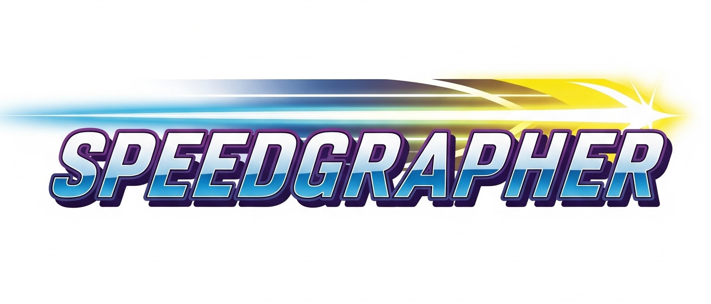
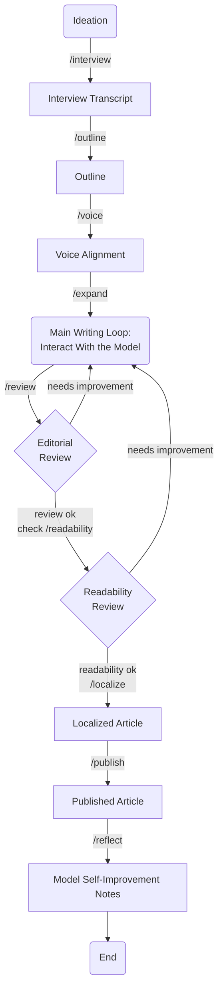

# Speedgrapher

> This is not an officially supported Google product.

Speedgrapher is a local MCP server written in Go, designed to assist writers by providing a suite of tools to streamline the writing process.

## What is it?

Speedgrapher is an MCP server designed to assist professional writers, with a particular focus on those in the tech industry. It provides a suite of tools and resources to streamline the writing process, from research and drafting to editing and publishing. The server is designed to be used as a local companion, running on the writer's own machine.

## How it works

Speedgrapher is written in Go and implements the Model Context Protocol (MCP). It uses the [official Go SDK for MCP](https://github.com/modelcontextprotocol/go-sdk) and communicates over the `stdio` transport layer. This design choice makes it a lightweight and secure local server, with no need for network deployment.

## Installation

### Gemini CLI (Extension)

Clone and install the extension:

```sh
git clone https://github.com/danicat/speedgrapher.git && cd speedgrapher
make extension
```

### Gemini CLI (MCP Server)

Clone and install the binary:

```sh
git clone https://github.com/danicat/speedgrapher.git && cd speedgrapher
make build
make install
```

Add this configuration to your `.gemini/settings.json`:

```json
{
    "mcpServers": {
        "speedgrapher": {
            "command": "speedgrapher"
        }
    }
}
```


## Available Tools

### Gunning Fog Index

The `fog` tool calculates a readability score (adapted from the [Gunning Fog Index](https://en.wikipedia.org/wiki/Gunning_fog_index)) for a given text.

The tool returns not only the numerical Fog Index but also a qualitative classification to help writers calibrate their text for a specific audience.

**Classification Levels:**

*   **Unreadable:** (Score >= 22) - Likely incomprehensible to most readers.
*   **Hard to Read:** (Score 18-21) - Requires significant effort, even for experts.
*   **Professional Audiences:** (Score 13-17) - Best for readers with specialized knowledge.
*   **General Audiences:** (Score 9-12) - Clear and accessible for most readers.
*   **Simplistic:** (Score < 9) - May be perceived as childish or overly simple.

## Available Prompts

Speedgrapher's functionality is exposed through a series of prompts, which can be used as slash commands in a compatible client.

| Command | Description | Example |
| --- | --- | --- |
| `/context` | Loads the current work-in-progress article to context for further commands. | `/context` |
| `/expand` | Expands a working outline or draft into a more detailed article. | `/expand hint="add a section on error handling"` |
| `/haiku` | Creates a haiku about a given topic. | `/haiku topic="Go programming"` |
| `/interview` | Interviews an author to gather material for an article. The interview is saved to `INTERVIEW.md`. | `/interview` |
| `/localize` | Translates the article currently being worked on into a target language. | `/localize target_language="Brazilian Portuguese"` |
| `/outline` | Generates a structured outline of the current draft, concept or interview report. | `/outline` |
| `/publish` | Publishes the final version of the article. | `/publish` |
| `/readability` | Analyzes the last generated text for readability using the Gunning Fog Index. | `/readability` |
| `/reflect` | Analyzes the current session and proposes improvements to the development process. | `/reflect` |
| `/review` | Reviews the article currently being worked on against the editorial guidelines. | `/review` |
| `/voice` | Analyzes the voice and tone of the user's writing to replicate it in generated text. | `/voice hint="~/Documents/my-articles"` |

## Example Editorial Workflow

Speedgrapher is designed to support a clear and iterative writing process. Below is a simplified workflow that leverages the available prompts to take an idea from concept to a polished, published article.

### The Flow in Words

The writing process is a cycle of ideation, drafting, and revision.

1.  **Ideation & Interview:** The process begins with an idea. Use the `/interview` prompt to brainstorm with the model, which will help you flesh out your concept by asking relevant questions. The full interview will be saved to `INTERVIEW.md`.
2.  **Outline:** Use the `/outline` prompt to generate a structured outline from the interview or your own notes.
3.  **Voice Alignment:** Use the `/voice` prompt to align the model with your unique writing style, ensuring the generated text sounds authentic.
4.  **Main Writing Loop:** This is the core creative phase. Use the `/expand` prompt to turn your outline or initial draft into a more detailed article. You can interact with the model to write, edit, and refine the article until you have a solid draft.
5.  **Review & Revision:**
    *   **Editorial Review:** Use the `/review` command to check the draft against editorial guidelines. If it needs improvement, the feedback will guide you as you loop back to the **Main Writing Loop**.
    *   **Readability Review:** Once the editorial review is complete, use the `/readability` command to check its accessibility. If it needs improvement, you can loop back to the **Main Writing Loop**.
    *   **Note on Context:** To ensure the review tools have the most up-to-date content, it is good practice to run `/context` before the `/review` and `/readability` commands.
6.  **Finalization:**
    *   **Localization:** Use the `/localize` command to translate the approved article into other languages.
    *   **Publish:** Use the `/publish` command to initiate the publishing process for your work.
7.  **Reflection:** At the end of the session, use the `/reflect` prompt to have the model analyze the collaboration and generate notes on how to improve the process for the next time.

### The Flow in a Diagram



## Resources

*   **Model Context Protocol Specification:** [https://modelcontextprotocol.io/specification/2025-06-18](https://modelcontextprotocol.io/specification/2025-06-18)
*   **Go SDK for MCP:** [https://github.com/modelcontextprotocol/go-sdk](https://github.com/modelcontextprotocol/go-sdk)
*   **How to build an MCP server with Gemini CLI and Go:** [https://danicat.dev/posts/20250729-how-to-build-an-mcp-server-with-gemini-cli-and-go/](https://danicat.dev/posts/20250729-how-to-build-an-mcp-server-with-gemini-cli-and-go/)