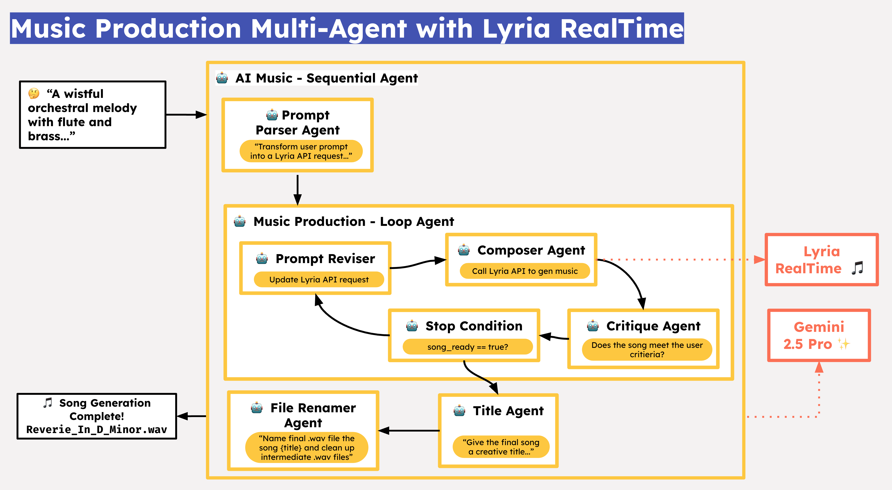

# Multi-Agent Orchestra: Music Production with Lyria RealTime, ADK and A2A 

This directory contains a multi-agent music production example, using: 
- [Agent Development Kit - Python (ADK)]()
- the [Agent2Agent (A2A)]() Protocol
- the [Lyria RealTime API](https://ai.google.dev/gemini-api/docs/music-generation#how-lyria-works) - Google AI Studio (Music generation)
- [Gemini 2.5 Pro](https://ai.google.dev/gemini-api/docs/models) - Google AI Studio (Text generation and reasoning)

### Architecture 

 


This multi-agent system has a root `SequentialAgent` that "harcodes" the core music production flow to run in succession, which is: parse the user's music generation request, run a music production loop, then give the final song a title. 

Within the music production `LoopAgent`, the Composer Agent (custom audio streaming agent) calls Lyria RealTime to generate music. The Critique Agent uses Gemini to analyze the generated song, and determine if it meets the user's requirements. If it does, the Critique Agent sets the `song_ready` state field to `true`, and the loop exist. If the Critique Agent has further recommendatinos to improve the song, the loop continues and a new Lyria API request is created (Prompt Reviser agent). 

Once the song is ready and the loop exits, the Title Agent calls Gemini to generate a creative song title. Lastly, the File Renamer Agent produces a final `.wav` file for the user, and cleans up intermediate artifacts. 

### Run locally 

1. Get a [Google AI Studio API key]() if you don't already have one, and set it as an environment variable. 

```bash
export GOOGLE_API_KEY="your-ai-studio-key"
```

2. Clone this repository, and `cd` into the sample directory. 

```bash
git clone https://github.com/GoogleCloudPlatform/devrel-demos
cd devrel-demos/ai-ml/multi-agent-orchestra
```

3. Run the root agent Runner to interact with the music multi-agent via CLI. (Note that this demo does not yet support the ADK Web UI). 

```bash
uv run root_agent.py
```

### Deploy to Google Cloud Run 
