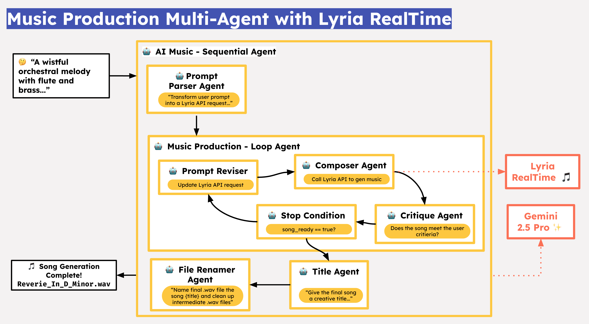
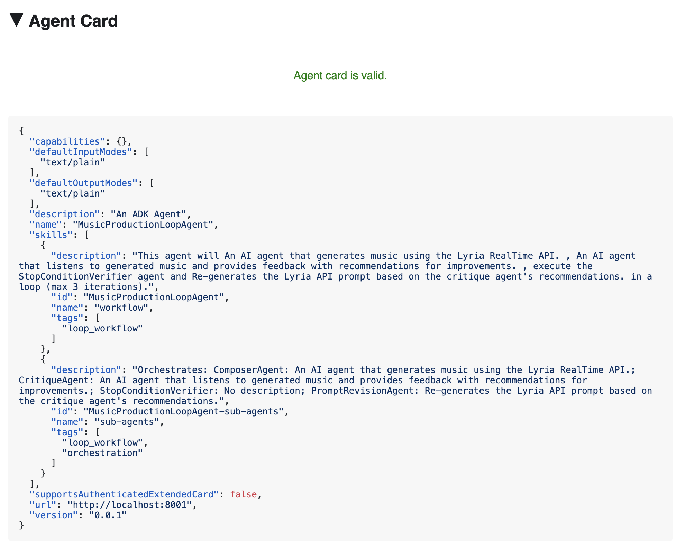

# Multi-Agent Orchestra: Music Production Demo with A2A, ADK, and Lyria RealTime

This directory contains a multi-agent music production example, using: 
- [Agent Development Kit - Python (ADK)](https://google.github.io/adk-docs/agents/workflow-agents/)
- the [Agent2Agent (A2A)](https://a2a-protocol.org/latest/) Protocol
- the [Lyria RealTime API](https://ai.google.dev/gemini-api/docs/music-generation#how-lyria-works) - Google AI Studio (Music generation)
- [Gemini 2.5 Pro](https://ai.google.dev/gemini-api/docs/models) - Google AI Studio (Text generation and reasoning)

### Architecture 

 


This multi-agent system has a root `SequentialAgent` that "harcodes" the core music production flow to run in succession, which is: parse the user's music generation request, run a music production loop, then give the final song a title. 

Within the music production `LoopAgent`, the Composer Agent (custom audio streaming agent) calls Lyria RealTime to generate music. The Critique Agent uses Gemini to analyze the generated song, and determine if it meets the user's requirements. If it does, the Critique Agent sets the `song_ready` state field to `true`, and the loop exits. If the Critique Agent has further recommendatinos to improve the song, the loop continues and a new Lyria API request is created (Prompt Reviser agent), which is in turn passed to the Composer Agent. The loop runs through a maximum of 3 iterations before the song is automatically deemed "ready."

Once the song is ready and the loop exits, the Title Agent calls Gemini to generate a creative song title. Lastly, the File Renamer Agent produces a final `.wav` file for the user, and cleans up intermediate artifacts. 

### Run locally 

**Prerequisites**: 
- Python 3.12+
- [`uv`](https://docs.astral.sh/uv/getting-started/installation/) 
- `brew install portaudio` 

1. Get a [Google AI Studio API key](https://ai.google.dev/gemini-api/docs/api-key) if you don't already have one, then set it as an environment variable. 

```bash
export GOOGLE_API_KEY="your-ai-studio-key"
```

2. Clone this repository, and `cd` into the sample directory. 

```bash
git clone https://github.com/GoogleCloudPlatform/devrel-demos
cd devrel-demos/ai-ml/multi-agent-orchestra
```

3. Run a uvicorn server for the remote agent (music production loop). 

```bash
source .venv/bin/activate
uvicorn music_production_loop_agent:a2a_app --host localhost --port 8001
```

4. Run the A2A inspector to verify that the remote agent's Card is accessible over localhost. 

https://github.com/a2aproject/a2a-inspector 

```

```

Can also access at: http://localhost:8001/.well-known/agent.json



5. Open another terminal tab, keeping the `uvicorn` server running for the production loop agent. Run the root agent Runner to interact with the music multi-agent via CLI. (Note that this demo does not yet support the ADK Web UI). 

```bash
cd root_agent
uv sync 
uv run root_agent.py 
```

### Deploy Agents to Google Cloud Run 

TODO!