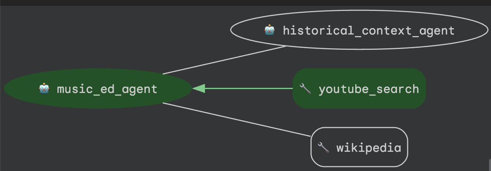
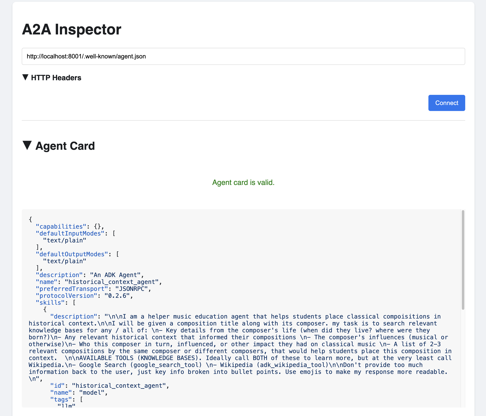
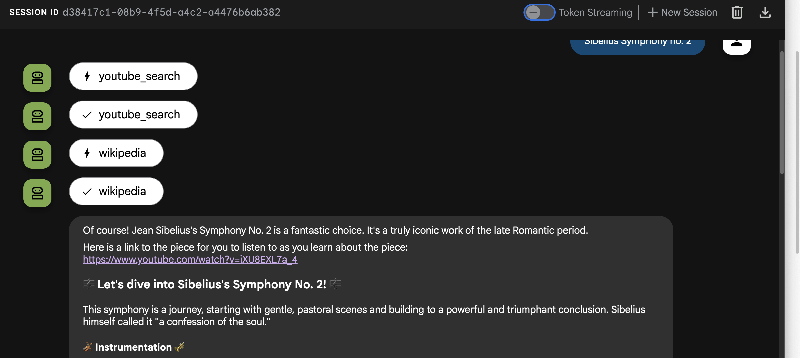

# 🎻 Music Education Multi-Agent with ADK and A2A 🎼



## Run Locally

**Prerequisites**: 
- Python 3.12  
- [uv](https://docs.astral.sh/uv/) (Python package manager)

**Run the Historical Context Agent (`RemoteA2AAgent`)** 

Rather than running this in the ADK Web UI or with an interactive runner, we'll run this helper agent as a backend *API server* that our root Music Education Agent can call. 

```bash
source .venv/bin/activate

uvicorn history_agent.agent:a2a_app --host localhost --port 8001

```

**Verify that the Agent Card is available over Localhost**: 

Navigate to: http://localhost:8001/.well-known/agent.json 

*Expected output*

``json
{"capabilities":{},"defaultInputModes":["text/plain"],"defaultOutputModes":["text/plain"],"description":"An ADK Agent","name":"history_agent","protocolVersion":"0.2.6","skills":[{"description":"\n\nI am a helper music education agent that helps students place classical compoisitions...
```

**[Optional] Run the A2A Inspector**: 

```bash
git clone https://github.com/a2aproject/a2a-inspector.git
cd a2a-inspector
uv sync
cd frontend
npm install
cd ..
chmod +x run.sh
./run.sh
```

*Expected output*: 

```bash
Starting backend server...
A2A Inspector is running!
Frontend PID: 36525
Backend PID: 36549
Press Ctrl+C to stop both services
[BACKEND] INFO:     Will watch for changes in these directories: ['/Users/mokeefe/a2a-inspector/backend']
[BACKEND] INFO:     Uvicorn running on http://127.0.0.1:5001 (Press CTRL+C to quit)
```

Open http://127.0.0.1:5001 in a browser. Then, enter the following as the Agent Card URL: `http://localhost:8001/.well-known/agent.json ` 

*Expected output*: 




**Run the Music Education Agent**: 

In another terminal tab, from the `music-education-a2a` root directory: 

```bash 
export REMOTE_AGENT_CARD="http://localhost:8001/.well-known/agent.json"
uv run adk web
```

**Test prompts:**
- Dvorak 9th Symphony 2nd movement 
- Rachmaninov 2nd piano concerto 1st movement
- Brahms 3rd Symphony 3rd movement
- Bach - Goldberg Variations
- Mozart Sinfonia Concertante in E flat
- Mahler Symphony no. 2 finale
- Wagner Tristan und Isolde
- Sibelius Symphony no. 2 
- Symphony No. 5 in C Minor, Op. 67 by Ludwig van Beethoven
- "Eine kleine Nachtmusik" (Serenade No. 13 for strings in G major), K. 525 by Wolfgang Amadeus Mozart: 
- Toccata and Fugue in D Minor, BWV 565 by Johann Sebastian Bach: 
-"Clair de lune" from Suite bergamasque by Claude Debussy 
- "Ride of the Valkyries" from Die Walküre by Richard Wagner 

... Or any classical music piece you want to learn more about! 



## Run in Google Cloud 

**Prerequisites**:
- A Google Cloud project 
- gcloud CLI
- Docker or other container runtime with Docker CLI 
- AI Studio API Key (Gemini API)


**Cloud Run Setup** (Enable APIs, create Artifact Registry repository)

```bash
export GEMINI_API_KEY="your-ai-studio-api-key"

export PROJECT_ID="your-project-id"
gcloud config set project $PROJECT_ID 

gcloud services enable run.googleapis.com

gcloud artifacts repositories create music-education-a2a \
    --repository-format=docker \
    --location=us-central1 

gcloud auth configure-docker us-central1-docker.pkg.dev
```

**Auth Setup** 

We want to secure communication from the music ed agent to the remote A2A history agent. To do this, we'll 

**Build and deploy history agent container image** -- 

```bash
HISTORY_TAG="us-central1-docker.pkg.dev/$PROJECT_ID/music-education-a2a/history-agent:latest"
docker build --platform linux/amd64 -f history_agent/Dockerfile -t $HISTORY_TAG .
docker push $HISTORY_TAG 
```

**Build and deploy music ed agent container image** --

```bash
MUSIC_TAG="us-central1-docker.pkg.dev/$PROJECT_ID/music-education-a2a/music-ed-agent:latest"
docker build --platform linux/amd64 -f music_ed_agent/Dockerfile -t $MUSIC_TAG .
docker push $MUSIC_TAG 
```

**Deploy history agent to Cloud Run** -- 

```bash
export GCP_REGION="us-central1" 
gcloud run deploy history-agent \
  --image $HISTORY_TAG \
  --region us-central1 \
  --port 8080 \
  --set-env-vars PROJECT_ID=$PROJECT_ID,GCP_REGION=$GCP_REGION
  --allow-unauthenticated \
  --memory 512Mi \
  --cpu 1 \
  --timeout 60s \ 
  --min 1
```

Copy the Cloud Run URL to the clipboard, and save as an environment variable -- 

```bash
export HISTORY_AGENT_URL="your-cloud-run-url"
export HISTORY_AGENT_CARD_URL="${HISTORY_AGENT_URL}/.well-known/agent.json"
```

Then, verify you can reach the Agent Card -- 

```bash
curl $HISTORY_AGENT_CARD_URL
```


**Deploy Music Ed agent to Cloud Run** - 

```bash
gcloud run deploy music-ed-agent \
  --image $MUSIC_TAG \
  --set-env-vars REMOTE_AGENT_CARD=$HISTORY_AGENT_CARD_URL,GEMINI_API_KEY=$GEMINI_API_KEY \
  --region us-central1 \
  --port 8080 \
  --allow-unauthenticated \
  --memory 1024Mi \
  --cpu 2 \ 
  --min 1
```