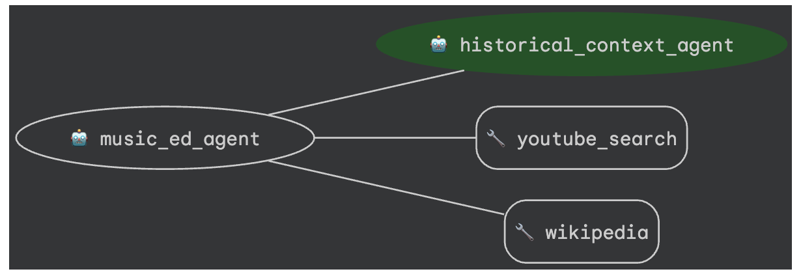

# 🎻 Music Education Multi-Agent with ADK and A2A 🎼



## Run Locally

**Prerequisites**: 
- A terminal with Python 3.10+ installed  
- uv (Python package manager)
- [ffmpeg](https://ffmpeg.org/) (eg. `brew install ffmpeg`)

**Run the Historical Context Agent (`RemoteA2AAgent`)** 

Rather than running this in the ADK Web UI or with an interactive runner, we'll run this helper agent as a backend *API server* that our root Music Education Agent can call. 

```bash
source .venv/bin/activate

uvicorn historical_context_agent.agent:a2a_app --host localhost --port 8001

```

**Verify that the Agent Card is available over Localhost**: 

Navigate to: http://localhost:8001/.well-known/agent.json 

*Expected output*

``json
{"capabilities":{},"defaultInputModes":["text/plain"],"defaultOutputModes":["text/plain"],"description":"An ADK Agent","name":"historical_context_agent","protocolVersion":"0.2.6","skills":[{"description":"\n\nI am a helper music education agent that helps students place classical compoisitions...
```

**[Optional] Run the A2A Inspector**: 

```bash
git clone https://github.com/a2aproject/a2a-inspector.git
cd a2a-inspector
uv sync
cd frontend
npm install
cd ..
chmod +x run.sh
./run.sh
```

*Expected output*: 

```bash
Starting backend server...
A2A Inspector is running!
Frontend PID: 36525
Backend PID: 36549
Press Ctrl+C to stop both services
[BACKEND] INFO:     Will watch for changes in these directories: ['/Users/mokeefe/a2a-inspector/backend']
[BACKEND] INFO:     Uvicorn running on http://127.0.0.1:5001 (Press CTRL+C to quit)
```

Open http://127.0.0.1:5001 in a browser. Then, enter the following as the Agent Card URL: `http://localhost:8001/.well-known/agent.json ` 

*Expected output*: 


**Run the Music Education Agent**: 

`export REMOTE_AGENT_CARD="http://localhost:8001/.well-known/agent.json"`

In another terminal tab, from the `music-education-a2a` root directory: 

```bash
uv run adk web
```

**Test prompts:**
- Dvorak 9th Symphony 2nd movement 
- Rachmaninov 2nd piano concerto 1st movement
- Brahms 3rd Symphony 3rd movement
- Bach - Goldberg Variations
- Mozart Sinfonia Concertante in E flat
- Mahler Symphony no. 2 finale
- Wagner Tristan und Isolde
- Sibelius Symphony no. 2 

... Or any piece you want to learn more about! 


## Run in Google Cloud 

TODO 