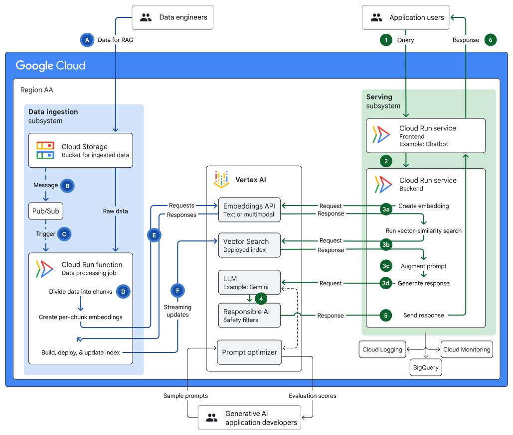

# RAG Architectures - App Source Code

This directory contains the application source code for the [Google Cloud Next 2025 breakout session: "Architectural approaches for RAG infrastructure."](https://cloud.withgoogle.com/next/25/session-library?session=BRK2-074#all), by Kumar Dhanagopal and [Megan O'Keefe](https://github.com/askmeegs). The sample application is a chatbot that uses a RAG (Retrieval-Augmented Generation) setup to answer questions about Quantum Computing.

The infrastructure code for this demo can be found in the [Architecture Center Samples repository](https://github.com/GoogleCloudPlatform/architecture-center-samples/tree/main/gen-ai-rag-vertex-ai-vector-search). 

## Demo Architecture 

## How to Run

### Prerequisites 

- A Google Cloud project with Billing enabled. 
- Google Cloud SDK (`gcloud` CLI) installed on your machine.
- Clone this repository to your local machine or Cloud Shell.
- Docker, or another container runtime that allows you to run `docker` commands. 

### Steps 

1. Follow the [Architecture Center Samples instructions]() to deploy the base infra, including the Cloud Run Storage bucket, Vertex AI Vector Search index with endpoint, and the "shells" of the three Cloud Run Services. 
2. Build, push, and deploy the `ingestion` Cloud Run Function. See the [ingestion README](ingestion/README.md).
3. Build, push, and deploy the serving `backend` Cloud Run Service. See the [serving/backend README](serving/backend/README.md).
4. Build, push, and deploy the serving `frontend` Cloud Run Service. See the [serving/frontend README](serving/frontend/README.md). 
5. Test the demo by uploading one of the Wikipedia text articles from `ingestion/wikipedia-data` to the Cloud Storage bucket. Use the Cloud Run logs for the `ingestion` function to verify that the article was ingested and indexed in Vertex AI Vector Search. 

Then, open the public URL for the Cloud Run `frontend` service. Ask a question related to the article you just uploaded, and view the response:    

