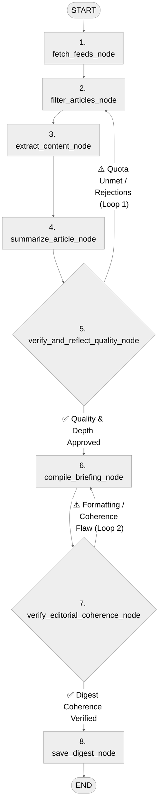

# Personal Tech-Briefing Digest Agent

A production-ready, autonomous AI digest agent built with the **Google Agent Development Kit 2.0 (ADK 2.0)** and deployed on **Google Cloud Run Instances** (singleton compute container) with persistent storage backed by **Google Cloud Storage (GCS) FUSE Volume Mounts**.

---

## 1. What is Google Cloud Run Instances?

[Cloud Run Instances](https://docs.cloud.google.com/run/docs/instances/create-and-manage-instances) is a container runtime primitive designed for long-running, stateful, and singleton workloads:

- **Always-On Singleton Worker:** Guarantees exactly one container instance (no scale-to-zero killing background loops, no multi-replica write collisions).
- **Predictable, Low-Cost Compute:** Runs 24/7 for **$5.70/month** using the smallest instance size (1 shared vCPU, 1 GiB memory) with burst capacity. Omitting CPU/memory flags uses the default instance size (2 vCPUs, 2 GiB) which costs ~$11.40/month.
- **Direct Cloud Storage Volume Mounting:** Mounts GCS buckets directly to `/data` via Cloud Storage FUSE for zero-ops local file persistence.
- **Built-in HTTPS & Custom Domains:** Provides a static HTTPS URL and built-in certificate management without additional load balancers.
- **7-Day Automatic Lifecycle Rotation:** Runs continuously for up to 7 days before Google Cloud gracefully restarts the instance. State is safely stored on the mounted GCS volume, allowing the agent to resume immediately upon restart.

---

## 2. System Architecture

The entire application runs inside a single Cloud Run Instance containing the web dashboard, background daemon, execution mutex, and the ADK 2.0 workflow engine:

```mermaid
%%{init: {'theme': 'neutral', 'themeVariables': { 'fontSize': '28px', 'fontFamily': 'sans-serif' }}}%%
flowchart TD
    User["👤 Developer / Reader (Browser)"]

    subgraph Instance ["Google Cloud Run Instance ($5.70/mo, Smallest Size)"]
        UI["⚡ FastAPI Web Reader & REST API"]
        Daemon["⏰ Asyncio Background Daemon (Every 6h)"]
        Mutex["🔒 In-Memory Execution Mutex (asyncio.Lock)"]
        Workflow["🤖 ADK 2.0 Graph Workflow Engine"]

        UI -->|Manual Trigger / API| Mutex
        Daemon -->|Scheduled Run (6h)| Mutex
        Mutex --> Workflow
    end

    Feeds["🌐 Hacker News Firebase API & RSS Feeds"]
    Gemini["✨ Gemini 2.5 Flash (Google GenAI SDK)"]
    Bucket[("🪣 Cloud Storage FUSE Mount (/data)")]

    User <===>|HTTPS / Live Dashboard| UI
    Workflow <--->|1. Ingest & Scrape| Feeds
    Workflow <--->|2. Filter & Summarize| Gemini
    Workflow <--->|3. Persist State & Digests| Bucket
```

---

## 3. ADK 2.0 Agent Workflow Architecture

The core intelligence is modeled as an 8-node ADK 2.0 workflow graph with two self-correcting reflection loops:



### Graph Node Breakdown:

1. **`fetch_feeds_node` (FunctionNode):** Concurrently queries the Hacker News Firebase REST API for top stories and discussion threads, alongside curated AI engineering blogs and research feeds. Filters candidate URLs against `seen_urls.json` to prevent re-processing items seen within the last 30 days.
2. **`filter_articles_node` (LlmAgent Node):** Ranks candidate articles matching the user's technical preference schema (`UserInterests`). Applies a strict diversity cap (max 1–2 articles per domain) and guarantees at least one high-engagement Hacker News item from the past 14 days is selected.
3. **`extract_content_node` (FunctionNode):** Concurrently downloads full article bodies and top discussion comments using Trafilatura, guarded by multi-layer SSRF validation.
4. **`summarize_article_node` (ParallelWorker Node):** Processes articles concurrently using `@node(parallel_worker=True)` and Gemini 2.5 Flash (`gemini-2.5-flash`), enforcing structured Pydantic schemas (`ArticleSummary`):
   - **TL;DR:** 1–2 sentences explaining what the project is and why it matters.
   - **Key Takeaways:** Exactly 2–3 bullet points strictly bounded to 15–25 words each, explaining internal mechanisms and architecture.
   - **Discussion Insights:** Direct synthesis of practitioner debates and trade-offs without conversational fluff.
5. **`verify_and_reflect_quality_node` (Reflection Loop 1):** Audits individual summaries for technical depth, grounding, and constraints.
6. **`compile_briefing_node` (FunctionNode):** Assembles the final Markdown digest with an integrated Table of Contents, dual links (`[🔗 Read Article]` and `[💬 Hacker News Discussion]`), and live score badges (`[🔥 {pts} pts • 💬 {comments}]` for Hacker News, `[📰 Curated]` for RSS).
7. **`verify_editorial_coherence_node` (Reflection Loop 2):** Evaluates whole-document structural coherence and scrapes for boilerplate leaks.
8. **`save_digest_node` (FunctionNode):** Atomically writes the briefing to `/data/digests/YYYY-MM-DD-digest.md` and `/data/digests/latest.md`, and records newly seen URLs in `/data/state/seen_urls.json`.

### Deep Dive: The Two Reflection Loops

#### 🔁 Reflection Loop 1: Article Quality & Grounding
* **Target:** Individual article summaries & source fidelity (`verify_and_reflect_quality_node` $\rightarrow$ `filter_articles_node` / `summarize_article_node`).
* **Validation Criteria:**
  - **Technical Depth & Developer Substance:** Evaluates whether the article provides genuine software/systems engineering value (filtering out marketing hype, minor changelog bumps, or copyright/app store drama).
  - **Grounding & Hallucination Defense:** Verifies that takeaways strictly represent the source text without hallucinated claims.
  - **Strict Scope Separation:** Enforces that the **TL;DR** covers *what/why* (product pitch/core problem) while **Key Takeaways** cover *how* (internal mechanisms/parameters) with exactly 2–3 bullets of 15–25 words and zero lexical overlap.
  - **Link Liveliness:** Pings URLs with HTTP HEAD/GET requests to prune dead or paywalled pages.
* **Feedback Mechanism:** Approved articles are added to `SessionShortTermMemory.approved_summaries`. Rejected articles are logged in `rejected_urls` with critique notes (`filter_guidance`). If the approved quota is unmet, the workflow routes back to `filter_articles_node` with memory guidance so the filter node selects better candidates without repeating past mistakes.

#### 🔁 Reflection Loop 2: Document-Level Editorial Coherence
* **Target:** The assembled Markdown briefing document as a whole (`verify_editorial_coherence_node` $\rightarrow$ `compile_briefing_node`).
* **Validation Criteria:**
  - **Whole-Document Integrity:** Ensures the Table of Contents, anchor jump links, dual links (`[🔗 Read Article]` and `[💬 Discussion]`), and engagement badges render properly without broken markdown.
  - **Anti-Boilerplate Scrubbing:** Verifies that no crawler artifact text (e.g., cookie banners, navigation stubs, "Enable JavaScript") leaked into the final output.
  - **Editorial Balance:** Ensures balanced coverage across sources according to domain diversity caps.
* **Feedback Mechanism:** If structural flaws or boilerplate leaks are detected, the node attaches corrective feedback to workflow state and routes back to `compile_briefing_node` to regenerate the Markdown file before it is written to disk. Once coherence score $\ge 8/10$, it advances to `save_digest_node`.

---

## 4. Codebase Structure

```text
├── Dockerfile                  # Multi-stage container build with non-root appuser (UID 1000)
├── pyproject.toml              # Dependencies (adk, google-genai, fastapi, trafilatura, uvicorn)
├── README.md                   # System documentation and deployment guide
├── blog_part1.md               # Conceptual guide: Building long-running agents for $5.70/mo
├── blog_code_step_by_step.md   # Step-by-step code and architecture walkthrough
├── digest_agent/
│   ├── __init__.py             # Exports root_agent and FastAPI app
│   ├── config.py               # Path discovery, feed registry, and runtime configuration
│   ├── schemas.py              # Pydantic v2 data models for ADK state and reflection
│   ├── utils.py                # SSRF guards, scrapers, NLP extractors, and atomic I/O
│   ├── agent.py                # ADK 2.0 workflow graph nodes and reflection loops
│   └── server.py               # FastAPI server, dark-mode UI viewer, and background daemon
└── tests/
    ├── __init__.py
    ├── test_utils.py           # SSRF, atomic persistence, and text extraction tests (45 tests)
    ├── test_workflow.py        # ADK 2.0 workflow, reflection loops, and schema tests (15 tests)
    └── test_server.py          # FastAPI endpoints, HTML rendering, and mutex tests (8 tests)
```

---

## 5. Quickstart: Run and Test Locally

Before deploying to the cloud, you can test the entire workflow, run the unit test suite, and launch the interactive web reader dashboard on your local machine.

### Step 1: Clone and Setup Environment
```bash
# Clone repository
git clone https://github.com/GoogleCloudPlatform/devrel-demos.git
cd devrel-demos/ai-ml/tech-briefing-agent

# Create and activate virtual environment
python3 -m venv .venv
source .venv/bin/activate

# Install dependencies in editable mode
pip install -e ".[dev]"
```

### Step 2: Run the Pytest Test Suite
Verify that all 68 unit tests, security validations, and ADK reflection flows pass:
```bash
pytest tests/ -v
# 68 passed in ~1.1s
```

### Step 3: Run the Local Development Server
```bash
# Export your Gemini API key (or add to a local .env file)
export GEMINI_API_KEY="your-gemini-api-key"
export DATA_DIR="./data"

# Launch the FastAPI application
uvicorn digest_agent.server:app --reload --port 8080
```

Open **`http://localhost:8080`** in your browser to view the interactive reader dashboard or trigger an on-demand briefing generation.

---

## 6. Deploy to Google Cloud Run Instances

Once you have verified the agent locally, follow these 6 steps to deploy it to Google Cloud Run Instances for always-on 24/7 background operation.

### Step 1: Enable Cloud Services
```bash
export PROJECT_ID="your-project-id"
export REGION="us-west1"
export BUCKET_NAME="${PROJECT_ID}-agent-data"
export REPO_NAME="agent-repo"

gcloud config set project $PROJECT_ID
gcloud services enable \
    run.googleapis.com \
    storage.googleapis.com \
    artifactregistry.googleapis.com \
    cloudbuild.googleapis.com \
    secretmanager.googleapis.com
```

### Step 2: Create Storage Bucket for State Persistence
```bash
gcloud storage buckets create gs://$BUCKET_NAME \
    --location=$REGION \
    --uniform-bucket-level-access
```

### Step 3: Build & Push Container Image
```bash
gcloud artifacts repositories create $REPO_NAME \
    --repository-format=docker \
    --location=$REGION

gcloud builds submit \
    --tag ${REGION}-docker.pkg.dev/${PROJECT_ID}/${REPO_NAME}/tech-briefing-agent:latest .
```

### Step 4: Create Dedicated Service Account
```bash
gcloud iam service-accounts create briefing-agent-sa \
    --display-name="Briefing Agent SA"

gcloud storage buckets add-iam-policy-binding gs://$BUCKET_NAME \
    --member="serviceAccount:briefing-agent-sa@${PROJECT_ID}.iam.gserviceaccount.com" \
    --role="roles/storage.objectUser"
```

### Step 5: Store Gemini API Key in Secret Manager
```bash
echo -n "YOUR_GEMINI_API_KEY" | gcloud secrets create gemini-api-key \
    --data-file=- \
    --replication-policy="automatic"

gcloud secrets add-iam-policy-binding gemini-api-key \
    --member="serviceAccount:briefing-agent-sa@${PROJECT_ID}.iam.gserviceaccount.com" \
    --role="roles/secretmanager.secretAccessor"
```

### Step 6: Launch the Cloud Run Instance
```bash
gcloud beta run instances create tech-briefing-agent \
    --image=${REGION}-docker.pkg.dev/${PROJECT_ID}/${REPO_NAME}/tech-briefing-agent:latest \
    --region=$REGION \
    --port=8080 \
    --cpu=1 \
    --memory=1Gi \
    --public \
    --service-account=briefing-agent-sa@${PROJECT_ID}.iam.gserviceaccount.com \
    --add-volume mount-path=/data,type=cloud-storage,mount-options="uid=1000;gid=1000;file-mode=0700;dir-mode=0700",bucket=$BUCKET_NAME \
    --set-secrets "GEMINI_API_KEY=gemini-api-key:latest" \
    --set-env-vars "DATA_DIR=/data"
```

> [!IMPORTANT]
> Explicitly setting `--cpu=1` and `--memory=1Gi` selects the **smallest instance size** to lock the compute cost to **$5.70/month**. If you omit these flags, Cloud Run defaults to 2 vCPUs and 2 GiB memory (~$11.40/month). The `mount-options="uid=1000;gid=1000;file-mode=0700;dir-mode=0700"` matches the non-root `appuser` in the Dockerfile.

---

## 7. Security & Reliability Engineering

- **Server-Side Request Forgery (SSRF) Defense:** Multi-layer DNS and IP validator (`is_safe_url`) blocking cloud metadata endpoints (`169.254.169.254`), RFC 1918 private subnets (`10.0.0.0/8`, `172.16.0.0/12`, `192.168.0.0/16`), loopbacks (`127.0.0.0/8`, `::1`), and link-local ranges.
- **Indirect Prompt Injection Defense:** All scraped third-party HTML text is encapsulated in `<untrusted_content>` XML tags. Prompts instruct Gemini to treat enclosed text strictly as passive input.
- **Cloud Storage FUSE Atomic Persistence:** Cloud Storage FUSE does not support POSIX advisory locks required by SQLite. All file writes (`seen_urls.json` and Markdown digests) use atomic temporary files with `os.replace` to prevent data corruption.
- **In-Memory Mutex (`asyncio.Lock`):** Serializes manual web requests and scheduled daemon jobs, preventing file write contention.

---

## 8. API Reference

| Method | Endpoint | Description |
| :--- | :--- | :--- |
| `GET` | `/` or `/digest/latest` | Renders the latest generated briefing in the responsive dark-mode HTML reader. |
| `GET` | `/api/digests` | Returns JSON metadata and filenames for all archived historical digests. |
| `GET` | `/api/digest/{filename}` | Returns raw Markdown content for a specific historical digest file. |
| `POST` | `/api/generate` | Triggers an on-demand briefing generation run (supports `force_refresh=true` and custom `topics`). |
| `GET` | `/healthz` | Health check endpoint for uptime probes and load balancers. |

---

## 9. Monthly Production Bill Breakdown

| Component | Usage Profile | Monthly Cost |
| :--- | :--- | :--- |
| **Cloud Run Instance** | Smallest instance size (1 shared vCPU, 1 GiB memory, not default 2 vCPU / 2 GiB), 24/7 continuous uptime | $5.70 |
| **Gemini 2.5 Flash** | ~6 articles summarized 4 times per day (~720 LLM calls/month) | $0.07 |
| **Cloud Storage** | Storing markdown briefings and JSON cache files (< 50 MB) | $0.01 |
| **Network Egress** | Feed polling and web reader traffic | $0.00 |
| **Total Monthly Cost** | | **$5.78** |
