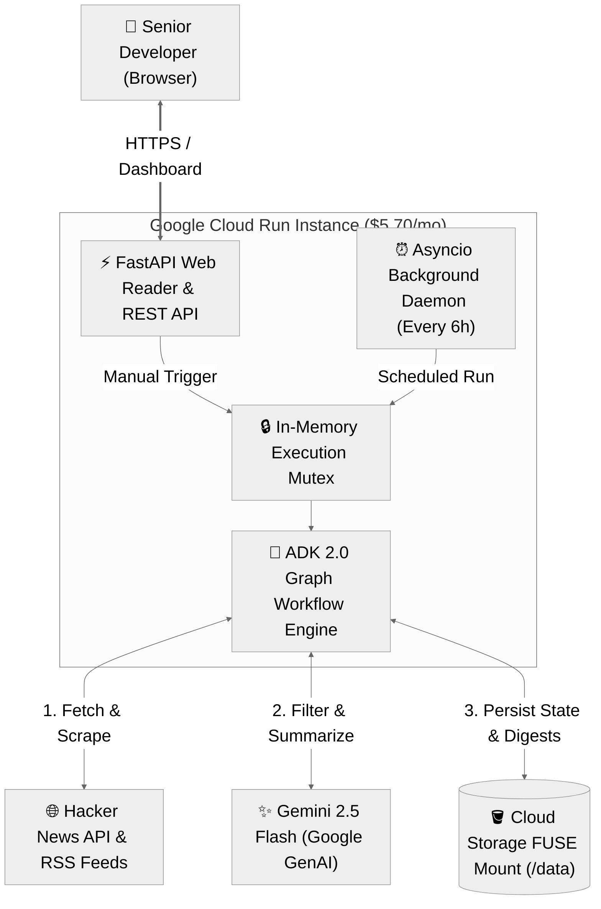
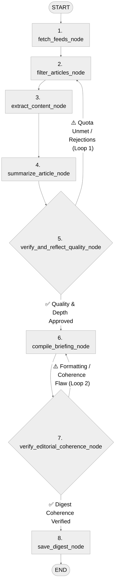

# Tech Briefing Agent: Code and Architecture Deep Dive

This guide provides a comprehensive, step-by-step technical explanation of the Personal Tech-Briefing Digest Agent codebase. It covers the system architecture, ADK 2.0 graph workflow, POSIX file persistence over Cloud Storage FUSE, FastAPI daemon, security guardrails, and deployment configurations.

---

## System Architecture Overview

The Tech Briefing Agent runs as a long-running daemon and web application inside a single **Google Cloud Run Instance** ($5.70/month using the smallest instance size of 1 shared vCPU / 1 GiB memory, rather than the 2 vCPU / 2 GiB default), persisting data directly to a mounted Cloud Storage bucket at `/data`.



---

## Codebase Structure

The project is structured into targeted Python modules:

```text
├── Dockerfile                  # Multi-stage container build with non-root appuser
├── pyproject.toml              # Project dependencies and packaging
├── digest_agent/
│   ├── config.py               # Runtime settings, paths, and feed definitions
│   ├── schemas.py              # Pydantic v2 data models for state and reflection
│   ├── utils.py                # SSRF guards, scrapers, NLP extractors, and atomic I/O
│   ├── agent.py                # ADK 2.0 workflow graph nodes and reflection loops
│   └── server.py               # FastAPI application, UI renderer, and daemon scheduler
└── tests/                      # Pytest suite with 68 unit and integration tests
```

---

## 1. Runtime Configuration (`digest_agent/config.py`)

The configuration module handles environment-driven path discovery and defaults.

```python
# Base data directory: defaults to /data when mounted in Cloud Run, falls back to ./data locally
_default_data_dir = "/data" if os.path.exists("/data") else "./data"
DATA_DIR = Path(os.getenv("DATA_DIR", _default_data_dir)).resolve()

STATE_DIR = DATA_DIR / "state"
DIGESTS_DIR = DATA_DIR / "digests"
SEEN_URLS_FILE = STATE_DIR / "seen_urls.json"

MAX_CONCURRENCY: int = int(os.getenv("MAX_CONCURRENCY", "4"))
RETENTION_DAYS: int = int(os.getenv("RETENTION_DAYS", "30"))
SCHEDULE_INTERVAL_HOURS: int = int(os.getenv("SCHEDULE_INTERVAL_HOURS", "6"))
DEFAULT_MODEL: str = os.getenv("GEMINI_MODEL", "gemini-2.5-flash")
```

### Key Highlights:
- **Automatic Path Resolution:** Automatically detects if `/data` exists (indicating a live Cloud Storage FUSE mount in Cloud Run) or falls back to `./data` for seamless local testing without environment overrides.
- **Retention Strategy:** `RETENTION_DAYS = 30` automatically prunes URLs from `seen_urls.json` that are older than 30 days to keep the state file small and fast to parse.

---

## 2. Typed Data Contracts (`digest_agent/schemas.py`)

We use Pydantic v2 models to ensure strict data integrity across all nodes:

- `ArticleMetadata`: Holds raw feed items, titles, canonical URLs, discussion URLs, engagement metrics (`points`, `comments_count`), and raw comments.
- `UserInterests`: Defines topic focus areas and minimum engagement thresholds.
- `ArticleSummary`: Represents structured LLM output with strict fields:
  - `tldr`: 1 to 2 sentence high-level overview explaining what the project is and why it matters.
  - `key_takeaways`: Exactly 2 to 3 bullet points, bounded to 15 to 25 words each, detailing internal mechanics.
  - `discussion_summary`: Direct synthesis of practitioner comments without conversational filler.
- `SessionShortTermMemory`: Carries adaptive critique notes across reflection loops.
- `DailyDigest`: Encapsulates the assembled Markdown document, article count, and generation timestamp.

---

## 3. Utilities, Security, and Storage (`digest_agent/utils.py`)

### SSRF Protection
The `is_safe_url` helper prevents Server-Side Request Forgery by resolving hostnames and blocking access to:
1. Cloud metadata endpoints (`169.254.169.254`).
2. Private RFC 1918 subnets (`10.0.0.0/8`, `172.16.0.0/12`, `192.168.0.0/16`).
3. Loopback interfaces (`127.0.0.0/8`, `::1`, `::ffff:127.0.0.1`).
4. Link-local ranges (`169.254.0.0/16`, `fe80::/10`).

```python
def is_safe_url(url: str) -> bool:
    try:
        parsed = urlparse(url)
        if parsed.scheme not in ("http", "https"):
            return False
        hostname = parsed.hostname
        if not hostname or hostname.lower() in ("localhost", "metadata.google.internal"):
            return False
        for family, _, _, _, sockaddr in socket.getaddrinfo(hostname, None):
            ip = ip_address(sockaddr[0])
            if ip.is_loopback or ip.is_private or ip.is_link_local or str(ip) == "169.254.169.254":
                return False
        return True
    except Exception:
        return False
```

### Prompt Isolation
Scraped third-party text is wrapped in `<untrusted_content>` tags to prevent indirect prompt injection attacks from overriding system instructions.

### Cloud Storage FUSE Atomic Persistence
Because Cloud Storage FUSE does not support POSIX advisory locks needed by SQLite, all writes to `seen_urls.json` and Markdown digests use atomic temporary files and rename operations (`os.replace`):

```python
def atomic_save_json(path: Path, data: Any) -> None:
    path.parent.mkdir(parents=True, exist_ok=True)
    temp_path = path.with_suffix(f".tmp.{os.getpid()}")
    try:
        with open(temp_path, "w", encoding="utf-8") as f:
            json.dump(data, f, indent=2, ensure_ascii=False)
            f.flush()
            os.fsync(f.fileno())
        os.replace(temp_path, path)
    finally:
        if temp_path.exists():
            temp_path.unlink()
```

---

## 4. ADK 2.0 Graph Workflow Engine (`digest_agent/agent.py`)

The core intelligence is modeled as an ADK 2.0 workflow graph:



### Graph Node Walkthrough:
1. **`fetch_feeds_node`:** Ingests top stories and comment threads from the Hacker News Firebase API concurrently alongside curated AI and engineering blogs and research feeds, filtering out seen URLs.
2. **`filter_articles_node`:** Applies relevance scoring, restricts sources to at most 1 to 2 articles per domain, and guarantees at least one recent Hacker News discussion is selected.
3. **`extract_content_node`:** Concurrently fetches article text and comment threads with multi-layer SSRF protection.
4. **`summarize_article_node`:** Uses `@node(parallel_worker=True)` with bounded semaphore concurrency (`MAX_CONCURRENCY=4`) to summarize articles with Gemini 2.5 Flash.
5. **`verify_and_reflect_quality_node` (Reflection Loop 1):** Audits individual summaries for technical depth, grounding, and constraints. Loops back to `filter_articles_node` with feedback if quota is unmet.
6. **`compile_briefing_node`:** Assembles the final Markdown document with Table of Contents, dual links (`[🔗 Read Article]` and `[💬 Hacker News Discussion]`), and live score badges.
7. **`verify_editorial_coherence_node` (Reflection Loop 2):** Evaluates whole-document structural coherence and scrapes for boilerplate leaks. Loops back to `compile_briefing_node` if issues are found.
8. **`save_digest_node`:** Atomically saves the briefing to `/data/digests/` and records seen URLs.

### Deep Dive: The Two Reflection Loops

#### 🔁 Reflection Loop 1: Article Quality & Grounding
- **Target:** Individual article summaries & source fidelity (`verify_and_reflect_quality_node` $\rightarrow$ `filter_articles_node` / `summarize_article_node`).
- **Validation Criteria:** Audits technical depth (filtering out marketing hype/drama), verifies factual grounding against source text, enforces strict 15–25 word takeaways with zero TL;DR overlap, and pings links for live reachability.
- **Feedback Loop:** Rejections are recorded in `SessionShortTermMemory.rejected_urls` with critique notes. If approved count is below quota, it loops back to `filter_articles_node` to select fresh candidates using the feedback guidance.

#### 🔁 Reflection Loop 2: Document-Level Editorial Coherence
- **Target:** The assembled Markdown briefing document as a whole (`verify_editorial_coherence_node` $\rightarrow$ `compile_briefing_node`).
- **Validation Criteria:** Checks document-level layout integrity, Table of Contents anchor links, dual links, engagement badges, and cleans any leaked crawler boilerplate text.
- **Feedback Loop:** If coherence score $< 8/10$ or malformed sections are detected, it loops back to `compile_briefing_node` to recompile a pristine Markdown digest before persisting to disk.

---

## 5. Web Server and Daemon (`digest_agent/server.py`)

The FastAPI application provides:
- **Responsive Web Dashboard (`GET /` & `GET /digest/latest`):** Dark-mode interface with dynamic Table of Contents, status badges, one-click link copying, and on-demand generation.
- **Execution Mutex (`asyncio.Lock`):** Serializes manual web requests and scheduled background jobs to prevent file write contention on Cloud Storage FUSE.
- **Background Scheduler:** An asynchronous loop running inside FastAPI lifespan that runs every 6 hours (`SCHEDULE_INTERVAL_HOURS=6`).
- **Graceful Shutdown:** Traps SIGTERM to allow in-flight workflows to flush state before container rotation.

---

## 6. Container Packaging (`Dockerfile`)

```dockerfile
FROM python:3.11-slim
WORKDIR /app
RUN apt-get update && apt-get install -y --no-install-recommends curl ca-certificates && rm -rf /var/lib/apt/lists/*
RUN pip install --no-cache-dir uv
COPY pyproject.toml README.md ./
RUN uv pip install --system --no-cache -e .
COPY digest_agent/ ./digest_agent/
RUN mkdir -p /data/digests /data/state
RUN useradd -u 1000 -m appuser && chown -R appuser:appuser /app /data
USER appuser
EXPOSE 8080
ENTRYPOINT ["uvicorn", "digest_agent.server:app", "--host", "0.0.0.0", "--port", "8080"]
```

Running as `appuser` (UID 1000) matches the volume mount permissions (`uid=1000;gid=1000;file-mode=0700;dir-mode=0700`) configured during Cloud Run instance creation.
