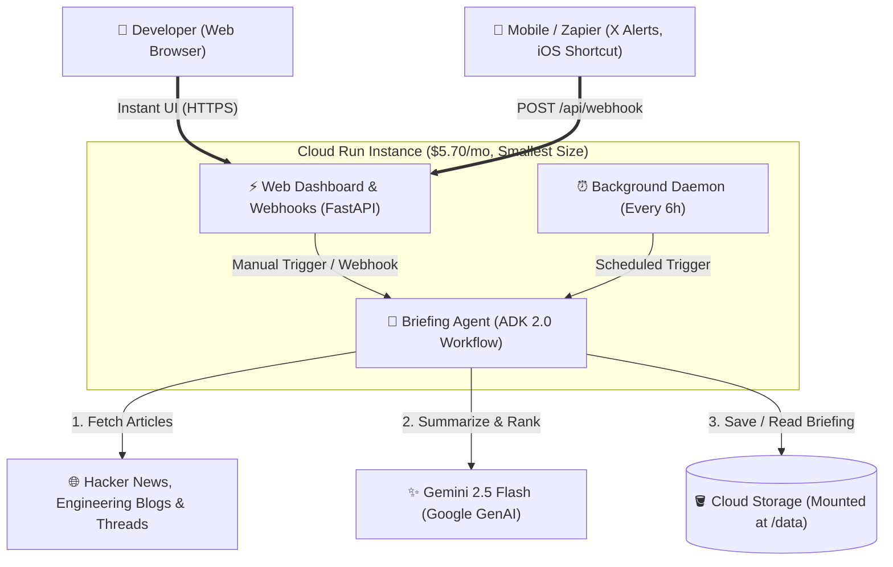

# Build a Long-Running Agent in the Cloud for $5.70/Month

How do you run an autonomous AI agent in the cloud 24/7 with persistent disk storage and an instant web reader for just $5.70 a month, without managing a virtual machine?

If you are building long-running agents that work in the background, you know the cloud hosting dilemma:

- **Standard serverless (like Cloud Run services or Lambda):** When traffic stops, the container scales to zero: killing your background loops and wiping your agent's active memory (RAM). On the flip side, a sudden traffic spike spins up multiple containers. If they try to write to your state file at the same time, your data gets corrupted. *(Note: Save your state with standard JSON or Markdown instead of SQLite. Cloud Run uses Cloud Storage FUSE for volume mounts, which lacks the POSIX file locking SQLite needs to prevent database corruption.)*
- **A regular virtual machine (like EC2 or Compute Engine):** Keeps your agent running 24/7. While you can find heavily-throttled fractional VMs (like an e2-micro shared-core) for around $7/month, a standard, dedicated 1-vCPU machine typically costs $15 to $25 every month even when idle. Regardless of which size you choose, you are still stuck with the full VM management overhead.

Last year, I built a [multi-agent Trend Spotter](https://medium.com/google-cloud/your-first-multi-agent-system-a-beginners-guide-to-building-an-ai-trend-finder-with-adk-6991cf587f22) with [ADK](https://docs.cloud.google.com/gemini-enterprise-agent-platform/build/adk). It worked well, but I wanted to make it fully autonomous: a continuous, long-running agent that scans and summarizes tech feeds in the background without manual triggers or high hosting costs.

Google Cloud's new [Cloud Run instances](https://docs.cloud.google.com/run/docs/instances/create-and-manage-instances) primitive solves this exact problem. It gives you a single, always-on container that runs 24/7, costs $5.70 a month on a shared CPU (using the smallest instance size), provides a free HTTPS endpoint, and lets you mount cloud storage like a normal local disk.

Here is how to build and deploy a production long-running agent with this setup.

---

## What are we building?

I want to stay up to date with what is happening in AI and agent engineering. But instead of manually opening 20 browser tabs across different websites every morning, I wanted to build my own long-running agent that updates me on recent news anytime I want.

Here is what the agent does:

- **Runs continuously as a background daemon:** Wakes up automatically every 6 hours to collect fresh news. Note that Cloud Run instances restart automatically up to every 7 days, so your agent just needs to gracefully resume its schedule when restarted.
- **Scans Hacker News and other curated AI and agent engineering sources.**
- **Filters the noise:** Strips out paywalls, ads, and low-substance articles.
- **Summarizes with Gemini 2.5 Flash:** We use Gemini 2.5 Flash because it is fast, very cost-effective, and strong enough to extract clear technical takeaways and discussion sentiment.
- **Saves data safely:** Stores the daily markdown briefing and seen URLs directly in a mounted cloud storage folder (`/data`).
- **Serves a clean web dashboard:** Gives an instant web page to read your briefing or trigger a fresh run whenever you want.

---

## What else can you build with a long-running agent?

A tech briefing agent is just one example. Because Cloud Run instances give you an always-on background worker, a free web endpoint, and safe local disk storage, you can use this exact same pattern for many developer workflows:

1. **Persistent Slack, Discord, or Telegram Bot:** A bot that maintains long-lived connections to chat gateways, answers developer questions, and syncs unresolved issues to your backlog.
2. **Security & Vulnerability Watchdog:** An agent that runs on an internal timer to monitor dependencies and CVE security feeds, caching vulnerability signatures on local disk.
3. **DevOps Incident Triage Co-Pilot:** An agent that receives incoming webhook alerts from monitoring tools, runs background log queries without timing out, and renders an instant root-cause dashboard.
4. **Pull-Based Queue Worker:** An agent that continuously pulls complex tasks from Pub/Sub, Kafka, or RabbitMQ, performs multi-step LLM reasoning, and writes results to storage.
5. **Nightly CI/CD & Flaky Test Fixer:** A background daemon that runs overnight test suites, analyzes test logs to spot flaky tests, and opens pull requests with automated fixes.

---

## How the system works

The whole application runs inside one Cloud Run instance:



---

## Why Cloud Run instances are great for agents

Standard serverless platforms are designed for quick web requests. They wait for a user to click a button, run for one second, and shut down.

Long-running background agents have different needs:

| What you need | Standard Serverless | Regular VM | Cloud Run Instances |
| :--- | :--- | :--- | :--- |
| **Always running?** | No (sleeps when idle) | Yes | **Yes (up to 7-day continuous runtime, then auto-restarts)** |
| **Saves state safely?** | No (multiple copies break files) | Yes | **Yes (always 1 copy)** |
| **Server maintenance?** | None | High (OS updates, certs) | **None** |
| **Persistent disk?** | Difficult or expensive | Yes | **Yes (mounts a bucket)** |
| **Monthly compute cost** | $0 when idle, $15+ if forced on | $15 to $25, ~$7 for a fractional VM | **$5.70 flat (smallest size)** |

With an instance, you get the simplicity of serverless with the stability of a VM. Because your instance is always hot with a public HTTPS endpoint, it easily handles **three trigger styles in one container**:
1. **Periodic Background Polling:** Runs autonomously on an internal `asyncio` schedule without needing external cron services.
2. **Instant Web Dashboard:** Zero cold starts when you open the reading dashboard.
3. **Real-Time Push Webhooks:** An inbound `POST /api/webhook` route that lets you push breaking tweets, iOS share sheet links, or GitHub release alerts straight into the agent for immediate summarization.

---

## What else can you build with a long-running instance?

The pattern of an always-on container with persistent storage and a web interface unlocks many real-world workloads:

- **App Uptime & Health Monitor:** Continuously poll your microservices or APIs every 30 seconds, record response time metrics to disk, and visit a live web dashboard at any time to inspect historical uptime without paying for an external SaaS monitoring tool.
- **Breaking News & Tweet Ingestion Agent:** Connect an iOS Shortcut or Zapier trigger to post breaking AI research tweets directly to `POST /api/webhook`, instantly synthesizing key takeaways and appending them to today's digest.
- **GitHub PR Review Daemon:** Listen for webhook events, clone changed files, run static analysis and Gemini code reviews, and post structured review comments back to GitHub.
- **Local RAG Memory Assistant:** Keep a lightweight vector index in memory, continually ingesting bookmarks and notes from your devices.

---

## When NOT to use this

Cloud Run instances are great for single-worker background agents. You should pick a different tool if you need:

- **Massive parallel batch jobs:** If you need to process 10,000 documents at once across 100 parallel workers, use **Cloud Run Jobs** or **GKE**. An instance is a single worker.
- **High-traffic, bursty web APIs:** If your website gets sudden spikes of millions of requests, use **standard Cloud Run services** so your app can automatically autoscale to hundreds of containers and scale down to zero when traffic stops.
- **Heavy local GPU model hosting:** If you want to host an open 70B model directly inside your container on a dedicated H100 GPU, use **GKE** or **Compute Engine**. Cloud Run instances are built for CPU applications that connect to hosted models like Gemini.

---

## Alternative architecture to instances for this use case

Instead of running an always-on instance, you can decouple this workflow into an event-driven system where Cloud Scheduler triggers a Cloud Run Job to run the 2-minute agent batch task, while a separate scale-to-zero Cloud Run Service hosts the web dashboard. With the decoupled approach, you gain maximum cost efficiency (dropping compute costs to virtually $0.00 within the free tier) and fault isolation (a heavy scraping failure will not affect web UI availability), but you lose single-container simplicity by having to manage multiple cloud services, IAM permissions, and distributed locks while accepting cold starts on the web dashboard.

| Factor | All-in-One Instance (This Guide) | Decoupled Job + Service |
| :--- | :--- | :--- |
| **Monthly Compute Cost** | ~$5.70 flat (Always-on) \*Using the smallest instance size, and not the default | ~$0.00 (Scale-to-zero free tier) |
| **Cloud Resources to Manage** | 1 (Single Cloud Run container) | 4 (Scheduler, Job, Service, Storage) |
| **Web Dashboard Cold Starts** | None (Always hot) | Yes (Cold start after idle periods) |
| **Write Lock Synchronization** | In-memory mutex (`asyncio.Lock`) | External distributed locking required |
| **Fault Isolation** | Shared container process | Fully isolated (Job crash won't affect UI) |
| **Best For** | Personal agents, internal tools, fast setup | High-traffic, multi-tenant enterprise apps |

---

## Deploy your long-running agent in 6 simple steps

You can deploy this setup to Google Cloud in about five minutes.

### 1. Turn on the cloud services

```bash
export PROJECT_ID="your-project-id"
export REGION="us-west1"
export BUCKET_NAME="${PROJECT_ID}-agent-data"
export REPO_NAME="agent-repo"

gcloud config set project $PROJECT_ID
gcloud services enable \
    run.googleapis.com \
    storage.googleapis.com \
    artifactregistry.googleapis.com \
    cloudbuild.googleapis.com \
    secretmanager.googleapis.com
```

### 2. Create a storage bucket for your data

```bash
gcloud storage buckets create gs://$BUCKET_NAME \
    --location=$REGION \
    --uniform-bucket-level-access
```

### 3. Build your container

```bash
gcloud artifacts repositories create $REPO_NAME \
    --repository-format=docker \
    --location=$REGION

gcloud builds submit \
    --tag ${REGION}-docker.pkg.dev/${PROJECT_ID}/${REPO_NAME}/tech-briefing-agent:latest .
```

### 4. Create a service account

```bash
gcloud iam service-accounts create briefing-agent-sa \
    --display-name="Briefing Agent SA"

gcloud storage buckets add-iam-policy-binding gs://$BUCKET_NAME \
    --member="serviceAccount:briefing-agent-sa@${PROJECT_ID}.iam.gserviceaccount.com" \
    --role="roles/storage.objectUser"
```

### 5. Store your API key securely

Never pass API keys in plain text. Store your Gemini API key in Google Cloud Secret Manager and grant your service account permission to read it:

```bash
echo -n "YOUR_GEMINI_API_KEY" | gcloud secrets create gemini-api-key \
    --data-file=- \
    --replication-policy="automatic"

gcloud secrets add-iam-policy-binding gemini-api-key \
    --member="serviceAccount:briefing-agent-sa@${PROJECT_ID}.iam.gserviceaccount.com" \
    --role="roles/secretmanager.secretAccessor"
```

### 6. Launch the instance

```bash
gcloud beta run instances create tech-briefing-agent \
    --image=${REGION}-docker.pkg.dev/${PROJECT_ID}/${REPO_NAME}/tech-briefing-agent:latest \
    --region=$REGION \
    --port=8080 \
    --cpu=1 \
    --memory=1Gi \
    --public \
    --service-account=briefing-agent-sa@${PROJECT_ID}.iam.gserviceaccount.com \
    --add-volume mount-path=/data,type=cloud-storage,mount-options="uid=1000;gid=1000;file-mode=0700;dir-mode=0700",bucket=$BUCKET_NAME \
    --set-secrets "GEMINI_API_KEY=gemini-api-key:latest" \
    --set-env-vars "DATA_DIR=/data"
```

We set `--cpu=1` and `--memory=1Gi` to keep the cost at $5.70. If you omit these, it defaults to 2 CPUs and 2 GiB (~$11.40/month, see [pricing table](https://cloud.google.com/run/pricing)). To improve load times, you can increase the CPU and memory.

> [!TIP]
> Adjust `uid=1000;gid=1000` in the `mount-options` flag to match the specific non-root user ID defined in your Dockerfile, if different.

When this command finishes, Cloud Run gives you a live HTTPS web address. Open it in your browser to see your briefing dashboard.

---

## What does this cost in real life?

Here is the real monthly bill for running this 24/7:

| Item | Details | Monthly Cost |
| :--- | :--- | :--- |
| **Cloud Run Instance** | 1 shared vCPU, 1 GiB RAM, running 24/7 (smallest instance size) | $5.70 |
| **Gemini 2.5 Flash** | Summarizing ~6 articles 4 times a day | $0.07 |
| **Cloud Storage** | Storing text digests and seen URLs | $0.01 |
| **Network traffic** | Scraping web pages and viewing your site | $0.00 |
| **Total per month** | | **$5.78** |

For less than the price of two cups of coffee, you have a private agent running day and night.

---

## Learn more about Cloud Run instances

Want to dive deeper into Cloud Run Instances? Check out these official Google Cloud resources:

- **Official Launch Blog:** [Introducing Cloud Run instances](https://cloud.google.com/blog/products/serverless/introducing-cloud-run-instances)
- **Official Documentation:** [Create and manage Cloud Run instances](https://docs.cloud.google.com/run/docs/instances/create-and-manage-instances)
- **Hands-on Codelab:** [Deploying to Cloud Run instances Codelab](https://codelabs.developers.google.com/codelabs/cloud-run/deploy-openclaw-cloud-run-instances#1)

---

## What is coming next?

Now that the hosting problem is solved, how do you make the agent smart and resilient? How do you stop it from summarizing noise when it hits a paywall, or build self-correcting reflection loops?

Join us in the next part where we will dive into graph engineering and the architecture of the agent using ADK 2.0.

Happy building!
