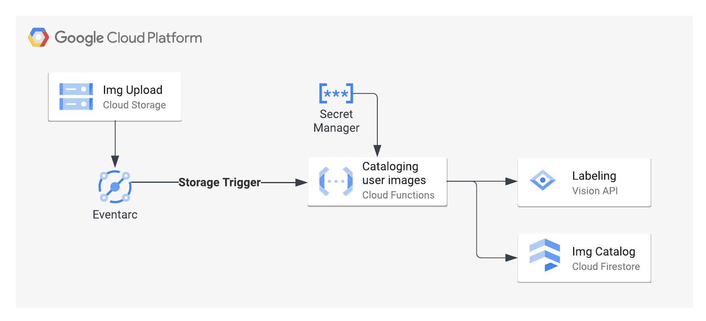

# How to develop and test your Cloud Functions 2nd gen locally

This demo illustrates a typical usecase of a Typescript application that processes thousands of images daily. It serves as the example code for the blog post ["How to develop and test your Cloud Functions 2nd gen locally"](URL).

## The full blog Post
Developing code for serverless platforms requires a different approach to your development flow. Since the platform provides and maintains the entire stack, from compute infrastructure up to the function handler. For this reason, your code usually runs in a concealed and abstracted environment. Debugging your code by deploying and invoking a Function in the cloud is a time-consuming and resource wasting effort. Fortunately, Cloud Functions offers an alternative that lets you implement and debug your code much faster.

In the blog post ["How to develop and test your Cloud Functions 2nd gen locally"](URL) you'll learn how to do the following:
- Run a Cloud Function locally
- Invoke a Cloud Function function with an Eventarc event locally
- Use the same permissions as deployed in the Cloud
- Fetch remote secrets stored in Google Secret Manager
- Set Breakpoints in Visual Studio Code within a local Cloud Function

## Overview

This example application derives insights from images and stores the resulting object labels. The following diagram illustrates this scenario as an event-driven microservice. 



For each newly uploaded image to a [Cloud Storage bucket](https://cloud.google.com/storage), [Eventarc](https://cloud.google.com/eventarc) invokes a [2nd gen Function](https://cloud.google.com/functions) and passes the image location including other event metadata. The Typescript application code uses the [Vision API](https://cloud.google.com/vision) to extract object labels, uses a secret stored in [Secret Manager](https://cloud.google.com/secret-manager), and indexes the image to a [Cloud Firestore](https://cloud.google.com/firestore).

## How to deploy this demo application 

1. You can use an existing Google Cloud project or create a [ new project](https://cloud.google.com/resource-manager/docs/creating-managing-projects).
2. Set your local gcloud CLI to use the new project

```
gcloud components update
export PROJECT_ID=$(gcloud config get-value project)
export PROJECT_NUMBER=$(gcloud projects list --filter="project_id:$PROJECT_ID" --format='value(project_number)')
export REGION="us-east1"
```

3. Enable all necessary Google Google APIs with the following CLI command
```
gcloud services enable \
  cloudfunctions.googleapis.com \
  cloudbuild.googleapis.com \
  artifactregistry.googleapis.com \
  eventarc.googleapis.com \
  pubsub.googleapis.com \
  logging.googleapis.com \
  vision.googleapis.com \
  run.googleapis.com \
  storage.googleapis.com \
  secretmanager.googleapis.com \
  appengine.googleapis.com 
```

4. Create a Cloud Storage Bucket and allow Cloud Storage Bucket to publish events to Pub/Sub

```
export BUCKET=$PROJECT_ID-image-upload-local-dev-demo
gsutil mb -l $REGION gs://$BUCKET

export GCS_SERVICE_ACCOUNT=$(gsutil kms serviceaccount -p $PROJECT_NUMBER)
gcloud projects add-iam-policy-binding $PROJECT_ID \
  --member serviceAccount:$GCS_SERVICE_ACCOUNT \
  --role roles/pubsub.publisher
```

5. Create a Firestore database 

If you don't have yet, you must first create an Google App Engine app in the corresponding region by running: `gcloud app create --region=$REGION`. Note the differences in the [AppEngine and Firestore region names](https://cloud.google.com/appengine/docs/standard/locations#cloud-firestore-location) if you encounter errors.

```
gcloud firestore databases create --region=$REGION
```

6. Create and upload an example secret in Secret Manager

```
export SECRET_ID="API_KEY"
gcloud secrets create $SECRET_ID \
    --replication-policy="automatic"
printf "s3cr3t" | gcloud secrets versions add $SECRET_ID --data-file=-
```

7. Create a Service Account for the Cloud Function and grant acess to the storage bucket, Firestore and Secret Manager

```
export SERVICE_ACCOUNT="cloud-function"
export SERVICE_ACCOUNT_ADDRESS=$SERVICE_ACCOUNT@$PROJECT_ID.iam.gserviceaccount.com
gcloud iam service-accounts create $SERVICE_ACCOUNT \
  --display-name="Eventarc Cloud Function service account"

gsutil iam ch serviceAccount:$SERVICE_ACCOUNT_ADDRESS:objectViewer gs://$BUCKET

gcloud projects add-iam-policy-binding $PROJECT_ID \
  --member serviceAccount:$SERVICE_ACCOUNT_ADDRESS \
  --role='roles/datastore.user'

gcloud secrets add-iam-policy-binding $SECRET_ID \
    --member serviceAccount:$SERVICE_ACCOUNT_ADDRESS \
    --role='roles/secretmanager.secretAccessor'
```

8. Create a Service Account for the Eventarc trigger and grant acess necessary access

```
export TRIGGER_SERVICE_ACCOUNT="eventarc-img-upload"
export TRIGGER_SERVICE_ACCOUNT_ADDRESS=$TRIGGER_SERVICE_ACCOUNT@$PROJECT_ID.iam.gserviceaccount.com
gcloud iam service-accounts create $TRIGGER_SERVICE_ACCOUNT \
  --display-name="Eventarc Cloud Function service account"

gcloud projects add-iam-policy-binding $PROJECT_ID \
  --member serviceAccount:$TRIGGER_SERVICE_ACCOUNT_ADDRESS \
  --role='roles/eventarc.eventReceiver'
```

9. Deploy the Cloud Function using the npm script deploy

```
FUNCTION_NAME=cloud-functions-2ndgen-local-development

npm run predeploy

gcloud functions deploy $FUNCTION_NAME --gen2 --region=$REGION --runtime nodejs16 \
--source='./build' --entry-point=index \
--service-account=$SERVICE_ACCOUNT_ADDRESS \
--trigger-event=google.storage.object.finalize --trigger-resource=$BUCKET --trigger-service-account=$TRIGGER_SERVICE_ACCOUNT_ADDRESS \
--set-secrets="SECRET_API_KEY=$(echo $SECRET_ID):latest"
```

10. Grant the Eventarc trigger Service Account the necessary invoker permissions. Both _roles/cloudfunctions.invoker_ and _roles/run.invoker_ are necessary, as 2nd gen Cloud Functions are based on Cloud Run

```
gcloud functions add-iam-policy-binding $FUNCTION_NAME --region=$REGION --gen2 \
  --member serviceAccount:$TRIGGER_SERVICE_ACCOUNT_ADDRESS \
  --role='roles/cloudfunctions.invoker' 

gcloud run services add-iam-policy-binding $FUNCTION_NAME --region=$REGION \
  --member serviceAccount:$TRIGGER_SERVICE_ACCOUNT_ADDRESS \
  --role='roles/run.invoker'
```

11. Upload a test image and stream Cloud Functions logs

```
gcloud storage cp ./CF_debugging_architecture.png gs://$BUCKET
gcloud beta run services logs tail $FUNCTION_NAME --region=$REGION
```

12. You can follow the [blog post](URL) to understand how this application can be further developed and debugged locally, by using also the following commands:
```
gcloud iam service-accounts add-iam-policy-binding $SERVICE_ACCOUNT_ADDRESS  \
  --member user:$(gcloud auth list --filter=status:ACTIVE --format="value(account)") \
  --role='roles/iam.serviceAccountUser'

gcloud auth application-default login --impersonate-service-account=$SERVICE_ACCOUNT_ADDRESS

npm run watch
```

To call the function code locally, you can use the [CloudEvents Conformance](https://github.com/cloudevents/conformance) tool. After installation, you can use the following command in a second terminal window:
```
cloudevents invoke http://localhost:8080 -f ./imageUploadEvent.yaml
```

