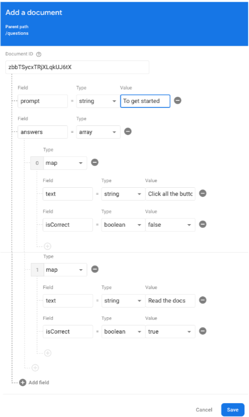
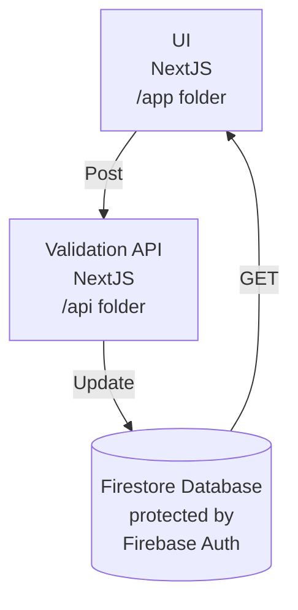

# Party Game

This is a [Next.js](https://nextjs.org/) project bootstrapped with [`create-next-app`](https://github.com/vercel/next.js/tree/canary/packages/create-next-app).

## Getting started

1. Clone the repository
    ```bash
    git clone https://github.com/GoogleCloudPlatform/devrel-demos.git
    ```
1. Navigate to the Party Game directory
    ```bash
    cd devrel-demos/app-dev/party-game/
    ```
1. Install dependencies:
    ```bash
    npm install
    ```
1. Run the development server:
    ```bash
    npm run dev
    ```
1. Open [http://localhost:3000](http://localhost:3000) with your browser to see the result.

## Make a change to the application

You can start editing the page by modifying `app/page.tsx`. The page auto-updates as you edit the file.

## Add a question

To add a question to the database:

1. A project administrator will need to give you access:
    1. Visit https://console.firebase.google.com/project/cloud-quiz-next/settings/iam
    1. Click `Add Member`
        * Role should be `Develop` -> `Admin`
1. Go to the firestore questions collection https://console.firebase.google.com/project/cloud-quiz-next/firestore/data/~2Fquestions
1. Click `Add document`
    1. Click `Auto-ID`
    1. Add a `prompt` field, type string, with the value of the question you want to ask.
    1. Add an `answers` field of type array
    1. For each possible answer, add:
        * `text` for the possible answer
        * `isCorrect` boolean for if the answer is correct




## Deploy on Cloud Run

```bash
gcloud run deploy party-game --source .
```


## Architecture

