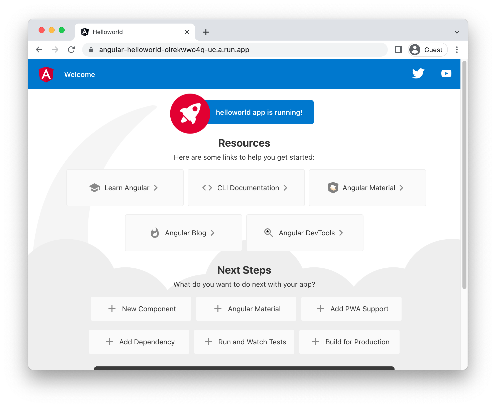

# Running Angular on Cloud Run

To deploy a [Angular](https://angular.io/) application to Cloud Run, you will need an application
based on this framework. This demo gets you to use the Angular template to generate one. 

This requires [node, npm](https://cloud.google.com/nodejs/docs/setup), and [gcloud](https://cloud.google.com/sdk/docs/install).


To complete this demo, you will need a [Google Cloud project](https://cloud.google.com/resource-manager/docs/creating-managing-projects#creating_a_project). 


### Create template application


* Install the framework:

    ```bash
    npm install -g @angular/cli
    ```

    
    

* Create a new template application:

    ```bash
    ng new helloworld
    ```


* Navigate to the created project:

    ```bash
    cd helloworld/
    ```

* Run the application locally:

    ```bash
    npm start
    ```

    

    Enter `Ctrl+C` or `CMD+C` to stop the process.


## Configure for Cloud Run

Using [Cloud Buildpacks](https://github.com/GoogleCloudPlatform/buildpacks), 
the base language is automatically identified.


For Angular, instead of using `npm start`, going to use a Node web server to serve the compiled files. 

* Generate the application: 

    ```bash
    ng build
    ```

* Create a `package.json` in the `dist/helloworld` folder:

    ```bash
    cat <<EOF > dist/helloworld/package.json 
    { 
      "scripts": { "start": "http-server" },
      "dependencies": { "http-server": "*" }
    }
    EOF
    ```

    *This is a scripting technique where all the text between `EOF` is written to the file.*


## Deploy to Cloud Run

* Set the project you created earlier in `gcloud`: 

    ```bash
    gcloud config set project MYPROJECT
    ```

* Build and deploy the service to Cloud Run: 

    ```bash
    gcloud run deploy angular-helloworld \
        --source dist/helloworld \
        --allow-unauthenticated 
    ```

    Type "Y" for all suggested operations.


Your service will now be deployed at the URL in the deployment output.




## Learn more

Resources: 

- https://angular.io/tutorial/toh-pt0
- https://angular.io/start/start-deployment
