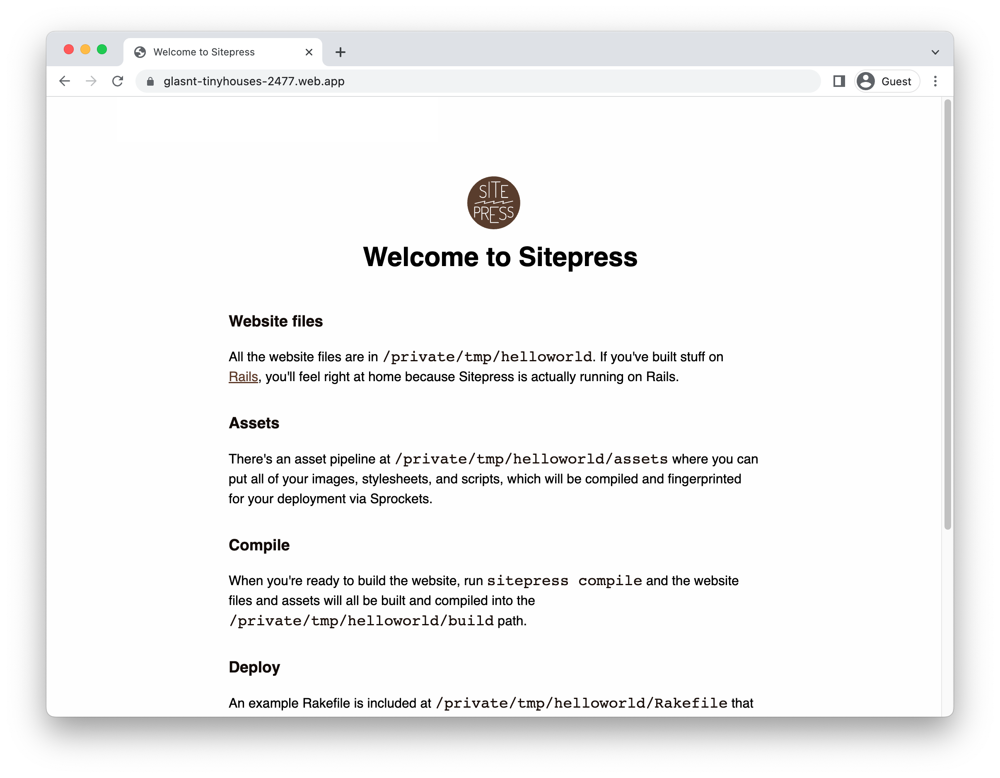

# Running SitePress on Firebase

To deploy a [SitePress](https://sitepress.cc/) application to Firebase, you will need an application
based on this framework. This demo gets you to use the SitePress template to generate one. 

This requires [ruby](https://cloud.google.com/ruby/docs/setup), and [firebase](https://cloud.google.com/firestore/docs/client/get-firebase).


To complete this demo, you will need a Firebase project. You can [create a new one](https://console.firebase.google.com/u/0/?pli=1), or connect an existing [Google Cloud project](https://cloud.google.com/firestore/docs/client/get-firebase).


### Create template application


* Install the framework:

    ```bash
    gem install sitepress
    ```

    
    

* Create a new template application:

    ```bash
    sitepress new helloworld
    cd helloworld

    ```


* Run the application locally:

    ```bash
    sitepress server
    ```

    

    Enter `Ctrl+C` or `CMD+C` to stop the process.


## Deploy to Firebase

* Generate the application: 

    ```bash
    sitepress compile
    ```

* Setup Firebase: 

    ```bash
    firebase init hosting
    ```

    * In "Project Setup", select the project you configured earlier.
    * For "What do you want to use as your public directory", enter "build".
    * Choose the default for all other options.

* Deploy to Firebase: 

    ```bash
    firebase deploy --only hosting
    ```

Your service will now be deployed at the URL in the output under "Hosting URL".




## Learn more

Resources: 

- https://sitepress.cc/getting-started/static
