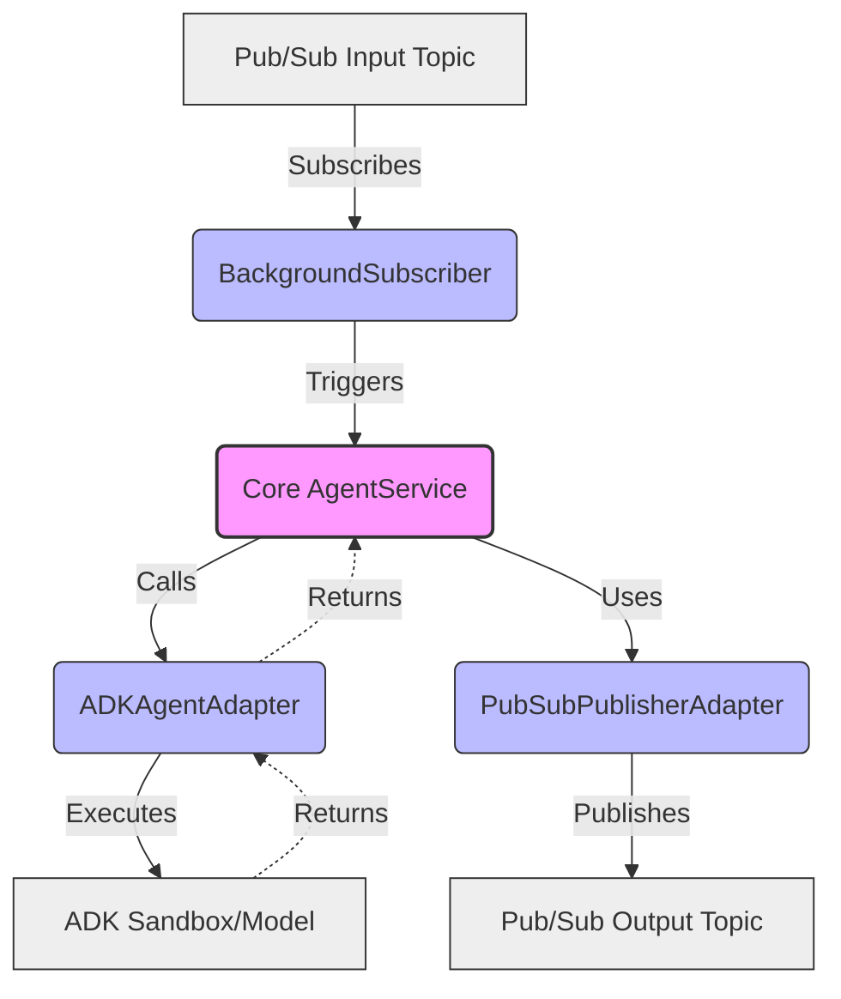

# Hackathon Judge Agent

A production-ready Python application that listens to a Google Cloud Pub/Sub subscription, asynchronously processes messages using a Google ADK agent, and publishes responses back to Pub/Sub.

Built with **FastAPI**, **Google Cloud Pub/Sub**, and **ADK**, structured using **Hexagonal Architecture (Ports and Adapters)**.

## Prerequisites

- Python 3.12+
- [uv](https://github.com/astral-sh/uv) (Python package manager)

## Installation

1. Make sure you have `uv` installed.
2. Install the project dependencies and sync the environment:
   ```bash
   uv sync
   ```

## Running the Application

You can run the FastAPI application using `uv`. The application starts a background Pub/Sub subscriber during its lifecycle.

```bash
uv run python src/main.py
```

Alternatively, run it directly with `uvicorn` for live-reloading during development:

```bash
uv run uvicorn src.main:app --reload
```

The API will be available at `http://localhost:8000`.
- Health check endpoint: `http://localhost:8000/health`

## Running Tests

The project uses `pytest` for testing. To run the full test suite:

```bash
uv run pytest
```

## Architecture Overview



This project follows a Hexagonal Architecture to separate concerns and ensure testability:

- **`src/core/`**: Contains the Domain Models (`AgentRequest`, `AgentResponse`) and Ports/Interfaces (`MessagePublisher`, `AgentService`).
- **`src/adapters/`**: Integrations with external services.
  - **`inbound/`**: `BackgroundSubscriber` (listens to Pub/Sub and triggers the agent).
  - **`outbound/`**: `ADKAgentAdapter` (calls the ADK Agent) and `PubSubPublisherAdapter` (publishes results back to Pub/Sub).
- **`src/main.py`**: The composition root. It wires the adapters to the core ports and manages the application lifecycle using FastAPI.