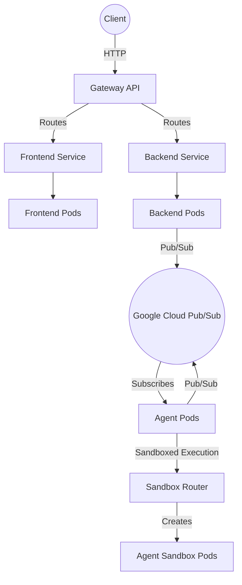

# Hackathon Judge Kubernetes Deployment

This directory contains the Kubernetes manifests required to deploy the Hackathon Judge application to a Google Kubernetes Engine (GKE) cluster.

## Architecture Diagram



## Components

- **Frontend (`frontend-deployment.yaml`, `frontend-service.yaml`)**: The user interface.
- **Backend (`backend-deployment.yaml`, `backend-service.yaml`)**: The main API server.
- **Agent (`agent-deployment.yaml`)**: The ADK agent that processes requests asynchronously via Pub/Sub.
- **Gateway (`gateway.yaml`, `httproute.yaml`)**: Kubernetes Gateway API for external routing.
- **Sandbox (`sandbox_router.yaml`, `sandbox-claim-template.yaml`)**: Infrastructure for dynamically provisioning isolated sandboxes for agent execution.
- **Configuration (`configmap.yaml`, `namespace.yaml`, `service-account.yaml`)**: Core cluster configuration and RBAC.

## Deployment

1. Apply the namespace and configuration:
   ```bash
   kubectl apply -f namespace.yaml
   kubectl apply -f configmap.yaml
   kubectl apply -f service-account.yaml
   ```

2. Apply the Gateway configuration:
   ```bash
   kubectl apply -f gateway.yaml
   kubectl apply -f httproute.yaml
   ```

3. Deploy the application components:
   ```bash
   kubectl apply -f frontend-deployment.yaml
   kubectl apply -f backend-deployment.yaml
   kubectl apply -f agent-deployment.yaml
   ```

4. Apply the sandbox configuration:
   ```bash
   kubectl apply -f sandbox_router.yaml
   kubectl apply -f sandbox-claim-template.yaml
   ```
