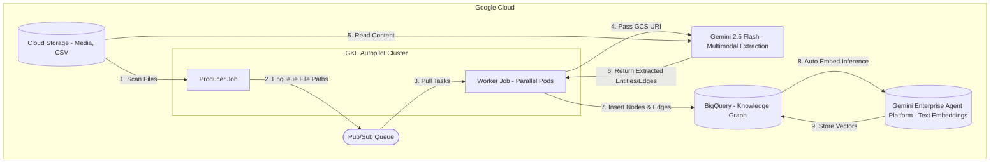

# Petverse Knowledge Graph Pipeline

Distributed knowledge acquisition pipeline processing unstructured multimedia assets (Audio, Video, Images, Text/CSV) from a Cloud Storage bucket, converting them into Knowledge Graph structured data via Gemini multi-modality processing on Google Kubernetes Engine (GKE), and natively enriching BigQuery relational datasets with high integrity.

There is a [codelab](https://codelabs.developers.google.com/codelabs/gke/ai-toolkit-lab-3) for this sample.

## System Architecture

The pipeline uses a decoupled, event-driven architecture to process multimedia assets in parallel at scale.



### Workflow
1. **Ingestion**: The **Producer** job scans the GCS bucket and enqueues all file paths onto a **Google Cloud Pub/Sub** topic.
2. **Decoupled Processing**: A pool of **Workers** running in parallel on **GKE Autopilot** pulls tasks from the Pub/Sub subscription.
3. **AI Extraction**: Workers call the **Gemini API** (Vertex AI) with the GCS URIs. Gemini processes the multimodal assets (audio, video, images, CSV) to extract entities and relationships.
4. **Storage**: Workers write the extracted nodes and edges directly to **BigQuery**.
5. **Vector Enrichment**: BigQuery automatically generates embeddings for pet bios using a connection to the Vertex AI Text Embeddings API.

---

## GKE Deployment & Orchestration Guide

This guide presents foundational components and precise workflows required to run the Petverse knowledge pipeline at scale in Google Kubernetes Engine (GKE) using enterprise-grade modern Workload Identity best practices.

## Setup Environment Variables
First, export the required environment variables. These will be used by the setup script and subsequent commands.

```bash
export PROJECT_ID="your-project-id"
export REGION="your-region"
```

## 0. Provision Data Warehouse (BigQuery) & Build Images
Run the automated priming script to verify configurations, set correct labeling, build and push container images to Artifact Registry, and establish the Pub/Sub resources. This script will also generate `job-producer.yaml` and `job-worker.yaml` from their respective templates.

```bash
chmod +x scripts/setup.sh
./scripts/setup.sh
```

---

## 1. Initialize Core Infrastructure
Use these commands to initialize the container cluster. The GCS bucket, Pub/Sub topics, and images are created by `setup.sh`.

```bash
# Create Cluster (GKE Autopilot is automated best-practice)
gcloud container clusters create-auto petverse-cluster \
    --region=$REGION \
    --labels=dev-tutorial=stabby-unicorn

# Get credentials to context into the cluster
gcloud container clusters get-credentials petverse-cluster --region $REGION --project $PROJECT_ID
```

---

## 2. Build and Deploy Workloads

Run the deployment script to configure GKE Modern Workload Identity permissions directly for the Kubernetes Service Account and load sample data into BigQuery.

```bash
chmod +x scripts/deploy.sh
./scripts/deploy.sh
```

After the deployment configuration is complete, deploy the Producer and Worker jobs to the cluster:

1. **Populate the queue** by running the Producer job:
```bash
kubectl apply -f job-producer.yaml
```
This job scans the GCS bucket and enqueues tasks to Pub/Sub, completing quickly.

2. **Process assets in parallel** by running the Worker job:
```bash
kubectl apply -f job-worker.yaml
```
This deploys workers configured to run in parallel to drain the Pub/Sub queue. GKE Autopilot will automatically scale nodes to accommodate the workload.

---

## 3. Validation monitoring

1. **Check the status of the jobs**:
```bash
kubectl get jobs
```
You should see both `petverse-producer-job` and `petverse-worker-job`.

2. **Verify the Producer enqueued tasks**:
```bash
kubectl logs -l app=petverse-producer --tail=50
```

3. **Monitor the Workers processing tasks**:
```bash
kubectl logs -l app=petverse-worker --tail=50
```
The workers will automatically shut down (due to a 60-second idle timeout) once the Pub/Sub queue is empty.

To check for completion, run:
```bash
kubectl get jobs
```

This is what successful completion looks like:
```
NAME                    STATUS     COMPLETIONS   DURATION   AGE
petverse-producer-job   Complete   1/1           15s        2m
petverse-worker-job     Complete   3/3           3m20s      3m
```

---

# Create the graph
In [BigQuery Studio](https://console.cloud.google.com/bigquery?utm_campaign=CDR_0x6cb6c9c7_default_b513837417&utm_medium=external&utm_source=lab), run the following query to create a graph:

```sql
CREATE OR REPLACE PROPERTY GRAPH `petverse_kg.knowledge_graph`
  NODE TABLES (
    `petverse_kg.Nodes` AS `Nodes`
      KEY (`entity_id`)
        LABEL `Nodes` PROPERTIES (entity_id AS `entity_id`, entity_type AS `entity_type`, name AS `name`, pet_bio AS `pet_bio`, properties AS `properties`, bio_embedding AS `bio_embedding`))

  EDGE TABLES (
    `petverse_kg.Edges` AS `Edges`
      KEY (`source_id`,`target_id`,`relationship`)
        SOURCE KEY (`source_id`)
          REFERENCES `Nodes` (`entity_id`)
        DESTINATION KEY (`target_id`)
          REFERENCES `Nodes` (`entity_id`)
        LABEL `Edges` PROPERTIES (properties AS `properties`));
```

Visualize the pets with similar hobbies:

```sql
GRAPH `petverse_kg.knowledge_graph`
MATCH p = (cat:Nodes)-[e]->(hobby:Nodes)
WHERE (LOWER(cat.entity_type) = 'pet' OR LOWER(cat.entity_type) = 'cat')
  AND LOWER(JSON_VALUE(cat.properties.species)) = 'cat'
  AND LOWER(hobby.entity_type) IN ('hobby', 'action', 'activity')
RETURN TO_JSON(p) as res
LIMIT 100
```
