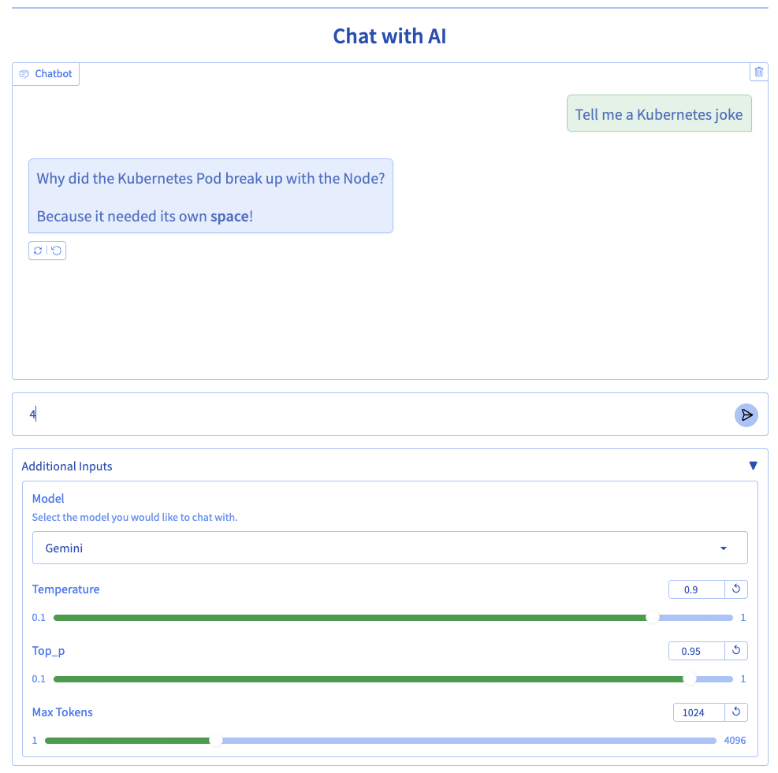
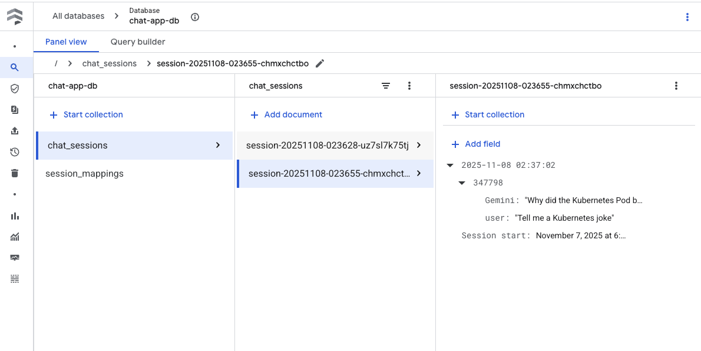

# AI Chat App on Cloud Run

This is a Cloud Run implementation of the AI Chat App.



## Architecture

```
+---------------------+
|    User Browser     |
+---------------------+
           | HTTPS
           v
+---------------------+
| Cloud Run: Chat App |----------------+
| (Gradio Frontend)   |                |
+---------------------+
     |          |                      |
     |          | (HTTPS/REST)         | (API)
     |          v                      v
     |    +-----------------+    +-----------+
     |    | Cloud Run:      |    | Vertex AI |
     |    | Gemma Service   |    | (Gemini)  |
     |    +-----------------+    +-----------+
     |
     v (Native Mode)
+-----------+
| Firestore |
| (History) |
+-----------+
```

## Resources Created

This project uses Terraform to provision the following Google Cloud resources:

### Gemma Service (`gemma-service/infra`)
*   **Cloud Run Service:** `gemma-service` configured with GPU acceleration (1 x NVIDIA L4), 8 vCPU, and 32GiB memory. It is configured to scale to zero when not in use.
*   **APIs Enabled:** Cloud Run API.

### Chat App Infrastructure (`chat-app/infra`)
*   **Artifact Registry Repository:** `chat-app-repo` for storing the chat application container image.
*   **Firestore Database:** `chat-app-db` (Native mode) for storing chat history.
*   **Service Account:** `chat-app-run-sa` used by the Chat App Cloud Run service.
*   **IAM Roles:** The `chat-app-run-sa` service account is granted:
    *   `roles/aiplatform.user`: To access Gemini via Vertex AI.
    *   `roles/datastore.user`: To read/write to Firestore.
    *   `roles/run.invoker`: To invoke the Gemma Cloud Run service.
*   **APIs Enabled:** Cloud Build, Artifact Registry, Cloud Run, Firestore, Vertex AI.

## Structure

```
gradio-chat-cloudrun/
├── chat-app/
│   ├── app/
│   │   ├── app.py            # Main Gradio application code
│   │   ├── themes.py         # Custom Gradio theme
│   │   └── requirements.txt  # Python dependencies
│   ├── infra/
│   │   └── main.tf           # Terraform for Chat App resources
│   └── Dockerfile            # Container definition for Chat App
gemma-service/
│   └── infra/
│   │   └── main.tf           # Terraform for Gemma model service
└── README.md
```

## Prerequisites

1.  Google Cloud Project with billing enabled.
2.  gcloud CLI installed and authenticated.
3.  Terraform installed.

## Getting Started

Clone this repository and navigate to this directory:

```bash
cd containers/gradio-chat-cloudrun
```

## Setup & Deployment

### 0. Set Environment Variables

Set these variables once to make the following commands copy-pasteable.

```bash
export TF_VAR_project_id=$(gcloud config get-value project)
export TF_VAR_project_number=$(gcloud projects describe $TF_VAR_project_id --format="value(projectNumber)")
export TF_VAR_region=us-central1
```

### 1. Enable Cloud Resource Manager API

Terraform requires this API to be enabled to manage your project.

```bash
gcloud services enable cloudresourcemanager.googleapis.com
```

### 2. Deploy Gemma Service (Optional but recommended)

If you want to chat with the self-hosted Gemma model, deploy it first.

1.  Navigate to the Gemma service infrastructure directory:
    ```bash
    cd gemma-service/infra
    ```
2.  Initialize Terraform:
    ```bash
    terraform init
    ```
3.  Review the planned changes. It is good practice to always review the plan before applying changes.
    ```bash
    terraform plan
    ```
4.  Apply the changes to create the resources:
    ```bash
    terraform apply
    ```
5.  Capture the Gemma service URL:
    ```bash
    export GEMMA_SERVICE_URL=$(terraform output -raw gemma_service_url)
    echo "Gemma Service URL: $GEMMA_SERVICE_URL"
    ```

### 3. Deploy Chat App Infrastructure

1.  Navigate to the chat app infrastructure directory:
    ```bash
    cd ../../chat-app/infra
    ```
2.  Initialize Terraform:
    ```bash
    terraform init
    ```
3.  Review the planned changes:
    ```bash
    terraform plan
    ```
4.  Apply the changes to set up Artifact Registry, Firestore, and the Service Account:
    ```bash
    terraform apply
    ```

### 4. Build and Push Chat App Image

Build the container image and push it to the created Artifact Registry.

```bash
cd ..
gcloud builds submit --tag $TF_VAR_region-docker.pkg.dev/$TF_VAR_project_id/chat-app-repo/chat-app:latest .
```

### 5. Deploy Chat App to Cloud Run

Deploy the service using `gcloud`. This command uses the Service Account created by Terraform in step 2, which has the necessary permissions to invoke the Gemma service.

If you skipped deploying Gemma, you can set `GEMMA_HOST` to a placeholder, but Gemma chat won't work.

```bash
gcloud run deploy chat-app \
  --image $TF_VAR_region-docker.pkg.dev/$TF_VAR_project_id/chat-app-repo/chat-app:latest \
  --region $TF_VAR_region \
  --allow-unauthenticated \
  --service-account=chat-app-run-sa@$TF_VAR_project_id.iam.gserviceaccount.com \
  --set-env-vars GEMMA_HOST=$GEMMA_SERVICE_URL,GEMMA_ENDPOINT=/api/generate,GEMMA_MODEL=gemma3:4b
```

## Extending the App

### Adding New Models

The application uses a `MODEL_CONFIG` dictionary in `chat-app/app/app.py` to define supported models. To add a new model:

1.  **Define Configuration:** Add a new entry to `MODEL_CONFIG` with a unique name (e.g., "Gemma-27b").
2.  **Specify Functions:** Assign the appropriate processing and calling functions (reuse existing ones if compatible, or write new ones).
3.  **Set Parameters:** Define any necessary configuration parameters, ideally using `os.environ.get()` to allow for runtime configuration via Cloud Run environment variables.

Example of adding a second Gemma model:

```python
    "Gemma-27b": {
        "process_fn": process_message_gemma,
        "call_fn": call_gemma_model,
        "config": {
            "host": os.environ.get("GEMMA_27B_HOST"),
            "endpoint": "/api/generate",
            "model_name": "gemma3:27b",
        },
    },
```

Redeploy the app with the new environment variables (e.g., `--set-env-vars GEMMA_27B_HOST=...`) to make the new model available in the UI dropdown.

## Log Example

This application logs each session as a document in Firestore.



## Cleanup

To avoid incurring charges, clean up the resources when you are done.

1.  **Delete Chat App Service:**
    ```bash
    gcloud run services delete chat-app --region $TF_VAR_region --quiet
    ```

2.  **Destroy Chat App Infrastructure:**
    Navigate to `chat-app/infra` and run:
    ```bash
    terraform destroy -auto-approve
    ```
    *(If it fails because Artifact Registry is not empty, run `gcloud artifacts repositories delete chat-app-repo --location=$TF_VAR_region --quiet` and try again)*

3.  **Destroy Gemma Service Infrastructure:**
    Navigate to `gemma-service/infra` and run:
    ```bash
    terraform destroy -auto-approve
    ```