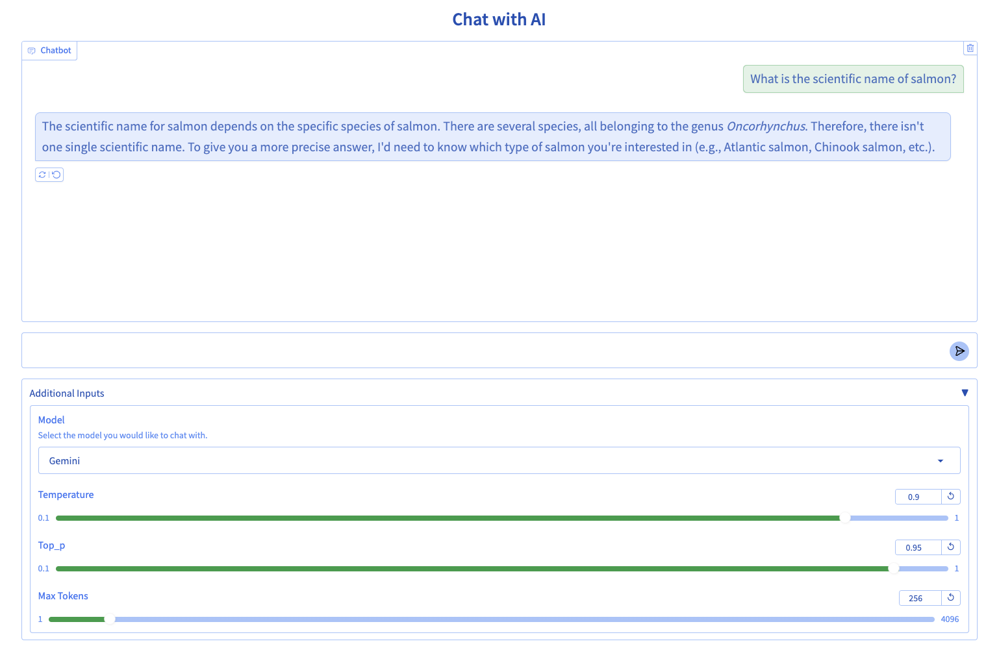

# Gradio-Based AI Chat App on GKE


This repository deploys the gemma3-12b-it model and a gradio-based ai chat app to a GKE cluster (which is set up via terraform). The chat app can switch between chatting with the GKE-deployed Gemma3-12b-it model, and Gemini-2.5-flash in Vertex AI. The application stores each session's chat history, and the history is shared even if you switch which model you're chatting with (Gemini or Gemma 3).




## Pre-Reqs
You should have:
* a [Hugging Face token](https://huggingface.co/docs/hub/en/security-tokens).
* a [Google Cloud project](https://developers.google.com/workspace/guides/create-project) with billing enabled.
* [Terraform installed](https://developer.hashicorp.com/terraform/tutorials/aws-get-started/install-cli) on the machine you will deploy from.
* The [gcloud CLI installed](https://cloud.google.com/sdk/docs/install) on the machine you will deploy from.

## Running this application
Clone this repository onto the machine you will deploy from. Navigate to the `containers/gradio-chat-gke` directory:

```bash
cd containers/gradio-chat-gke
```

If it's not already set, set your working project for the gcloud cli. Replace [YOUR_PROJECT_ID] with your project id.
```
gcloud config set project [YOUR_PROJECT_ID]
```

Create environment variables to set the project you will deploy to via Terraform.
```
export TF_VAR_project_id=$(gcloud config get-value project)
export TF_VAR_project_number=$(gcloud projects describe $TF_VAR_project_id --format="value(projectNumber)")
```

These environment variables will automatically be used by terraform.

### Enable Cloud Resource Manager API
Terraform requires this API to be enabled to manage your project.
```
gcloud services enable cloudresourcemanager.googleapis.com
```

### Create Cloud Build Staging Bucket
Ensure the staging bucket for Cloud Build exists:
```
gcloud storage buckets create gs://${TF_VAR_project_id}_cloudbuild
```

> **Note:** This command will return an error if the bucket already exists. You can safely ignore this error.

### Create the Google Cloud resources using terraform

The main.tf file in this project contains code to enable APIs for Google Cloud Build, Artifact Registry, Firestore, VertexAI, and GKE.
It will create the following resources in region us-central1:
* A GKE autopilot cluster named "gradio-chat-cluster"
* A Firestore collection called "chat_sessions", with an initial document, "session1"

The GKE cluster will be used to run the Gemma model instance, and the gradio-based chat application.
The Firestore collection will be used to store chat history.

**NOTE:** The `infra/main.tf` file has some `TODO` sections for educational purposes. Before running Terraform, you must either:
1.  Fill in the `TODO` sections in `infra/main.tf` (refer to `infra/main_full.tf.ignore` for the complete code).
2.  OR, overwrite `infra/main.tf` with the completed version: `cp infra/main_full.tf.ignore infra/main.tf`

1. Change directories into the "infra" folder within this repository.
```
cd infra
```

2. Initialize Terraform:
```
terraform init
```

3. Check what resources Terraform will create:
```
terraform plan
```

4. Create the resources using Terraform:
```
terraform apply
```

### Connect to the cluster from your local machine
Once the cluster has finished deploying, connect to the cluster from your local machine.
```
gcloud container clusters get-credentials gradio-chat-cluster --region us-central1 --project $TF_VAR_project_id
```

Change directories to the home directory where you cloned this code.
```
cd ..
```

### Deploy Gemma
This repo deploys Gemma3-12b-it from Hugging Face, as a Deployment on the GKE Autopilot cluster. 

1. Set your Hugging Face token as an environment variable
```
export hf_token=[YOUR_HF_TOKEN]
```

2. Set your Hugging Face token as a Kubernetes Secret
NOTE: Kubernetes secrets obfuscate secret data, but do not encrypt them! For use in production or shared environments, store your hugging face token in a more secure tool such as Google Cloud Secrets Manager. If you change this, you will need to update gemma3-12b-deployment.yaml to use the secret wherever it is stored.
```
kubectl create secret generic hf-secret --from-literal=hf_api_token="$hf_token"
```

3. Deploy Gemma3-12b-it as a workload on the GKE Autopilot cluster:
```
kubectl apply -f deploy/gemma3-12b-deploy.yaml
```

### Deploy the chat app

**NOTE:** The `app/app.py` file has `TODO` sections. Before deploying, you must either:
1.  Fill in the `TODO` sections in `app/app.py` (refer to `app/app_full.py.ignore` for the complete code).
2.  OR, overwrite `app/app.py` with the completed version: `cp app/app_full.py.ignore app/app.py`

This repo is designed to build the chat application container image using Google Cloud Build. The image is stored in Artifact Registry, and then can be deployed to the GKE cluster using the chat-deploy.yaml file.

NOTE: Rather than doing this, you could open the code in VS Code and use the [Cloud Code plugin](https://cloud.google.com/code/docs/vscode/install) to run and deploy it. This works great, and is convenient if you want to explore and edit this application!

#### Build and Run the application using Skaffold and Google Cloud Build
This repo is designed to be built using Google Cloud Build via Skaffold. Skaffold simplifies the build and deploy process by automating the pipeline from building on CloudBuild to deploying onto the GKE cluster.
```
skaffold run --default-repo=us-central1-docker.pkg.dev/$TF_VAR_project_id/chat-app-repo
```

Note: When a container image of the application is built, it uses the "latest" flag. If this app were to be used in production, you should design the CI/CD workflow to flag each container image with major and minor versions as a best practice.

#### Access the application
Once the application has deployed and your rolebindings are set, you can access the application on the external IP (via Loadbalancer). The application is served on port 7860.

1. Get the External IP using kubectl
```
kubectl get svc
```

2. Connect to the external IP, with the port 7860. ie: 0.0.0.0:7860

The application will take a couple minutes to become available.

Enjoy chatting with Gemini and Gemma 3!

## Log Example
This application logs each session as a document in Firestore. The document name is in the format "year-month-day-session-uuid". Here is an example of a log for a single session.


## Clean Up
To avoid incurring charges, destroy the resources you created:

```bash
cd infra
terraform destroy
```