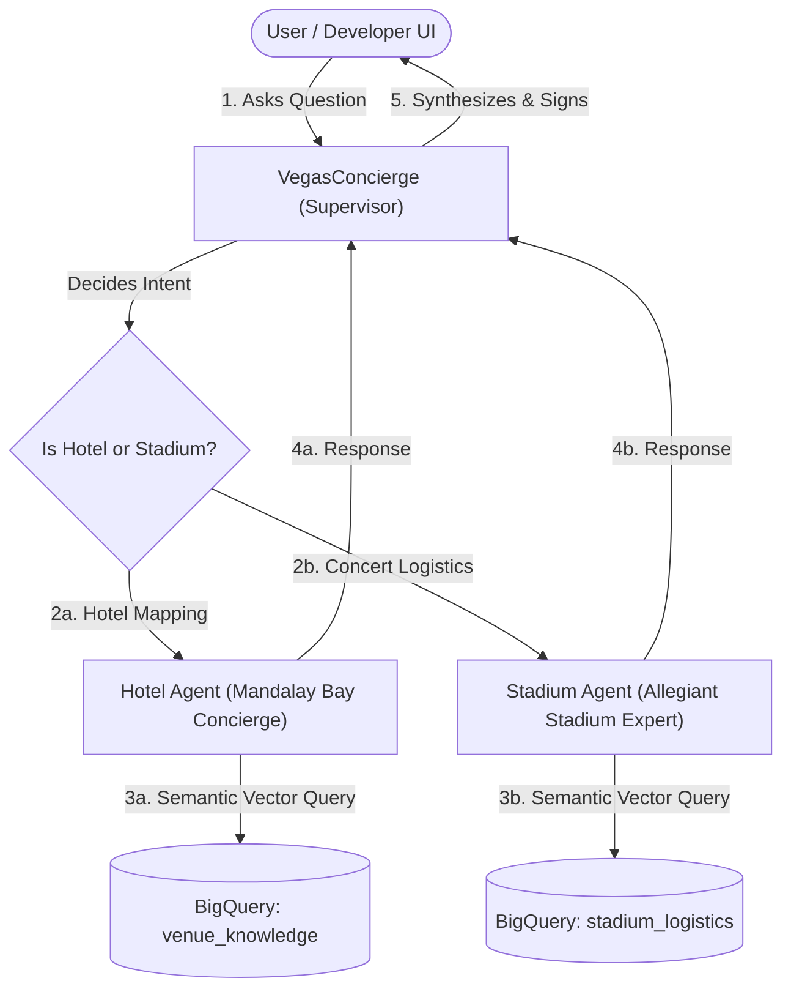

# Conversational Multi-Agent App Workspace

Welcome to the Conversational Multi-Agent Application. This folder houses our multi-agent architecture built using the Google Agent Development Kit (ADK) and the standard Agent-to-Agent (A2A) protocol.

---

## Multi-Agent Architecture

Our conversational application is designed using a Supervisor-Worker (Hub-and-Spoke) pattern. The system consists of three distinct agents coordinating to answer attendee questions:



### 1. VegasConcierge (Supervisor Agent)
*   **File**: [`agents/agent.py`](agents/agent.py) (Running on Port `8083`)
*   **Role**: Orchestrates incoming queries. It acts as the routing and delegation hub, identifying whether a query belongs to Mandalay Bay Hotel or Allegiant Stadium, delegating the query to the correct sub-agent, and synthesizing the final response.

### 2. Hotel Agent (Mandalay Bay Concierge)
*   **File**: [`agents/hotel_agent.py`](agents/hotel_agent.py) (Running on Port `8081`)
*   **Role**: Specialized interior navigation concierge for Mandalay Bay. It can locate restaurants, quiet zones, restrooms, and conference amenities by querying the `next_navigator.venue_knowledge` table in BigQuery.

### 3. Stadium Agent (Allegiant Stadium Expert)
*   **File**: [`agents/stadium_agent.py`](agents/stadium_agent.py) (Running on Port `8082`)
*   **Role**: Specialized concert logistics and security assistant for Allegiant Stadium. It answers questions about bag policies, VIP entry, laptops, and door times by querying the `next_navigator.stadium_logistics` BigQuery table.

---

## Core Concepts: ADK, A2A, and A2UI

### 1. Google Agent Development Kit (ADK)
The ADK (`google-adk`) is Google's Python SDK for building generative AI agents.
*   **Session State Management**: Manages sessions, memory states, custom plugins, and execution runners (`Runner`).
*   **Tooling Integration**: Binds structured tools (like the `BigQueryToolset`) directly to agents.
*   **Telemetry & Observability**: Integrates monitoring plugins. We utilize the `BigQueryAgentAnalyticsPlugin` which streams structured traces (agent states, prompt structures, tool calls) directly into the `agent_events_v2` BigQuery table for analytics.

### 2. Agent-to-Agent (A2A) Collaboration
Our agents interact over REST endpoints using the standard A2A Protocol.
*   **Capabilities & Cards**: Each agent exposes an `.well-known/agent-card.json` containing metadata, skill descriptions (e.g., `Navigate Hotel` or `Stadium Info`), and service endpoints.
*   **A2A Client/Server Mechanics**: The Supervisor defines sub-agents using `RemoteA2aAgent` and wraps them in `AgentTool` objects. This allows the primary model to trigger a remote REST call to the sub-agents as standard python tools.
*   **FastAPI Hosting**: Each agent runs its own microservice using FastAPI wrapped via the `A2ARESTFastAPIApplication` builder.

### 3. Agent-to-User Interface (A2UI) / Developer Playground
The `a2ui` is the developer playground that acts as the frontend interface for our agents.
*   **Chat Canvas**: Renders a chat interface to interact with your agents in real-time.
*   **Traces & Logs**: Let's you inspect execution timelines, see when a sub-agent is invoked, review the prompt sent to each model, and check SQL executions on BigQuery.

---

## Execution and Operations

### 1. Launching Background Agents
To start the underlying agent microservices on their respective ports (`8081`, `8082`, and `8083`), run the root execution script:
```bash
./scripts/start_agents.sh
```

To view live background process logs:
*   **Supervisor Logs**: `tail -f agents/supervisor.log`
*   **Hotel Logs**: `tail -f agents/hotel.log`
*   **Stadium Logs**: `tail -f agents/stadium.log`

### 2. Launching the Developer Playground (a2ui)
To interact with the multi-agent system, run the developer playground:
```bash
# Starts the playground web server on port 8080
agents-cli playground
```
Once started, navigate your web browser to:
👉 **[http://127.0.0.1:8080/dev-ui/?app=agents](http://127.0.0.1:8080/dev-ui/?app=agents)**

### Interacting with your Agents
Once inside the playground, you can test the multi-agent orchestration by submitting queries in the chat window. Try experimenting with the following prompt examples:
*   Hotel Navigation (Single-Agent): `"Where is the closest quiet zone at Mandalay Bay?"`
*   Stadium Logistics (Single-Agent): `"Can I bring my laptop bag into Allegiant Stadium?"`
*   Cross-Domain Orchestration (Supervisor Router): `"Find me a restaurant at Mandalay Bay and also tell me what time the stadium doors open."`

> [!NOTE]
> **First Interaction Latency (20-30 seconds):** The first message you submit in the playground will take an extra 20 to 30 seconds to return a response. This occurs because the BigQuery Agent Analytics Plugin dynamically provisions the target event tables and multiple analytics SQL views on its first invocation. Subsequent interactions respond quickly.
> More details can be found in the [ADK BigQuery Agent Analytics documentation](https://adk.dev/integrations/bigquery-agent-analytics/#automatically-created-views).

---

## Guardrails and Scope Boundaries

Our agents are equipped with strict scope boundaries to prevent out-of-bounds requests:
1.  **Denial Phrase**: If a request falls out of scope, the agents respond with: `unfortunately I am unable to help with that.`
2.  **Signature**:
    *   Hotel Agent must sign with: `— This is the HOTEL AGENT`
    *   Stadium Agent must sign with: `— This is the STADIUM AGENT`
