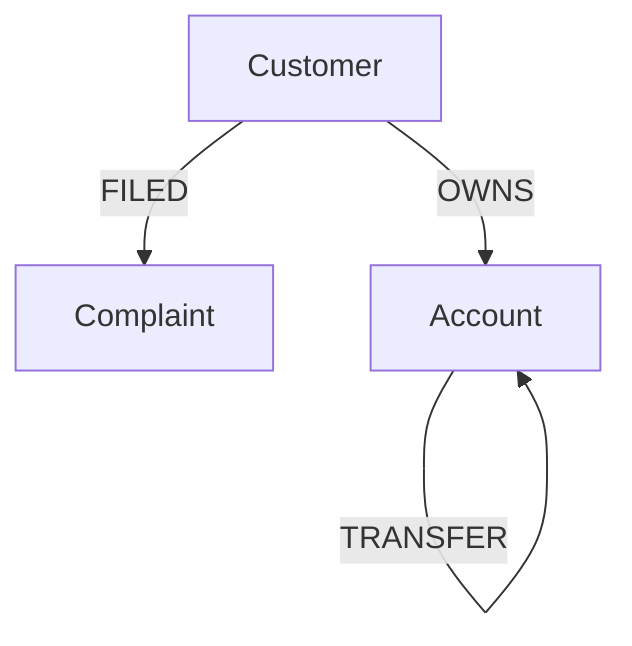

# BigQuery Graph: Scalar & AI Functions Samples

This directory contains sample SQL scripts demonstrating how to leverage **standard scalar functions**, **AI functions** (like `AI.EMBED`, `ML.DISTANCE`, and `ML.TRANSLATE`), and **JSON serialization** within BigQuery Property Graph queries.

These samples highlight the power of combining Graph Query Language (GQL) with BigQuery's rich function ecosystem, enabling complex analysis, semantic search, and translation directly on graph node and edge properties.

---

## Architecture & Use Case Overview

The samples use a **financial transaction network** as the domain model. In this network:
- **Customers** own **Accounts**.
- **Accounts** transfer money to other **Accounts** via **Transactions**.
- **Customers** can file **Complaints** regarding transactions or issues (e.g., scams, app crashes).

### Graph Schema (`BankGraph_Complaints`)



---

## File Walkthrough

### 1. Setup ([setup.sql](./setup.sql))
This script initializes the database schema, tables, sample data, and the property graph.
* **Autonomous Embeddings**: Shows how to define a `Complaints` table where the `complaint_text` column is automatically vectorized using `AI.EMBED` with the `embeddinggemma-300m` model as a generated stored column.
* **Schema & Data**: Creates `Customers`, `Accounts`, `Transactions`, and `Complaints` tables and populates them with realistic demo data representing normal transfers, unauthorized transfers, and potential scams.
* **Property Graph Definition**: Defines the `finance_ds.BankGraph_Complaints` property graph, establishing relationships (`OWNS`, `TRANSFER`, `FILED`) between the entities.

### 2. Standard Scalar Functions ([standard_scalar.sql](./standard_scalar.sql))
Demonstrates the use of standard SQL functions within the `MATCH` pattern block or the `RETURN` clause of a `GRAPH` query.
* **String Functions**: Uses `LENGTH()` and `UPPER()` to filter and format customer names.
* **Formatting & Conversion**: Combines `CONCAT()` and `CAST()` to build custom human-readable transaction descriptions directly from matched edge properties.

### 3. AI & Vector Search ([ai_embed_sample.sql](./ai_embed_sample.sql))
Showcases advanced AI integrations and graph visualization.
* **Graph Path Visualization**: Uses `TO_JSON(p)` where `p` is a matched path to serialize and visualize relationships.
* **Graph RAG & Semantic Search**: Demonstrates matching nodes (`Customer` and `Complaint`) and using `ML.DISTANCE` to perform a vector search on the node embedding property (`comp.text_embedding`). It compares the stored embedding against a dynamically generated embedding of a search query (e.g., `'Angry customer'`) using `AI.EMBED`.

### 4. Multi-modal TVF Translation ([tvf_translate.sql](./tvf_translate.sql))
Shows how to extract structured graph data and pass it to BigQuery ML Table-Valued Functions (TVFs) for downstream processing.
* **Graph to CTE Extraction**: Uses `GRAPH_TABLE` to perform a graph match (`Customer` -> `Complaint`) and extract properties into a standard SQL Common Table Expression (CTE).
* **Translation Pipeline**: Passes the extracted graph data to `ML.TRANSLATE` using a remote translation model (`finance_ds.translate`) to translate customer complaints from English to Spanish (`es`).

---

## Getting Started & Running the Samples

### Prerequisites

1. **Vertex AI Connection**: You need a BigQuery connection configured to access Vertex AI models. By default, the queries expect a connection (which can be specified via `connection_id` or defaults to the project's default).
2. **Translation API**: Ensure the Cloud Translation API is enabled: [Enable Translation API](https://console.cloud.google.com/apis/api/translate.googleapis.com/metrics).
3. **Translation Model**: Create a translation model if running `tvf_translate.sql`:
   ```sql
   CREATE OR REPLACE MODEL `finance_ds.translate`
   REMOTE WITH CONNECTION `us.__default_cloudresource_connection__` -- replace with your connection
   OPTIONS (REMOTE_SERVICE_TYPE = 'CLOUD_AI_TRANSLATE_V3');
   ```
4. **IAM Roles**: The service account of the connection must be granted the `Service Usage Consumer` role (`roles/serviceusage.serviceUsageConsumer`) on your project.

### Execution Steps

1. Run the contents of [setup.sql](./setup.sql) to create the tables, populate them with data, and build the property graph `finance_ds.BankGraph_Complaints`.
2. Open and execute [standard_scalar.sql](./standard_scalar.sql) to see standard SQL scalar operations in GQL.
3. Open and execute [ai_embed_sample.sql](./ai_embed_sample.sql) to run semantic vector search on graph nodes.
4. Configure the translation model and run [tvf_translate.sql](./tvf_translate.sql) to translate matched graph nodes.
