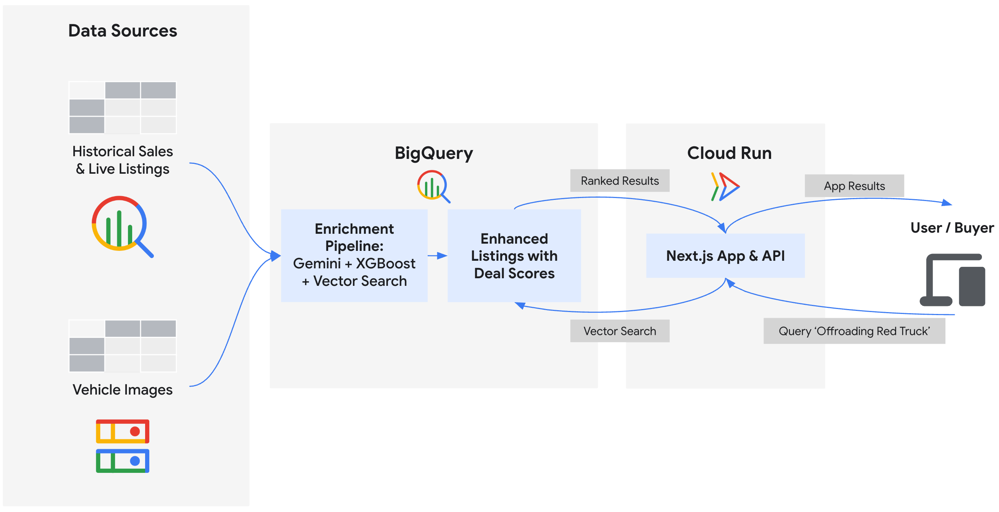

# Build an AI-Powered Vehicle Marketplace with BigQuery and Gemini Models

This repository contains the infrastructure setup scripts and frontend application for "Cymbal Autos," an intelligent online vehicle marketplace. You will use [BigQuery](https://cloud.google.com/bigquery) and [Gemini models on Vertex AI](https://cloud.google.com/vertex-ai/docs/generative-ai/learn/overview) to inspect vehicle photos, predict prices using [BigQuery ML](https://cloud.google.com/bigquery/docs/bqml-introduction), detect potential scam listings using vector embeddings, and calculate composite deal scores. Finally, you will surface these insights on a Next.js frontend deployed to [Cloud Run](https://cloud.google.com/run/docs).



This scenario demonstrates an AI Developer's ability to orchestrate enterprise data (BigQuery) and multimodal models (Gemini) by connecting BigQuery to unstructured Cloud Storage images using [ObjectRef](https://docs.cloud.google.com/bigquery/docs/objectref-columns) and extracting attributes without moving any files. The demo showcases training an [XGBoost model](https://cloud.google.com/bigquery/docs/reference/standard-sql/bigqueryml-syntax-create-boosted-tree) in BigQuery ML, identifying potential scam listings with [`VECTOR_SEARCH`](https://cloud.google.com/bigquery/docs/vector-search), and calculating comprehensive deal scores.

## Repository Structure
```text
n26-screen-demo-deploy/
├── app/                         # Next.js Marketplace Application
├── data/                        # CSVs and mock datasets
├── docs/                        # External documentation and images
│   ├── images/
│   │   └── cymbal_autos_architecture.png
│   ├── codelab.md
│   ├── demo_script.md
│   └── index.lab.md
├── scripts/
│   ├── setup/                   # Environment setup and ML pipelines
│   │   ├── 00_copy_data.sh      # Sync local workspace and public images to GCS
│   │   ├── 01_setup_api_connection.sh # Set up APIs and Cloud Resource Connection
│   │   ├── 02_load_to_bq.sh # Load data to BigQuery
│   │   ├── 03_vision_extraction.sql
│   │   ├── 04_predictive_pricing.sql
│   │   ├── 05_semantic_scam_detection.sql
│   │   ├── 06_generative_deal_score.sql
│   │   ├── 07_run_all_ml_pipelines.sh # Fast track script
│   │   └── 08_export_frontend_data.py
│   └── cleanup/
│       └── teardown.sh         # Cleanup script for all resources
└── README.md
```

## Prerequisites
*   **A Google Cloud project** with billing enabled.
*   **Basic familiarity** with SQL, Python, and Google Cloud.
*   **Sufficient IAM permissions** to enable APIs and create resources (e.g. Project Owner).

## Deployment Guide

Follow these steps in [Cloud Shell](https://cloud.google.com/shell/docs) to provision the demo environment.

### 1. Clone the Repository
Clone the repository and navigate into the project directory:

```bash
git clone https://github.com/GoogleCloudPlatform/devrel-demos.git
cd devrel-demos/data-analytics/cymbal-autos-multimodal
```

### 2. Configure Environment
Set your Google Cloud Project ID and authenticate:

```bash
export PROJECT_ID="your-gcp-project-id"
gcloud config set project $PROJECT_ID
gcloud auth application-default login
```

Enable the required Google Cloud APIs for the project:

```bash
gcloud services enable \
  aiplatform.googleapis.com \
  artifactregistry.googleapis.com \
  bigquery.googleapis.com \
  bigqueryconnection.googleapis.com \
  cloudbuild.googleapis.com \
  run.googleapis.com
```

### 3. Copy Data Assets
Run the data ingestion script to pull pre-processed images from a central public bucket and push your local workspace datasets (`data/`) into personal Cloud Storage bucket created in this script:

```bash
chmod +x scripts/setup/*.sh
./scripts/setup/00_copy_data.sh
```

### 4. Set Up BigQuery Connection
The setup scripts will automatically create your BigQuery datasets and load the data. Because some of the demo uses unstructured data (visual images in GCS) and calls Vertex AI models, the scripts will also create a Cloud Resource Connection for you:

```bash
./scripts/setup/01_setup_api_connection.sh
./scripts/setup/02_load_to_bq.sh
```

### 5. Build the AI Features (Step-by-Step)
To see the storytelling in action, run the SQL contents of the files `03` through `06` (located in the `scripts/setup/` directory) in the [BigQuery Studio UI](https://console.cloud.google.com/bigquery) (Click **+ Compose new query** → Paste SQL → Click **Run**). These queries build the features that power the frontend:

1.  **`03_vision_extraction.sql`**: Uses Gemini models to extract condition and color directly from images using standard SQL.
2.  **`04_predictive_pricing.sql`**: Trains an XGBoost model in BigQuery ML to predict fair market value based on mileage and condition.
3.  **`05_semantic_scam_detection.sql`**: Uses text embeddings and `VECTOR_SEARCH` to identify linguistic risk by comparing descriptions against known scam and enthusiast profiles.
4.  **`06_generative_deal_score.sql`**: Combines all features together to calculate a final "Deal Score".

---

#### 🚀 **Alternative: Fast Track or CLI**
To run all pipelines sequentially:
```bash
./scripts/setup/07_run_all_ml_pipelines.sh
```

To run a single script via `bq` CLI (you can swap in other SQL files from `scripts/setup/` to run them one-by-one):
```bash
bq query --use_legacy_sql=false --project_id=$PROJECT_ID < scripts/setup/03_vision_extraction.sql
```

---

### 6. Export Data to Next.js Frontend
Query the final BigQuery table you created and export the new AI scores into the application's local data store to serve listings with minimal latency:

```bash
python3 scripts/setup/08_export_frontend_data.py
```

### 7. Run the Next.js Marketplace
Navigate to the `app/` directory and run Next.js locally, or deploy it to Cloud Run:

#### Local Execution (Cloud Shell):
Run the Next.js app locally in Cloud Shell. Once it spins up, click the `- Local: http://localhost:3000` link in the Cloud Shell terminal to test the live frontend:

```bash
cd app
npm install
npm run dev
```

#### Deploy to Cloud Run:
Alternatively, deploy the application as a serverless container to the public internet using Cloud Run:
```bash
cd app
gcloud run deploy cymbal-autos-frontend \
  --source . \
  --region us-central1 \
  --allow-unauthenticated \
  --min-instances 1 \
  --project $PROJECT_ID
```

Once deployed, click the **Service URL** printed in your terminal to view the live frontend!

## Narrative & Logic

The data in this repository is designed to demonstrate successful agent reasoning chains and ML workflows.

| Table | Demo Purpose | Narrative Logic |
| :--- | :--- | :--- |
| **`vehicle_vision_features`** | **Multimodal Vision Extraction**<br>Extract attributes from raw photos. | ✨ **Visual Condition** and color are extracted directly from GCS images using Gemini models, without moving files or adding complex pipelines. |
| **`vehicle_price_predictions`** | **Predictive Pricing**<br>Train XGBoost to find Fair Market Value. | 📈 **Fair Market Value** is calculated by training a regression model on 100,000 historical sales directly in BigQuery. |
| **`vehicle_authenticity_scores`** | **Semantic Authenticity Detection**<br>Identify linguistic risks using vector search. | 🔍 **Authenticity Score** stretching small cosine variances into a clean 0-100 metric by comparing descriptions against known scam and enthusiast profiles. |
| **`marketplace_listings`** | **Generative Deal Scoring**<br>Combined recommendation score. | 🎯 **Deal Score** combines condition, authenticity, and price signals into a clear metric for buyers. |


## Explore the Cymbal Autos Application

Test the live Next.js application in your browser (via local Cloud Shell or Cloud Run deployment):

1. **Perform a Semantic Search:** Try searching abstract concepts like *"A reliable work truck that hauls and can offroad"*. Next.js converts this text into a vector embedding and queries BigQuery in real-time.
2. **Review AI Signals:** Click on any vehicle in the grid to see the unbundled machine learning signals:
    - 📈 **Fair Market Value**: Baseline price predicted by XGBoost in BigQuery.
    - ✨ **Visual Condition**: Damages extracted by Gemini from images.
    - 🔍 **Authenticity Score**: Vector metric separating real sellers from potential scams.

## Cleanup

To avoid incurring ongoing costs, run the automated teardown script. This will empty your GCS bucket, delete the `model_dev` BigQuery dataset, and delete the frontend Cloud Run service.

```bash
chmod +x scripts/cleanup/teardown.sh
./scripts/cleanup/teardown.sh
```

## Data Provenance & License

- **Original Source**: [GSA Auctions API](https://catalog.data.gov/dataset/auctions-api)
- **License**: [Creative Commons CC0 1.0 Universal](https://creativecommons.org/publicdomain/zero/1.0/) (Public Domain).
- **Modifications**: Some values of the raw JSON response were manually edited to improve data quality and filtered for Personally Identifiable Information (PII). All derivative data remains CC0.
