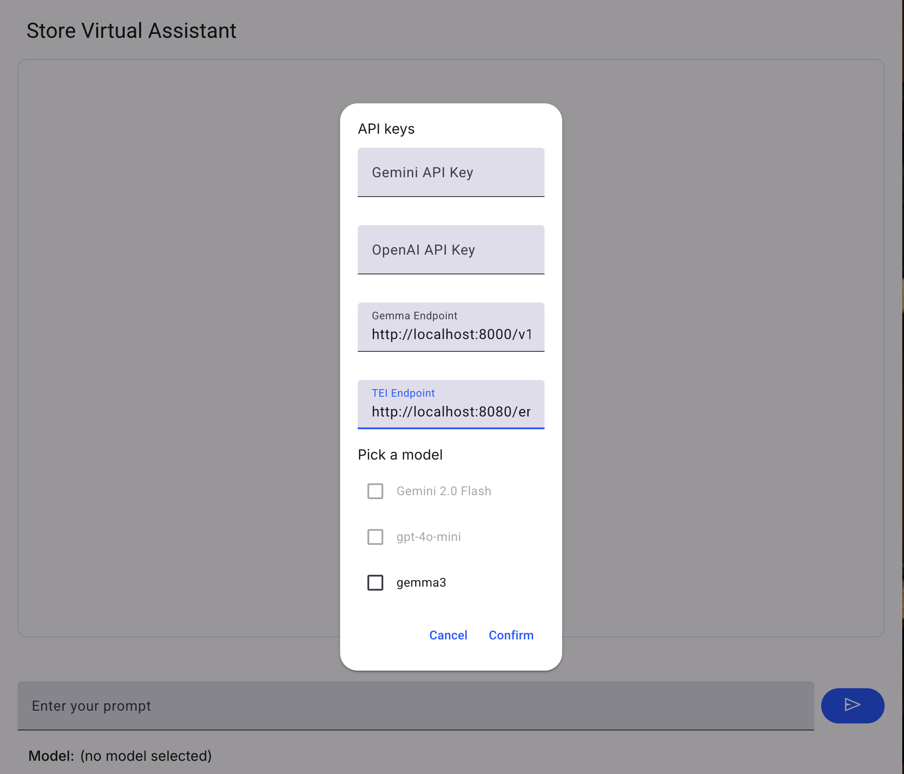
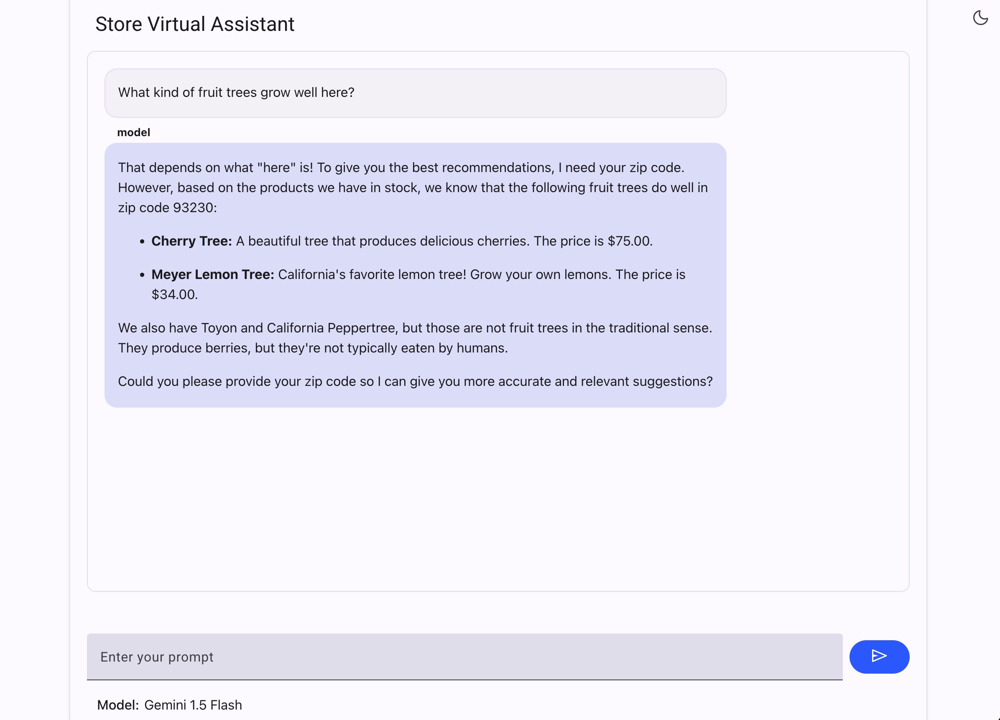

# Sample app for genai embeddings
## Description
- The demo shows a sample retail chat assistant using a postgres compatible database to offer a product from the inventory based on the question asked.

### Architecture


## Requirements
- Platform to deploy the application supporting Python 3.11
- Token in Google AI studio (you can get it from [here](https://ai.google.dev/gemini-api/docs/api-key))
- Token for OpenAI API (optional)
- Project in Google Cloud with enabled APIs for all components.

### Clone the software
Clone the software using git:
```
git clone https://github.com/GoogleCloudPlatform/devrel-demos.git
```


## Deployment
### Enable all required APIs usng gcloud command
```
gcloud services enable alloydb.googleapis.com \
                       compute.googleapis.com \
                       cloudresourcemanager.googleapis.com \
                       servicenetworking.googleapis.com \
                       vpcaccess.googleapis.com \
                       aiplatform.googleapis.com \
                       cloudbuild.googleapis.com \
                       artifactregistry.googleapis.com \
                       run.googleapis.com \
                       iam.googleapis.com \
                       secretmanager.googleapis.com
```

### Create AlloyDB cluster
Please follow instruction in the documentation to create an AlloyDB cluster and primary instance in the same project where the application is going to be deployed.

Here is the [link to the documentation for AlloyDB](https://cloud.google.com/alloydb/docs/quickstart/create-and-connect)
For example after creating the instance you get:


### Enable virtual environment for Python
You can use either your laptop or a virtual machnie for deployment. I am using a VM deployed in the same Google pCloud project. On a Debian Linux you can enable it in the shell using the following command:
```
sudo apt-get update
sudo apt install python3.11-venv git postgresql-client
python3 -m venv venv
source venv/bin/activate
```

### Clone the software
Clone the software using git:
```
git clone https://github.com/GoogleCloudPlatform/devrel-demos.git
```

### Load the data
```
cd devrel-demos/infrastructure/cymbal-store-embeddings
```
Create a database with the name cymbal_store and the user cymbal


Calculate the embeddings

### Run the application 
#### Install Python 3.11 and dependencies
```
sudo apt install -y python3.11-venv git
python3 -m venv .venv
source .venv/bin/activate
pip install --upgrade pip
pip install -r requirements.txt
```
#### export variables
```
export DB_USER=cymbaldb_owner
export DB_PASS=StrongPassword
export DB_NAME=cymbaldb
export INSTANCE_HOST=127.0.0.1
export DB_PORT=5432
```
##### Run the application
```
gunicorn --bind :8080 --reload --workers 1 --threads 8 --timeout 0 cymbal_store:me
```

### Deploy the applicaion to Cloud Run
Create a service account cymbal-store-identity and grant role VertexAI User to the account - optional now since we are not using Vertex AI as of now.
Build and deploy application to the Cloud Run service.

```
gcloud alpha run deploy cymbal-store \
   --source=./ \
   --no-allow-unauthenticated \
   --service-account cymbal-store-identity \
   --region us-central1 \
   --network=default \
   --set-env-vars=DB_USER=cymbaldb_owner,DB_PASS=StrongPassword,DB_NAME=cymbaldb,INSTANCE_HOST=127.0.0.1,DB_PORT=5432 \
   --quiet
```
### Deploy the applicaion to GKE
- Grant to the default GCE service account (PROJECT_NUMBER-compute@developer.gserviceaccount.com) roles/artifactregistry.reader role
- Create artifact registry repository 
```
gcloud artifacts repositories create cymbal-store-embeddings --location us-central1 --repository-format=docker --project $PROJECT_ID
``` 
- Build the image
```
gcloud builds submit --pack image=us-central1-docker.pkg.dev/$PROJECT_ID/cymbal-store-embeddings/cymbal_store .
```
- Create secret
```
kubectl create secret generic cymbal-store-embeddings-secret \
  --from-literal=database=cymbal_store \
  --from-literal=username=cymbal \
  --from-literal=password=ChangeMe123
```
- Create manifest file
```
apiVersion: apps/v1
kind: Deployment
metadata:
  name: cymbal-store-embeddings
spec:
  selector:
    matchLabels:
      app: cymbal-store
  template:
    metadata:
      labels:
        app: cymbal-store
    spec:
      containers:
      - name: cymbal-store
        # Replace <PROJECT_ID> and <REGION> with your project ID and region.
        image: us-central1-docker.pkg.dev/dbs-next-demo-01/cymbal-store-embeddings/cymbal_store:latest
        imagePullPolicy: Always
        # This app listens on port 8080 for web traffic by default.
        ports:
        - containerPort: 8080
        env:
        - name: PORT
          value: "8080"
        - name: INSTANCE_HOST
          value: "34.118.226.5"
        - name: DB_PORT
          value: "5432"
        - name: DB_USER
          valueFrom:
            secretKeyRef:
              name: cymbal-store-embeddings-secret
              key: username
        - name: DB_PASS
          valueFrom:
           secretKeyRef:
              name: cymbal-store-embeddings-secret
              key: password
        - name: DB_NAME
          valueFrom:
            secretKeyRef:
              name: cymbal-store-embeddings-secret
              key: database
```
- Apply the manifest
- Create service 

### Use the application
#### Choose the model
- Click "Model" on the bottom of the application and new dialog window will be opened
  
- Provide your Google AI API token 
- Switch focus to models and click checkbox for Gemini 2.0 flash model
- If you use local Gemma model and local embedding model deployed in your environment please provide endpoints for both using format like http://localhost:8000/v1 (the local GenAI model should support OpenAI VLLM API - tested with Gemma3 and embedding model BGE)
- Click "Confirm"

#### Ask questions
- Ask questions in the chat
  
- Ask in the chat - "What kind of fruit trees grow well here?"

# TO DO
- Add support for other models and providers
- Add error handlers when AI provider returns an error

# License
Apache License Version 2.0; 
Copyright 2024 Google LLC


