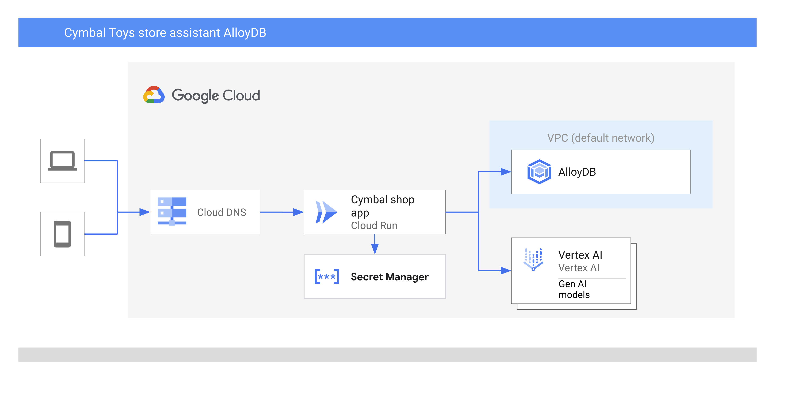

# Cymbal toystore demo
## Description
- The demo shows a sample retail application deployed in the cloud. It has a chat component which is the main point of the discussion.
- The chat application is using Vertex AI integration to provide the answers related to inventory and other available information.
- The LLM in general might be not a fully reliable source of information lacking factual information about inventory and availability for some products. 
- AlloyDB is used as a backend database for the retail application and has products inventory. 
- It helps to generate RAG reasoning for LLM when it comes to answers in the chat. It improves the reliability and usefulness of the chat application keeping it fully flexible and able to provide answers based on semantic search.
- The application is using native integration between Google Databases and LangChain 

### Architecture



## Requirements
- Project in Google Cloud with enabled APIs for all components.
- AlloyDB cluster and primary instance created 
- A laptop or a VM with Python 3.11+,git and postgres utilities such as psql

### Clone the software
Clone the software using git:
```
git clone https://github.com/GoogleCloudPlatform/devrel-demos.git
```


## Deployment
### Enable all required APIs usng gcloud command
```
gcloud services enable alloydb.googleapis.com \
                       compute.googleapis.com \
                       cloudresourcemanager.googleapis.com \
                       servicenetworking.googleapis.com \
                       vpcaccess.googleapis.com \
                       aiplatform.googleapis.com \
                       cloudbuild.googleapis.com \
                       artifactregistry.googleapis.com \
                       run.googleapis.com \
                       iam.googleapis.com \
                       secretmanager.googleapis.com
```

### Create AlloyDB cluster
Please follow instruction in the documentation to create an AlloyDB cluster and primary instance in the same project where the application is going to be deployed.

Here is the [link to the documentation for AlloyDB](https://cloud.google.com/alloydb/docs/quickstart/create-and-connect)
For example after creating the instance you get:
- Cluster name:my-cluster
- Instance name:my-instance
- Instance IP:10.3.141.2
- Postgres user:postgres
- Postgres password:StrongPassword

Enable integration with Vertex AI for the AlloyDB instance
```
PROJECT_ID=$(gcloud config get-value project)
gcloud projects add-iam-policy-binding $PROJECT_ID \
  --member="serviceAccount:service-$(gcloud projects describe $PROJECT_ID --format="value(projectNumber)")@gcp-sa-alloydb.iam.gserviceaccount.com" \
  --role="roles/aiplatform.user"
```

### Enable virtual environment for Python
You can use either your laptop or a virtual machnie for deployment. I am using a VM deployed in the same Google pCloud project. On a Debian Linux you can enable it in the shell using the following command:
```
sudo apt-get update
sudo apt install python3.11-venv git postgresql-client
python3 -m venv venv
source venv/bin/activate
```

### Clone the software
Clone the software using git:
```
git clone https://github.com/gotochkin/devrel-demos.git
```

### Load the data
Create a database with the name cymbal_store and the user cymbal
```
export PGPASSWORD=StrongPassword
psql "host=10.3.141.2 user=postgres dbname=postgres" -c "create database cymbal_store"
psql "host=10.3.141.2 user=postgres dbname=postgres" -c "create user cymbal with password 'StrongPassword'"
psql "host=10.3.141.2 user=postgres dbname=postgres" -c "GRANT ALL ON DATABASE cymbal_store to cymbal;"
psql "host=10.3.141.2 user=postgres dbname=cymbal_store" -c "GRANT ALL ON SCHEMA public TO cymbal;"
psql "host=10.3.141.2 user=postgres dbname=cymbal_store" -c "CREATE EXTENSION IF NOT EXISTS vector;"
psql "host=10.3.141.2 user=postgres dbname=cymbal_store" -c "CREATE EXTENSION IF NOT EXISTS google_ml_integration;"
```
Load the data
```
cd ~/devrel-demos/infrastructure/cymbal-toy-store/data/
psql "host=10.3.141.2 user=cymbal dbname=cymbal_store" <cymbal_toystore.sql
```

Calculate the embeddings
```
psql "host=10.3.141.2 user=cymbal dbname=cymbal_store" -c "insert into cymbal_embeddings select uniq_id,embedding( 'textembedding-gecko@003',product_name||':  '||product_description) from cymbal_products;"
```

### Deploy the applicaion to Cloud Run

* Create a secret for the cymbal user password
```
gcloud secrets create cymbal-user-pw
echo -n "StrongPassword" | gcloud secrets versions add cymbal-user-pw --data-file=- 
```

* create service account for the application
```
export PROJECT_ID=$(gcloud config get-value project)
gcloud iam service-accounts create cymbal-shop-identity
gcloud projects add-iam-policy-binding $PROJECT_ID \
  --member="serviceAccount:cymbal-shop-identity@$PROJECT_ID.iam.gserviceaccount.com" \
  --role="roles/aiplatform.user"
gcloud secrets add-iam-policy-binding cymbal-user-pw --member="serviceAccount:cymbal-shop-identity@$PROJECT_ID.iam.gserviceaccount.com" --role="roles/secretmanager.secretAccessor"

```

* Create configuration file
```
echo "DB_USER='cymbal'
DB_USER_SECRET_ID='cymbal-user-pw'
DB_NAME='cymbal_store'
GCP_PROJECT='cymbal-demo'
GCP_REGION='us-central1'
USE_ALLOYDB='True'
INSTANCE_HOST='10.3.141.2'
DB_PORT=5432" >~/devrel-demos/infrastructure/cymbal-toy-store/backend/src/backend/.env-prod
```
* Deploy the application to Cloud rRun 
```
cd ~/devrel-demos/infrastructure/cymbal-toy-store
gcloud alpha run deploy cymbal-toystore \
   --source=./ \
   --no-allow-unauthenticated \
   --service-account cymbal-shop-identity \
   --region us-central1 \
   --network=default \
   --quiet
   ```

* Get endpoint from output of the previous command, from the web console for cloud run or using the following command:
```
gcloud  run services list --filter="(cymbal-toystore)" --format="value(URL)"
```
* Access to the endpoint
  - You can open the endpoint to the public access 
  - You can use proxy 
  - You can put a load balancer before it
* Requests to Try 
  - Ask in the chat - "What is the best toy of a 5yo boy liking science?"
  - Try to take a picture of another toy using a link "Toy like this" and get a description of a toy to find out.
# License
Apache License Version 2.0; 
Copyright 2024 Google LLC


