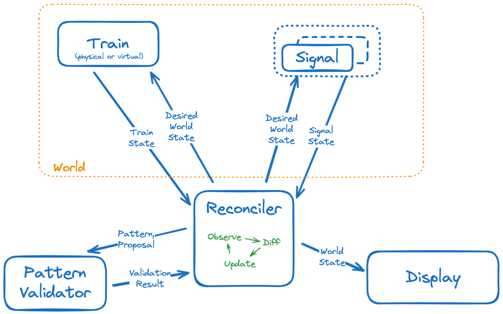

# Overview

At a high level, we have two independent information loops.

- Validation of a proposal (pattern + proposal)
- World state: Train (including cargo), Signals, more later?

To coordinate user input, train motion, validation and displaying overall state we have a central Reconciler. Inspired by Kubernetes reconciliation loops (compare desired state to actual state, make changes to move actual towards desired) and game servers.



## Pattern validation information flow

Logically, this is a single request/response flow.

(`Pattern.slug`, `Proposal`) --> `PatternResult`

It is a deterministic function, always returning the same result for the same input.

The Reconciler may call this repeatedly over time if the train cargo changes.

# Data Structures

### World

World state:

```
    slug,
    name,
    description,
    train: Train,
    signals: [Signal, ...],
    pattern: PatternResult,
```

### GCP metadata

Service example:

```
{
    "slug": "cloud-run",
    "name": "Cloud Run",
    "four_words": "Serverless for containerized applications",
    "doc_url": "https://cloud.google.com/run/docs"
}
```

### Patterns & Proposals

(TODO for all of these, link to actual definition in code/JSON once it exists)

Checkpoint:

```
    slug,
    name,
    description,
    satisfying_services: [Service.slug, ...],
```

Pattern:

```
    slug,
    name,
    description,
    checkpoints: [Checkpoint, ...],
```

Proposal:

```
    pattern_slug,
    service_slugs: [Service.slug, ...],
```

CheckpointResult:

```
    checkpoint: Checkpoint,
    valid: bool,
    reason: string,
```

ProposalResult:

```
    valid: bool,
    reason: string,
    proposal: Proposal,
    pattern: Pattern,
    checkpoints[(Checkpoint, CheckpointResult), ..],
```

### Trains, Cargo & Signals

TODO
