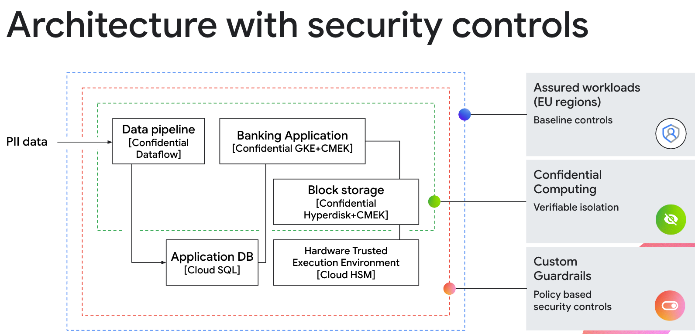

This is not an officially supported Google product. This project is not
eligible for the [Google Open Source Software Vulnerability Rewards
Program](https://bughunters.google.com/open-source-security).

This project is intended for demonstration purposes only. It is not
intended for use in a production environment.

You can review [Google Cloud terms of service
here](https://console.cloud.google.com/tos?id=cloud).

## Summary
Demonstrate how to take an existing banking application to add data privacy controls without making changes to the application or data pipeline.  This notebook supplements NEXT'25 BRK2-187 session.

Address bringing data into a confidential computing trust boundary that has baseline controls provided by Assured Workloads.

## Architecture

## Security services used in demo

*  Assured Workloads - EU Regional Controls
*  Cloud HSM + CMEK
*  Confidential Computing
   *  Confidential GKE
   *  Confidential Hyperdisk
   *  Confidential Dataflow
*  Secret Manager
*  Custom org policies
*  Cloud SQL

## Getting started

1.  Grant your userid the following roles
   * Org Level
      * roles/assuredworkloads.admin
   * Project Level
      * roles/compute.admin
      * roles/dataflow.admin
      * roles/resourcemanager.projectIamAdmin
      * roles/iam.securityAdmin
      * roles/iam.serviceAccountTokenCreator
      * roles/serviceusage.serviceUsageConsumer
1.  Use the notebook build various controls that add data privacy to your existing application

## References
This demo builds upon aspects from various existing guides:

1.  Assured workloads project migration
1.  Dataflow flex templates: Getting Started
1.  Bank of Anthos
1.  Confidential mode for Hyperdisk